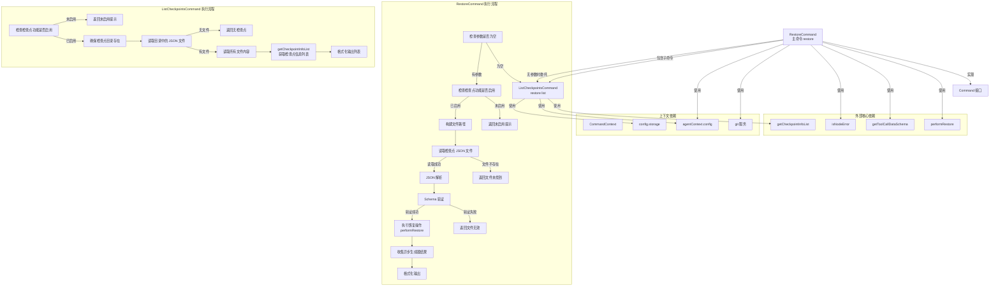

# restore.ts

## 概述

`restore.ts` 是 Gemini CLI 中 ACP 命令体系的检查点恢复命令实现文件。该文件定义了 `RestoreCommand` 主命令和 `ListCheckpointsCommand` 子命令，提供了对话和文件历史的检查点（Checkpoint）恢复功能。

检查点机制允许用户在 AI 辅助开发过程中保存工作状态快照，并在需要时恢复到之前的某个状态，类似于版本控制系统中的回滚操作。检查点数据以 JSON 文件形式存储在项目的临时目录中，包含了对话历史和文件变更信息。

## 架构图（Mermaid）

## 核心组件

### 1. RestoreCommand 主命令

| 属性 | 类型 | 说明 |
|------|------|------|
| `name` | `readonly string` | 值为 `'restore'` |
| `description` | `readonly string` | 恢复到之前的检查点，或列出可用的检查点。将重置对话和文件历史到检查点创建时的状态 |
| `requiresWorkspace` | `readonly boolean` | `true`，需要工作区 |
| `subCommands` | `readonly Command[]` | 包含 `ListCheckpointsCommand` 一个子命令 |

#### execute 方法详细流程

1. **解构上下文**：从 `context` 中提取 `agentContext` 和 `git`（Git 服务）。
2. **参数处理**：将 `args` 数组拼接为字符串 `argsStr`。
3. **无参数分支**：若 `argsStr` 为空，委托给 `ListCheckpointsCommand` 执行，列出所有可用检查点。
4. **功能启用检查**：调用 `config.getCheckpointingEnabled()` 检查检查点功能是否启用，未启用则返回配置提示。
5. **文件名补全**：若参数不以 `.json` 结尾，自动追加 `.json` 后缀。
6. **构建完整路径**：通过 `config.storage.getProjectTempCheckpointsDir()` 获取检查点目录，与文件名拼接。
7. **读取检查点文件**：
   - 成功：继续处理。
   - 失败（`ENOENT`）：返回文件未找到错误。
   - 其他错误：向上抛出。
8. **JSON 解析与 Schema 验证**：使用 `getToolCallDataSchema()` 获取 Zod Schema，对解析后的数据进行 `safeParse` 验证。
9. **执行恢复**：调用 `performRestore(parseResult.data, gitService)` 获取异步生成器，遍历收集所有结果。
10. **格式化输出**：
    - `message` 类型：格式化为 `[类型大写] 内容`。
    - `load_history` 类型：输出加载的消息数量。
    - 其他类型：JSON 序列化输出。

### 2. ListCheckpointsCommand 子命令

| 属性 | 类型 | 说明 |
|------|------|------|
| `name` | `readonly string` | 值为 `'restore list'` |
| `description` | `readonly string` | `'Lists all available checkpoints.'` |

#### execute 方法详细流程

1. **功能启用检查**：同主命令，检查检查点功能是否启用。
2. **确保目录存在**：调用 `fs.mkdir(checkpointDir, { recursive: true })` 创建检查点目录（若已存在则忽略错误）。
3. **读取目录内容**：使用 `fs.readdir` 读取目录中的所有文件。
4. **筛选 JSON 文件**：过滤出以 `.json` 结尾的文件。
5. **空检查**：若无 JSON 文件，返回 `'No checkpoints found.'`。
6. **读取文件内容**：遍历所有 JSON 文件，读取内容存入 `Map<文件名, 内容>`。
7. **获取检查点信息**：调用 `getCheckpointInfoList(checkpointFiles)` 获取结构化的检查点信息列表。
8. **格式化输出**：将每个检查点格式化为 `- **文件名**: 工具名 (Status: 状态) [时间戳]` 的 Markdown 列表格式。

## 依赖关系

### 内部依赖

| 模块 | 导入内容 | 用途 |
|------|----------|------|
| `./types.js` | `Command`, `CommandContext`, `CommandExecutionResponse` | 命令接口定义和类型约束 |

### 外部依赖

| 模块 | 导入内容 | 用途 |
|------|----------|------|
| `@google/gemini-cli-core` | `getCheckpointInfoList` | 从检查点文件数据中提取结构化的检查点信息列表 |
| `@google/gemini-cli-core` | `getToolCallDataSchema` | 获取工具调用数据的 Zod Schema，用于验证检查点文件格式 |
| `@google/gemini-cli-core` | `isNodeError` | Node.js 错误类型判断工具函数，用于识别 `ENOENT` 等系统错误 |
| `@google/gemini-cli-core` | `performRestore` | 执行实际恢复操作的核心函数，返回异步生成器 |
| `node:fs/promises` | `fs` (整体导入) | 异步文件系统操作：读取文件 (`readFile`)、读取目录 (`readdir`)、创建目录 (`mkdir`) |
| `node:path` | `path` (整体导入) | 路径操作：拼接路径 (`join`) |

## 关键实现细节

1. **异步生成器消费模式**：`performRestore` 返回一个异步生成器（AsyncGenerator），命令使用 `for await...of` 循环逐步消费所有结果。这种模式允许恢复过程分步执行并逐步报告进度，尽管当前实现将所有结果收集到数组后一次性输出。

2. **Schema 验证安全性**：使用 Zod 的 `safeParse` 方法进行非抛出式验证，优雅处理无效或损坏的检查点文件，而非直接崩溃。

3. **文件名智能补全**：自动为不含 `.json` 后缀的参数追加后缀，提升用户体验。用户可以输入 `restore checkpoint-1` 或 `restore checkpoint-1.json`，两者等效。

4. **Node.js 错误识别**：使用 `isNodeError` 工具函数配合 `error.code === 'ENOENT'` 判断文件不存在的情况，而非简单地捕获所有错误。非文件不存在的错误会被重新抛出，由外层 `try-catch` 捕获。

5. **双层异常处理**：内层 `try-catch` 专门处理文件读取错误（区分文件不存在和其他错误），外层 `try-catch` 捕获所有未预期的错误并返回友好的错误消息。

6. **检查点功能开关**：检查点功能需要通过配置 `general.checkpointing.enabled: true` 显式启用。`RestoreCommand` 和 `ListCheckpointsCommand` 都独立进行了此检查，确保即使直接调用子命令也能正确处理。

7. **目录自动创建**：`ListCheckpointsCommand` 在读取目录前使用 `fs.mkdir(checkpointDir, { recursive: true })` 确保目录存在，避免因目录不存在导致的错误。错误被静默忽略（目录已存在时 `recursive: true` 不会报错，但其他可能的错误也被忽略了）。

8. **Git 服务集成**：`performRestore` 接收 `gitService` 参数，表明恢复操作涉及 Git 操作（如回滚文件变更），将对话恢复与代码文件恢复紧密集成。

9. **格式化输出适配**：代码注释提到 "Format the result nicely since Zed just dumps data"，说明格式化逻辑是为了适配 Zed 编辑器等客户端的显示需求。

10. **异步文件操作**：与 `init.ts` 使用同步 `fs` 不同，`restore.ts` 使用 `node:fs/promises` 的异步 API，更适合处理可能涉及多个文件读取的批量操作场景。
