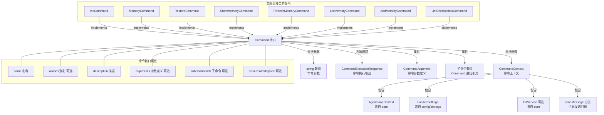

# types.ts

## 概述

`types.ts` 是 Gemini CLI 中 ACP 命令体系的类型定义文件。该文件定义了命令系统的核心接口：`CommandContext`（命令上下文）、`CommandArgument`（命令参数）、`Command`（命令接口）和 `CommandExecutionResponse`（命令执行响应）。这些接口构成了整个 ACP 命令系统的类型契约，所有具体命令（如 `InitCommand`、`MemoryCommand`、`RestoreCommand`）都必须遵循这些接口约定。

该文件是纯类型定义文件，不包含任何运行时代码，仅通过 TypeScript 的 `interface` 和 `import type` 提供编译时类型检查。

## 架构图（Mermaid）

## 核心组件

### 1. CommandContext 接口（命令上下文）

命令执行时所需的所有上下文信息的聚合接口。

| 属性 | 类型 | 必需 | 说明 |
|------|------|------|------|
| `agentContext` | `AgentLoopContext` | 是 | Agent 循环上下文，包含配置 (`config`)、工具注册表 (`toolRegistry`)、沙箱管理器 (`sandboxManager`) 等核心运行时信息 |
| `settings` | `LoadedSettings` | 是 | 已加载的应用设置，来自本地配置文件 |
| `git` | `GitService` | 否（可选） | Git 服务实例，提供 Git 相关操作能力。可选是因为某些环境下可能没有 Git |
| `sendMessage` | `(text: string) => Promise<void>` | 是 | 异步消息发送回调函数，用于向用户界面发送状态或进度消息 |

#### 设计要点

- `agentContext` 是最核心的依赖，几乎所有命令都需要通过它访问配置和工具。
- `git` 被设置为可选（`?`），体现了对非 Git 项目或无 Git 环境的兼容性。
- `sendMessage` 是一个异步函数类型，允许命令在执行过程中与 UI 层通信，实现进度反馈。

### 2. CommandArgument 接口（命令参数定义）

描述命令接受的参数的元数据接口。

| 属性 | 类型 | 必需 | 说明 |
|------|------|------|------|
| `name` | `readonly string` | 是 | 参数名称 |
| `description` | `readonly string` | 是 | 参数描述，用于帮助信息展示 |
| `isRequired` | `readonly boolean` | 否（可选） | 是否为必需参数，默认可选 |

#### 设计要点

- 所有属性均为 `readonly`，确保参数定义不可变。
- `isRequired` 为可选属性，未设置时视为非必需参数。

### 3. Command 接口（命令主接口）

所有 ACP 命令必须实现的核心接口，定义了命令的元数据和执行方法。

| 属性/方法 | 类型 | 必需 | 说明 |
|-----------|------|------|------|
| `name` | `readonly string` | 是 | 命令名称，用于命令路由和识别 |
| `aliases` | `readonly string[]` | 否 | 命令别名列表，如 `memory reload` 是 `memory refresh` 的别名 |
| `description` | `readonly string` | 是 | 命令描述，用于帮助信息展示 |
| `arguments` | `readonly CommandArgument[]` | 否 | 命令接受的参数定义列表 |
| `subCommands` | `readonly Command[]` | 否 | 子命令列表，支持命令的层次化组织 |
| `requiresWorkspace` | `readonly boolean` | 否 | 是否需要工作区环境，用于框架层的前置检查 |
| `execute(context, args)` | `Promise<CommandExecutionResponse>` | 是 | 命令执行方法，接收上下文和参数，返回执行响应 |

#### 设计要点

- **递归子命令**：`subCommands` 的类型为 `Command[]`，即子命令本身也是 `Command` 接口的实现，形成树形命令结构。
- **别名机制**：通过 `aliases` 支持命令的多种调用方式。
- **工作区需求声明**：`requiresWorkspace` 允许框架在执行前自动检查工作区状态，避免在每个命令内部重复检查。
- **异步执行**：`execute` 方法返回 `Promise`，支持异步操作（如文件 I/O、网络请求、Git 操作等）。

### 4. CommandExecutionResponse 接口（命令执行响应）

命令执行完成后的统一返回格式。

| 属性 | 类型 | 必需 | 说明 |
|------|------|------|------|
| `name` | `readonly string` | 是 | 命令名称，标识响应来自哪个命令 |
| `data` | `readonly unknown` | 是 | 响应数据，类型为 `unknown`，各命令可返回不同类型的数据 |

#### 设计要点

- `data` 使用 `unknown` 类型而非 `any`，在提供灵活性的同时保持了类型安全（使用时需要类型断言或类型守卫）。
- `name` 字段允许响应消费者识别响应来源，尤其在批量处理多个命令响应时非常有用。

## 依赖关系

### 内部依赖

| 模块 | 导入内容 | 用途 |
|------|----------|------|
| `../../config/settings.js` | `LoadedSettings` (type) | 已加载的应用设置类型，用于 `CommandContext` 中的 `settings` 属性 |

### 外部依赖

| 模块 | 导入内容 | 用途 |
|------|----------|------|
| `@google/gemini-cli-core` | `AgentLoopContext` (type) | Agent 循环上下文类型，包含核心运行时配置和服务 |
| `@google/gemini-cli-core` | `GitService` (type) | Git 服务接口类型，提供 Git 操作抽象 |

## 关键实现细节

1. **纯类型文件**：该文件完全由 `interface` 定义和 `import type` 语句组成，编译后不会产生任何 JavaScript 运行时代码。这是 TypeScript 最佳实践——将类型定义与实现分离。

2. **import type 语法**：所有导入均使用 `import type` 语法，明确标记为仅类型导入。这确保了：
   - 编译后不会产生 `require` 调用。
   - 避免循环依赖问题。
   - 使打包工具能更好地进行 tree-shaking。

3. **命令模式（Command Pattern）**：`Command` 接口是经典的命令模式实现。所有命令都实现统一的 `execute` 接口，使得命令的注册、路由、执行和响应处理可以完全解耦。

4. **组合模式（Composite Pattern）**：通过 `subCommands` 属性，`Command` 接口支持树形命令组织结构。主命令可以包含子命令，子命令本身也可以包含更深层的子命令，形成多级命令层次。

5. **上下文注入模式**：`CommandContext` 将所有外部依赖聚合为一个上下文对象，通过 `execute` 方法的参数注入到命令中，而非让命令自行获取依赖。这种方式：
   - 便于单元测试（可以轻松 mock 上下文）。
   - 解耦了命令与具体的运行时环境。
   - 使得不同的调用环境（CLI、编辑器插件等）可以提供不同的上下文实现。

6. **readonly 一致性**：几乎所有接口属性都标记为 `readonly`，体现了不可变数据的设计理念。命令的元数据（名称、描述、参数定义）一旦定义就不应被修改。

7. **sendMessage 的异步设计**：`sendMessage` 返回 `Promise<void>`，这意味着消息发送可能涉及异步操作（如写入 WebSocket、更新 UI 等）。调用方可以选择 `await` 等待发送完成，也可以 fire-and-forget。

8. **Git 服务的可选性**：`git?: GitService` 的设计使得命令系统可以在没有 Git 的环境中正常工作。使用 Git 服务的命令（如 `RestoreCommand`）需要自行处理 `git` 为 `undefined` 的情况。
