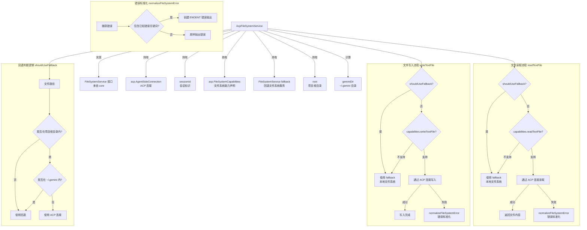

# fileSystemService.ts

## 概述

`fileSystemService.ts` 是 Gemini CLI 中 ACP（Agent Client Protocol）层的文件系统服务实现文件。该文件定义了 `AcpFileSystemService` 类，它是 `FileSystemService` 接口的 ACP 客户端实现，通过 ACP 协议连接远程 IDE（如 VS Code、Zed 等）的文件系统能力来读写文件。

该服务的核心设计是一个**带回退机制的代理模式**：优先通过 ACP 连接使用远程 IDE 的文件系统能力，当远程能力不可用或目标文件不在项目根目录范围内时，自动回退到本地原生文件系统操作（fallback）。同时还包含特殊的错误标准化逻辑，将各种文件系统错误统一转换为 Node.js 标准的 `ENOENT` 错误格式。

## 架构图（Mermaid）

## 核心组件

### AcpFileSystemService 类

#### 构造函数参数

| 参数 | 类型 | 访问修饰符 | 说明 |
|------|------|-----------|------|
| `connection` | `acp.AgentSideConnection` | `private readonly` | ACP Agent 端连接实例，用于与远程 IDE 通信 |
| `sessionId` | `string` | `private readonly` | 当前会话 ID，标识特定的 ACP 会话 |
| `capabilities` | `acp.FileSystemCapabilities` | `private readonly` | 远程端声明的文件系统能力，指示哪些操作被支持 |
| `fallback` | `FileSystemService` | `private readonly` | 回退文件系统服务实例，当 ACP 不可用时使用 |
| `root` | `string` | `private readonly` | 项目根目录路径，用于判断文件是否在项目范围内 |

#### 实例属性

| 属性 | 类型 | 说明 |
|------|------|------|
| `geminiDir` | `string` (readonly) | Gemini CLI 全局配置目录路径，即 `~/.gemini`，通过 `path.join(os.homedir(), '.gemini')` 计算 |

### 方法详解

#### 1. shouldUseFallback(filePath: string): boolean

**私有方法**——判断给定文件路径是否应使用回退（本地原生）文件系统。

**判断逻辑**：
- 如果文件路径**不在项目根目录内**（`!isWithinRoot(filePath, this.root)`）：返回 `true`（使用回退）。
- 如果文件路径**在 `~/.gemini` 目录内**（`isWithinRoot(filePath, this.geminiDir)`）：返回 `true`（使用回退）。
- 其他情况：返回 `false`（使用 ACP 连接）。

**设计理由**：ACP 连接通常只能访问 IDE 打开的项目范围内的文件。全局配置目录 `~/.gemini` 即使在物理上位于项目根目录下（例如用户在 home 目录下运行 CLI），也必须通过本地文件系统访问，因为 IDE 可能不具备对这些内部配置文件的感知和访问能力。

#### 2. normalizeFileSystemError(err: unknown): never

**私有方法**——将各种文件系统错误标准化为统一的 Node.js `ENOENT` 错误格式。

**返回类型**：`never`——该方法总是抛出异常，不会正常返回。

**标准化规则**：
检测错误消息中是否包含以下关键词之一：
- `'Resource not found'`
- `'ENOENT'`
- `'does not exist'`
- `'No such file'`

如果匹配，创建一个新的 `Error` 对象并附加 `code = 'ENOENT'` 属性（符合 `NodeJS.ErrnoException` 接口），然后抛出。否则，原样抛出原始错误。

#### 3. readTextFile(filePath: string): Promise\<string\>

**公开异步方法**——读取文本文件内容。

**执行流程**：
1. 检查 `capabilities.readTextFile` 是否为 `true` 且文件不需要回退。
2. 若需回退或不支持：委托给 `this.fallback.readTextFile(filePath)`。
3. 若通过 ACP：调用 `this.connection.readTextFile({ path, sessionId })`，返回 `response.content`。
4. 若 ACP 调用出错：通过 `normalizeFileSystemError` 标准化后抛出。

#### 4. writeTextFile(filePath: string, content: string): Promise\<void\>

**公开异步方法**——写入文本文件内容。

**执行流程**：
1. 检查 `capabilities.writeTextFile` 是否为 `true` 且文件不需要回退。
2. 若需回退或不支持：委托给 `this.fallback.writeTextFile(filePath, content)`。
3. 若通过 ACP：调用 `this.connection.writeTextFile({ path, content, sessionId })`。
4. 若 ACP 调用出错：通过 `normalizeFileSystemError` 标准化后抛出。

## 依赖关系

### 内部依赖

| 模块 | 导入内容 | 用途 |
|------|----------|------|
| `@google/gemini-cli-core` | `isWithinRoot` | 工具函数，判断文件路径是否在指定根目录内 |
| `@google/gemini-cli-core` | `FileSystemService` (type) | 文件系统服务接口，`AcpFileSystemService` 实现此接口 |

### 外部依赖

| 模块 | 导入内容 | 用途 |
|------|----------|------|
| `@agentclientprotocol/sdk` | `acp` (namespace, type only) | ACP SDK 类型定义，提供 `AgentSideConnection`、`FileSystemCapabilities` 等类型 |
| `node:os` | `os` (default import) | 操作系统工具，用于获取用户主目录 (`os.homedir()`) |
| `node:path` | `path` (default import) | 路径操作工具，用于拼接路径 (`path.join`) |

## 关键实现细节

1. **代理模式与回退策略**：`AcpFileSystemService` 是一个典型的代理模式实现，包裹了 ACP 远程文件系统操作，并在以下情况自动回退到本地文件系统：
   - ACP 能力声明中不支持该操作（`capabilities.readTextFile` 或 `capabilities.writeTextFile` 为 `false`）。
   - 文件路径不在项目根目录范围内。
   - 文件路径在 `~/.gemini` 全局配置目录内。

2. **全局目录特殊处理**：即使项目根目录是用户主目录（`~`），`~/.gemini` 目录下的文件仍然强制使用本地文件系统。这避免了 IDE 可能对内部配置文件的错误操作或访问限制问题。代码注释明确说明了这一设计决策。

3. **错误标准化的必要性**：不同的 ACP 客户端（不同的 IDE 实现）可能返回不同格式的文件不存在错误消息。`normalizeFileSystemError` 方法将这些异构错误统一转换为 Node.js 标准的 `ENOENT` 错误（带有 `code` 属性），使得上层代码可以用统一的方式处理文件不存在的情况（如 `if (isNodeError(err) && err.code === 'ENOENT')`）。

4. **never 返回类型**：`normalizeFileSystemError` 的返回类型为 `never`，这在 TypeScript 中表示函数永远不会正常返回（总是抛出异常）。这使得 TypeScript 编译器能正确推断调用点之后的代码不可达，避免了类型检查的误报。

5. **能力声明驱动**：`FileSystemCapabilities` 是 ACP 协议的能力协商机制的一部分。ACP 客户端（IDE）在连接建立时声明其支持的文件系统操作，`AcpFileSystemService` 根据这些声明决定是否使用 ACP 通道。这种设计使得系统能优雅地适配不同 IDE 的能力差异。

6. **会话绑定**：所有 ACP 文件系统操作都附带 `sessionId` 参数，确保操作关联到正确的 ACP 会话。这在多窗口或多项目场景下尤为重要。

7. **类型安全的妥协**：代码中存在多处 `eslint-disable` 注释（`@typescript-eslint/no-unsafe-assignment` 和 `@typescript-eslint/no-unsafe-return`），说明 ACP SDK 的返回类型可能不够精确（可能使用了 `any` 类型）。这是与外部 SDK 集成时常见的类型安全妥协。

8. **接口一致性**：`AcpFileSystemService` 完整实现了 `FileSystemService` 接口，对外暴露的 API（`readTextFile`、`writeTextFile`）与本地文件系统服务完全一致。上层代码无需关心底层是通过 ACP 还是本地文件系统执行操作，实现了完美的抽象。

9. **isWithinRoot 安全检查**：使用 `isWithinRoot` 函数进行路径安全检查，防止路径遍历攻击（如 `../../etc/passwd`）。只有确实在项目根目录内的文件才会通过 ACP 通道操作。
