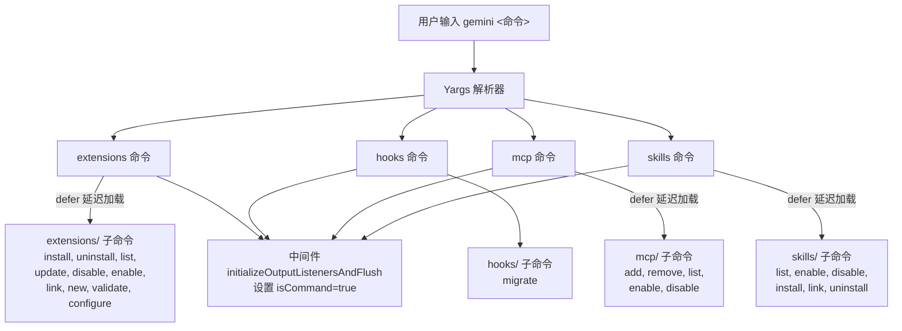
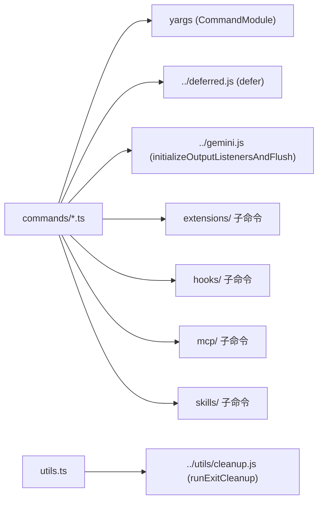
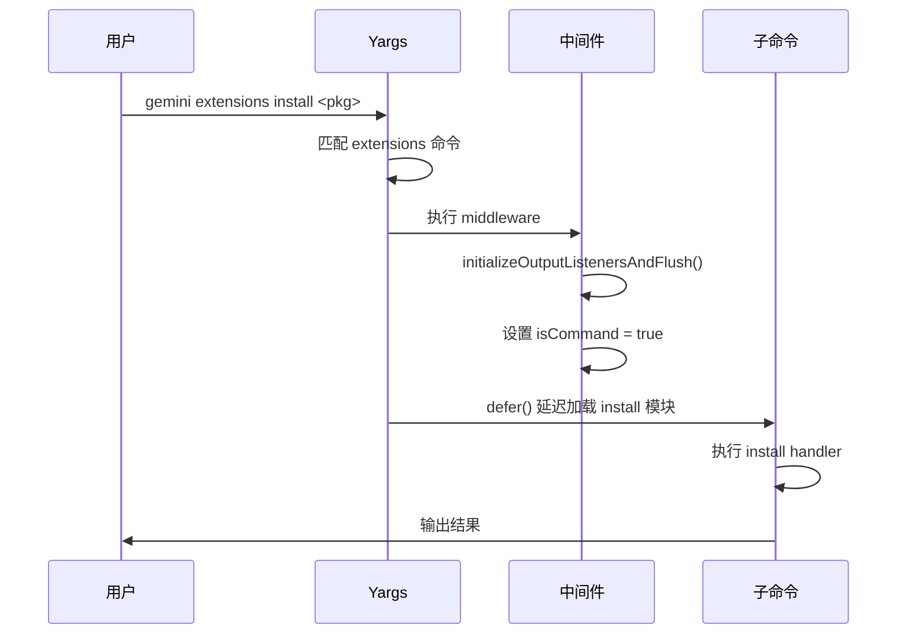

# commands 目录

## 概述

`commands/` 是 Gemini CLI 的**顶层命令注册中心**，基于 [yargs](https://yargs.js.org/) 框架实现命令行解析与子命令分发。每个文件对应一个顶级命令（`extensions`、`hooks`、`mcp`、`skills`），负责将用户输入路由到对应的子命令处理模块。

## 目录结构

```
commands/
├── extensions.tsx          # extensions 顶级命令，注册 10 个子命令
├── extensions.test.tsx     # extensions 命令测试
├── hooks.tsx               # hooks 顶级命令，注册 migrate 子命令
├── mcp.ts                  # mcp 顶级命令，注册 5 个子命令
├── mcp.test.ts             # mcp 命令测试
├── skills.tsx              # skills 顶级命令，注册 6 个子命令
├── skills.test.tsx         # skills 命令测试
├── utils.ts                # 工具函数（exitCli 退出清理）
├── utils.test.ts           # 工具函数测试
├── extensions/             # extensions 子命令实现
├── hooks/                  # hooks 子命令实现
├── mcp/                    # mcp 子命令实现
└── skills/                 # skills 子命令实现
```

## 架构图



## 核心组件

### 1. 命令模块（CommandModule）

每个顶级命令文件导出一个 `CommandModule` 对象，包含：

| 属性 | 说明 |
|------|------|
| `command` | 命令名称及参数格式，如 `'extensions <command>'` |
| `aliases` | 命令别名，如 `extensions` 可缩写为 `extension` |
| `describe` | 命令描述文字 |
| `builder` | 注册子命令和中间件的构建函数 |
| `handler` | 未匹配子命令时的处理（通常为空，由 yargs 显示帮助） |

### 2. `defer()` 延迟加载机制

所有子命令通过 `defer()` 函数包装，实现**按需加载**——只有用户实际调用某个子命令时，才会加载其对应的模块。这大幅优化了 CLI 的启动速度。

### 3. `utils.ts` - 退出工具

```typescript
export async function exitCli(exitCode = 0) {
  await runExitCleanup();  // 执行清理回调
  process.exit(exitCode);
}
```

提供统一的退出入口，确保所有资源在进程退出前被正确清理。

### 4. 中间件

每个顶级命令的 `builder` 中都注册了统一的中间件：
- `initializeOutputListenersAndFlush()` — 初始化输出监听器并刷新缓冲区
- `argv['isCommand'] = true` — 标记当前运行的是子命令模式（区别于交互式 REPL）

## 依赖关系



## 数据流


