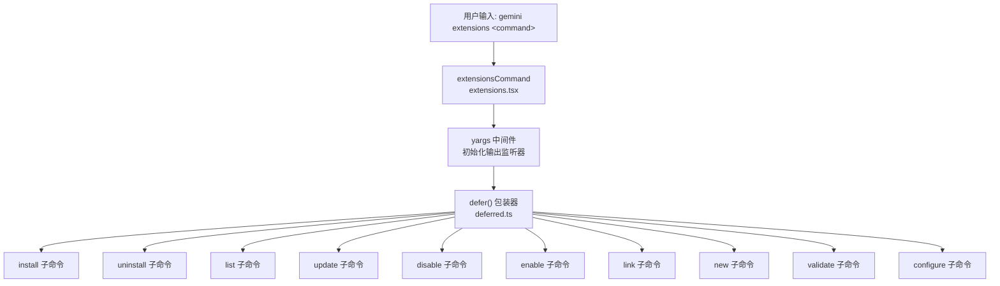

# extensions.tsx

## 概述

`extensions.tsx` 是 Gemini CLI 扩展管理系统的**顶层入口命令模块**。它定义了 `gemini extensions <command>` 这一主命令，并将所有子命令（install、uninstall、list、update、disable、enable、link、new、validate、configure）注册到 yargs 命令体系中。该文件本身不包含具体业务逻辑，而是作为一个**命令路由器/聚合器**，负责子命令的注册、中间件初始化以及延迟执行机制的接入。

## 架构图（Mermaid）



## 核心组件

### 1. `extensionsCommand: CommandModule`

导出的主命令模块对象，符合 yargs 的 `CommandModule` 接口。

| 属性 | 值 | 说明 |
|------|------|------|
| `command` | `'extensions <command>'` | 命令格式，`<command>` 为必需的子命令占位符 |
| `aliases` | `['extension']` | 别名，允许用户使用单数形式 `extension` |
| `describe` | `'Manage Gemini CLI extensions.'` | 命令描述，用于帮助信息展示 |

### 2. `builder` 函数

`builder` 是 yargs 的构建器函数，负责：

1. **注册中间件**：在所有子命令执行前，调用 `initializeOutputListenersAndFlush()` 初始化输出监听器，并将 `argv['isCommand']` 设置为 `true`，标记当前执行的是一个显式命令（而非交互式对话）。

2. **注册子命令**：通过 `yargs.command()` 注册 10 个子命令，每个子命令都经过 `defer()` 包装：
   - `installCommand` — 安装扩展
   - `uninstallCommand` — 卸载扩展
   - `listCommand` — 列出扩展
   - `updateCommand` — 更新扩展
   - `disableCommand` — 禁用扩展
   - `enableCommand` — 启用扩展
   - `linkCommand` — 链接本地扩展（开发用途）
   - `newCommand` — 创建新扩展
   - `validateCommand` — 验证扩展
   - `configureCommand` — 配置扩展

3. **强制子命令**：`demandCommand(1, ...)` 要求至少提供一个子命令，否则显示错误信息。

4. **禁用版本选项**：`version(false)` 关闭子命令级别的 `--version` 选项。

### 3. `handler` 函数

handler 为空函数体。当用户提供了有效子命令时，yargs 会路由到对应子命令的 handler；当没有子命令时，由于 `demandCommand(1)` 的约束，yargs 会自动显示帮助信息。

## 依赖关系

### 内部依赖

| 模块路径 | 导入内容 | 用途 |
|---------|---------|------|
| `./extensions/install.js` | `installCommand` | 安装扩展子命令 |
| `./extensions/uninstall.js` | `uninstallCommand` | 卸载扩展子命令 |
| `./extensions/list.js` | `listCommand` | 列出已安装扩展子命令 |
| `./extensions/update.js` | `updateCommand` | 更新扩展子命令 |
| `./extensions/disable.js` | `disableCommand` | 禁用扩展子命令 |
| `./extensions/enable.js` | `enableCommand` | 启用扩展子命令 |
| `./extensions/link.js` | `linkCommand` | 链接本地开发扩展子命令 |
| `./extensions/new.js` | `newCommand` | 创建新扩展子命令 |
| `./extensions/validate.js` | `validateCommand` | 验证扩展子命令 |
| `./extensions/configure.js` | `configureCommand` | 配置扩展子命令 |
| `../gemini.js` | `initializeOutputListenersAndFlush` | 初始化输出事件监听器并刷新缓冲区 |
| `../deferred.js` | `defer` | 延迟命令执行的包装函数 |

### 外部依赖

| 包名 | 导入内容 | 用途 |
|------|---------|------|
| `yargs` | `CommandModule`（类型导入） | yargs 命令模块类型定义 |

## 关键实现细节

### 延迟执行机制（Deferred Execution）

这是本文件最重要的设计模式。每个子命令都通过 `defer()` 函数包装后再注册到 yargs。

`defer()` 函数（定义在 `../deferred.ts` 中）的工作原理：
1. 返回一个新的 `CommandModule`，其 handler 被替换为：不立即执行原始 handler，而是将原始 handler 和 argv 保存到一个单例变量 `deferredCommand` 中。
2. 同时记录 `commandName` 为 `'extensions'`（通过 `defer(xxxCommand, 'extensions')` 的第二个参数传入）。
3. 在主程序后续流程中，`runDeferredCommand(settings)` 被调用时，才真正执行保存的 handler。

**为什么需要延迟执行？**

这是因为命令的实际执行需要依赖**配置加载完成**（`MergedSettings`）。yargs 解析命令行参数的阶段早于配置加载完成，因此需要先暂存命令，等配置就绪后再注入 `settings` 并执行。此外，`runDeferredCommand` 还会检查管理员策略（`adminSettings?.extensions?.enabled`），如果扩展功能被管理员禁用，则直接报错退出，不会执行子命令。

### 中间件的作用

```typescript
.middleware((argv) => {
  initializeOutputListenersAndFlush();
  argv['isCommand'] = true;
})
```

- `initializeOutputListenersAndFlush()`：初始化控制台输出的事件监听器。Gemini CLI 使用事件驱动的输出系统，此函数确保在命令执行前，输出管道已就绪，且之前缓冲的输出被刷新。
- `argv['isCommand'] = true`：标记当前执行流是一个 CLI 命令（非交互模式），后续逻辑可依据此标记决定输出格式和行为。

### 命令别名

`aliases: ['extension']` 允许用户使用 `gemini extension install xxx` 替代 `gemini extensions install xxx`，提升用户体验，减少因单复数拼写导致的使用障碍。
