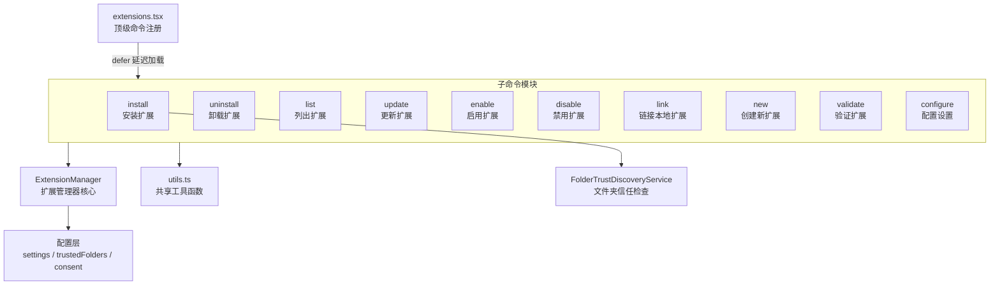
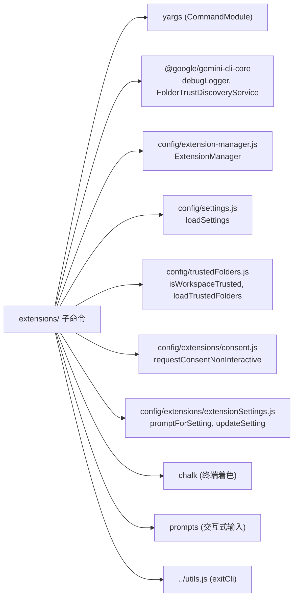
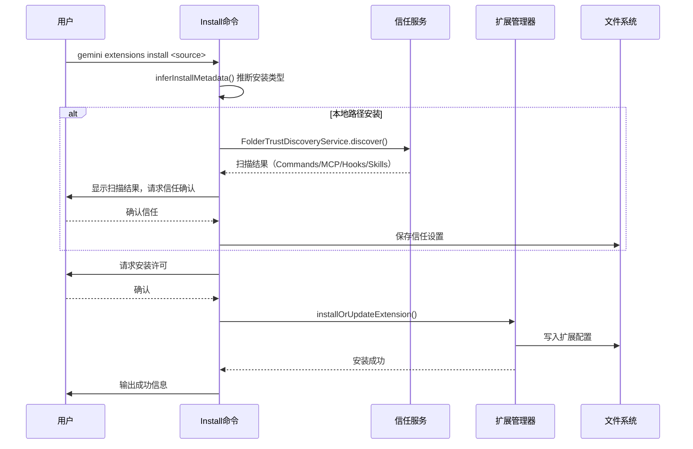

# extensions 目录

## 概述

`extensions/` 目录实现了 Gemini CLI 的**扩展管理系统**，提供扩展的完整生命周期管理能力，包括安装、卸载、更新、启用/禁用、链接、创建、验证和配置。所有子命令均通过 yargs `CommandModule` 规范导出，由上层 `extensions.tsx` 统一注册。

## 目录结构

```
extensions/
├── install.ts          # 安装扩展（支持 Git URL 和本地路径）
├── install.test.ts     # install 测试
├── uninstall.ts        # 卸载扩展
├── uninstall.test.ts   # uninstall 测试
├── list.ts             # 列出已安装扩展（支持 text/json 格式）
├── list.test.ts        # list 测试
├── update.ts           # 更新扩展
├── update.test.ts      # update 测试
├── enable.ts           # 启用扩展
├── enable.test.ts      # enable 测试
├── disable.ts          # 禁用扩展
├── disable.test.ts     # disable 测试
├── link.ts             # 链接本地开发扩展
├── link.test.ts        # link 测试
├── new.ts              # 创建新扩展脚手架
├── new.test.ts         # new 测试
├── validate.ts         # 验证扩展配置
├── validate.test.ts    # validate 测试
├── configure.ts        # 配置扩展设置项
├── configure.test.ts   # configure 测试
└── utils.ts            # 共享工具函数
```

## 架构图



## 核心组件

### 1. install.ts - 安装扩展

最复杂的子命令，支持两种安装来源：
- **Git 仓库 URL**：从远程克隆
- **本地路径**：本地目录安装

安装流程包含**文件夹信任检查**：对本地路径会通过 `FolderTrustDiscoveryService` 扫描扩展内容（Commands、MCP servers、Hooks、Skills 等），提示用户确认信任后才允许安装。

```typescript
// 关键参数
interface InstallArgs {
  source: string;         // Git URL 或本地路径
  ref?: string;           // Git ref（分支/标签）
  autoUpdate?: boolean;   // 自动更新
  allowPreRelease?: boolean; // 允许预发布版本
  consent?: boolean;      // 跳过确认提示
  skipSettings?: boolean; // 跳过配置过程
}
```

### 2. list.ts - 列出扩展

支持两种输出格式：
- `text`（默认）：人类可读的文本格式
- `json`：结构化 JSON 输出，便于脚本处理

### 3. utils.ts - 共享工具函数

提供扩展子命令间的复用逻辑：

| 函数 | 功能 |
|------|------|
| `getExtensionManager()` | 创建并初始化 ExtensionManager 实例 |
| `getExtensionAndManager()` | 按名称查找已安装扩展 |
| `configureSpecificSetting()` | 配置单个扩展设置项 |
| `configureExtension()` | 配置扩展的全部设置 |
| `configureAllExtensions()` | 批量配置所有扩展 |
| `configureExtensionSettings()` | 带作用域的设置配置流程 |
| `getFormattedSettingValue()` | 格式化设置值（敏感值脱敏） |

设置支持**两种作用域**：`USER`（用户级）和 `WORKSPACE`（工作区级），工作区设置优先于用户设置。

## 依赖关系



## 数据流


