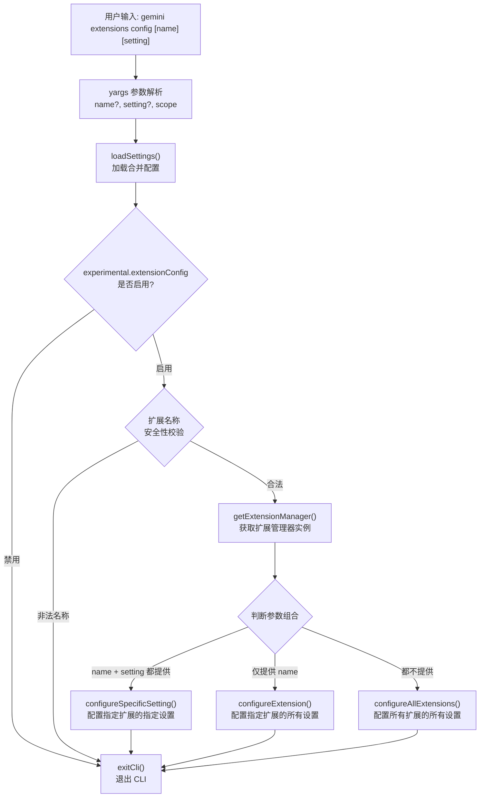

# configure.ts

## 概述

`configure.ts` 实现了 `gemini extensions config [name] [setting]` 子命令，用于**配置扩展的设置项**。该命令支持三种粒度的配置操作：配置某个扩展的某个具体设置项、配置某个扩展的所有设置项、以及配置所有已安装扩展的所有设置项。配置值可以存储在 `user`（用户级）或 `workspace`（工作区级）两个作用域中。

## 架构图（Mermaid）



## 核心组件

### 1. `ConfigureArgs` 接口

定义命令的参数类型：

```typescript
interface ConfigureArgs {
  name?: string;     // 扩展名称（可选位置参数）
  setting?: string;  // 具体设置项名称或环境变量名（可选位置参数）
  scope: string;     // 作用域: 'user' | 'workspace'，默认 'user'
}
```

### 2. `configureCommand: CommandModule<object, ConfigureArgs>`

导出的 yargs 命令模块。

| 属性 | 值 | 说明 |
|------|------|------|
| `command` | `'config [name] [setting]'` | 命令格式，name 和 setting 都是可选的位置参数 |
| `describe` | `'Configure extension settings.'` | 命令描述 |

### 3. `builder` 函数

配置 yargs 解析规则：

- **位置参数 `name`**：扩展名称，类型为 string，可选。
- **位置参数 `setting`**：具体设置项的名称或环境变量名，类型为 string，可选。
- **选项 `--scope`**：设置的作用域，可选值为 `'user'` 和 `'workspace'`，默认为 `'user'`。

### 4. `handler` 函数

命令的核心执行逻辑，按以下流程处理：

#### 步骤 1：加载配置并检查功能开关

```typescript
const settings = loadSettings(process.cwd()).merged;
if (!(settings.experimental?.extensionConfig ?? true)) {
  // 功能被禁用，输出错误信息并退出
}
```

`extensionConfig` 是一个实验性功能开关。默认值为 `true`（启用）。只有当用户显式将 `experimental.extensionConfig` 设置为 `false` 时，此功能才会被禁用。

#### 步骤 2：扩展名称安全校验

```typescript
if (name.includes('/') || name.includes('\\') || name.includes('..')) {
  debugLogger.error('Invalid extension name...');
  return;
}
```

防止路径遍历攻击。扩展名称中不允许包含路径分隔符 (`/`、`\\`) 或上级目录引用 (`..`)。

#### 步骤 3：获取扩展管理器

通过 `getExtensionManager()` 创建并初始化 `ExtensionManager` 实例。该函数会：
- 使用当前工作目录作为工作区目录
- 加载已合并的配置
- 设置同意请求和设置项提示的回调
- 调用 `loadExtensions()` 加载所有已安装的扩展

#### 步骤 4：三级分支调度

根据 `name` 和 `setting` 参数的组合，分派到三种不同的配置函数：

| 条件 | 调用函数 | 说明 |
|------|---------|------|
| `name` 且 `setting` 都有值 | `configureSpecificSetting()` | 配置指定扩展的指定设置项 |
| 仅 `name` 有值 | `configureExtension()` | 交互式配置指定扩展的所有设置项 |
| 都没有值 | `configureAllExtensions()` | 交互式配置所有已安装扩展的所有设置项 |

## 依赖关系

### 内部依赖

| 模块路径 | 导入内容 | 用途 |
|---------|---------|------|
| `../../config/extensions/extensionSettings.js` | `ExtensionSettingScope`（类型导入） | 设置项作用域枚举类型 |
| `./utils.js` | `configureAllExtensions`, `configureExtension`, `configureSpecificSetting`, `getExtensionManager` | 配置操作的核心工具函数 |
| `../../config/settings.js` | `loadSettings` | 加载和合并用户/工作区/管理员配置 |
| `../utils.js` | `exitCli` | 安全退出 CLI 进程 |

### 外部依赖

| 包名 | 导入内容 | 用途 |
|------|---------|------|
| `yargs` | `CommandModule`（类型导入） | yargs 命令模块类型定义 |
| `@google/gemini-cli-core` | `coreEvents`, `debugLogger` | 核心事件系统（反馈输出）和调试日志 |

## 关键实现细节

### 作用域机制（Scope）

配置支持两个作用域：

- **`user` 作用域**（默认）：设置存储在用户级目录中，对所有项目生效。敏感值可能通过系统钥匙链（Keychain）安全存储。
- **`workspace` 作用域**：设置存储在当前工作区目录中，仅对当前项目生效。

当在 `user` 作用域下配置设置时，系统会检查 `workspace` 作用域中是否已有同名设置，并通过日志提示用户。如果当前作用域中已存在设置值，会通过交互式确认询问用户是否覆盖。

### 工具函数详解（utils.ts）

#### `getExtensionManager()`

创建 `ExtensionManager` 实例的工厂函数：
- 使用 `process.cwd()` 作为工作区目录
- 配置 `requestConsentNonInteractive` 作为同意请求回调
- 配置 `promptForSetting` 作为设置值输入回调
- 加载合并配置并传入
- 调用 `loadExtensions()` 加载所有扩展元数据

#### `configureSpecificSetting()`

配置单个设置项的流程：
1. 通过 `getExtensionAndManager()` 查找扩展
2. 加载扩展配置 (`loadExtensionConfig`)
3. 调用 `updateSetting()` 更新指定的设置项
4. 输出成功消息

#### `configureExtension()`

配置某扩展所有设置项的流程：
1. 查找扩展并加载其配置
2. 检查是否有可配置的设置项
3. 调用 `configureExtensionSettings()` 进行批量配置

#### `configureAllExtensions()`

遍历所有已安装扩展，对每个有设置项的扩展调用 `configureExtensionSettings()`。

#### `configureExtensionSettings()`

批量配置的核心逻辑：
1. 获取当前作用域下已有的设置值
2. 如果当前作用域是 `user`，同时获取 `workspace` 作用域的设置值用于提示
3. 遍历每个设置项：
   - 如果 `workspace` 作用域已有值，提示用户知晓
   - 如果当前作用域已有值，交互式询问是否覆盖
   - 调用 `updateSetting()` 写入新值

### 实验性功能保护

```typescript
if (!(settings.experimental?.extensionConfig ?? true)) { ... }
```

使用了空值合并运算符 `??`，当 `experimental.extensionConfig` 未定义时默认为 `true`（启用）。只有当显式设置为 `false` 时功能才被禁用。这是一种渐进发布策略——功能默认可用，但提供了禁用开关。

### 路径遍历防护

扩展名称中禁止包含 `/`、`\\` 和 `..`，防止攻击者通过构造恶意扩展名称来访问文件系统中的其他目录。这是一个重要的安全措施，因为扩展名称会被用于构造文件路径。
