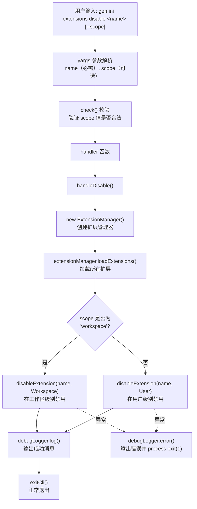

# disable.ts

## 概述

`disable.ts` 实现了 `gemini extensions disable <name>` 子命令，用于**禁用指定的已安装扩展**。禁用操作支持按作用域（`user` 或 `workspace`）进行，禁用后扩展仍然保留在系统中但不会被加载和执行。该文件导出了命令模块 `disableCommand` 以及可独立调用的核心处理函数 `handleDisable`，后者便于测试和程序化调用。

## 架构图（Mermaid）



## 核心组件

### 1. `DisableArgs` 接口

定义命令处理函数的参数类型：

```typescript
interface DisableArgs {
  name: string;     // 要禁用的扩展名称（必需）
  scope?: string;   // 作用域: 'user' | 'workspace'，可选
}
```

### 2. `handleDisable(args: DisableArgs)` 函数

**导出的异步函数**，封装了禁用扩展的核心逻辑。该函数独立于 yargs 框架，可以被直接调用（如在测试中）。

执行流程：

1. **创建 ExtensionManager 实例**：
   ```typescript
   const extensionManager = new ExtensionManager({
     workspaceDir,
     requestConsent: requestConsentNonInteractive,
     requestSetting: promptForSetting,
     settings: loadSettings(workspaceDir).merged,
   });
   ```
   - `workspaceDir`：使用 `process.cwd()` 获取当前工作目录
   - `requestConsent`：使用非交互式同意请求（因为这是 CLI 命令场景）
   - `requestSetting`：使用终端提示方式请求设置值
   - `settings`：加载并合并后的配置

2. **加载扩展**：调用 `extensionManager.loadExtensions()` 加载所有已安装的扩展信息。

3. **执行禁用操作**：
   - 如果 `scope` 为 `'workspace'`（不区分大小写），调用 `disableExtension(name, SettingScope.Workspace)`
   - 否则默认调用 `disableExtension(name, SettingScope.User)`

4. **结果处理**：
   - 成功：通过 `debugLogger.log()` 输出成功消息
   - 失败：通过 `debugLogger.error()` 输出错误消息，并以退出码 1 终止进程

### 3. `disableCommand: CommandModule`

导出的 yargs 命令模块。

| 属性 | 值 | 说明 |
|------|------|------|
| `command` | `'disable [--scope] <name>'` | 命令格式，name 为必需参数 |
| `describe` | `'Disables an extension.'` | 命令描述 |

### 4. `builder` 函数

配置 yargs 解析规则：

- **位置参数 `name`**（必需）：要禁用的扩展名称，类型为 string。
- **选项 `--scope`**（可选）：禁用的作用域，类型为 string，默认值为 `SettingScope.User`（即 `'User'`）。
- **自定义校验 `check()`**：验证 `scope` 参数的值是否为 `SettingScope` 枚举中的合法值之一（不区分大小写）。如果非法，抛出包含所有合法值列表的错误消息。

### 5. `handler` 函数

作为 `handleDisable` 的薄包装层：
1. 从 `argv` 中提取 `name` 和 `scope` 参数
2. 调用 `handleDisable()`
3. 调用 `exitCli()` 确保进程正常退出

## 依赖关系

### 内部依赖

| 模块路径 | 导入内容 | 用途 |
|---------|---------|------|
| `../../config/settings.js` | `loadSettings`, `SettingScope` | 加载合并配置、作用域枚举 |
| `../../config/extension-manager.js` | `ExtensionManager` | 扩展管理器类，负责扩展的增删改查 |
| `../../config/extensions/consent.js` | `requestConsentNonInteractive` | 非交互式用户同意请求回调 |
| `../../config/extensions/extensionSettings.js` | `promptForSetting` | 交互式设置值输入提示 |
| `../utils.js` | `exitCli` | 安全退出 CLI 进程 |

### 外部依赖

| 包名 | 导入内容 | 用途 |
|------|---------|------|
| `yargs` | `CommandModule`（类型导入） | yargs 命令模块类型定义 |
| `@google/gemini-cli-core` | `debugLogger`, `getErrorMessage` | 调试日志输出、错误信息提取工具 |

## 关键实现细节

### 作用域（Scope）枚举

`SettingScope` 枚举定义在 `../../config/settings.ts` 中：

```typescript
enum SettingScope {
  User = 'User',
  Workspace = 'Workspace',
  System = 'System',
  SystemDefaults = 'SystemDefaults',
  Session = 'Session',
}
```

`disable` 命令仅使用 `User` 和 `Workspace` 两个作用域：
- **User（用户级）**：禁用设置存储在用户主目录下的配置文件中，影响所有工作区
- **Workspace（工作区级）**：禁用设置存储在当前项目目录中，仅影响当前工作区

### `handleDisable` 的设计意图

`handleDisable` 被单独导出为命名函数而非匿名 handler，这是一种有意的架构设计：
- **可测试性**：可以直接在单元测试中调用，无需通过 yargs 模拟命令行参数
- **可复用性**：其他代码路径可以直接调用此函数来禁用扩展
- **关注点分离**：参数解析（yargs）与业务逻辑（handleDisable）解耦

### 大小写不敏感的 Scope 校验

```typescript
.check((argv) => {
  if (
    argv.scope &&
    !Object.values(SettingScope)
      .map((s) => s.toLowerCase())
      .includes(argv.scope.toLowerCase())
  ) {
    throw new Error(`Invalid scope: ${argv.scope}. Please use one of ...`);
  }
  return true;
})
```

校验逻辑将所有枚举值和用户输入都转换为小写后再比较，这意味着用户可以输入 `user`、`User`、`USER` 等任意大小写组合。但 `handleDisable` 内部的比较使用 `args.scope?.toLowerCase() === 'workspace'`，也是大小写不敏感的。

### 错误处理策略

该命令采用了**双层错误处理**：
1. **参数校验层**（builder 中的 `check()`）：在命令执行前拦截无效参数，由 yargs 框架处理错误展示
2. **业务逻辑层**（handleDisable 中的 try-catch）：捕获 `disableExtension()` 可能抛出的异常（如扩展不存在），通过 `debugLogger.error()` 输出并以 `process.exit(1)` 退出

注意：在业务逻辑层的错误处理中使用了 `process.exit(1)` 直接退出，而非 `exitCli()`。这意味着错误场景下可能跳过一些清理逻辑。这与成功路径中使用 `exitCli()` 不同。
