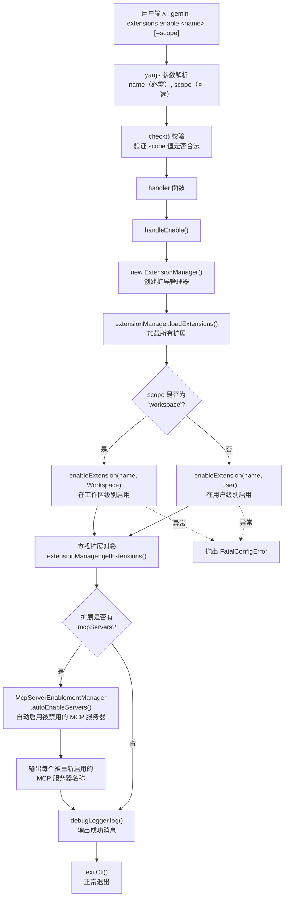

# enable.ts

## 概述

`enable.ts` 实现了 `gemini extensions enable <name>` 子命令，用于**启用指定的扩展**。与 `disable` 命令对称，该命令支持按作用域（`user` 或 `workspace`）启用扩展。**重要的差异点**：`enable` 命令除了启用扩展本身之外，还会自动启用该扩展所关联的所有被禁用的 MCP（Model Context Protocol）服务器，确保扩展启用后其所有依赖的 MCP 服务可以在下次会话中正常加载。此外，错误处理方式也与 `disable` 不同，使用 `FatalConfigError` 抛出异常而非直接 `process.exit(1)`。

## 架构图（Mermaid）



## 核心组件

### 1. `EnableArgs` 接口

定义命令处理函数的参数类型：

```typescript
interface EnableArgs {
  name: string;     // 要启用的扩展名称（必需）
  scope?: string;   // 作用域（可选），未指定时启用所有作用域
}
```

### 2. `handleEnable(args: EnableArgs)` 函数

**导出的异步函数**，封装了启用扩展的核心逻辑。

执行流程：

#### 步骤 1：创建并初始化扩展管理器

```typescript
const extensionManager = new ExtensionManager({
  workspaceDir: workingDir,
  requestConsent: requestConsentNonInteractive,
  requestSetting: promptForSetting,
  settings: loadSettings(workingDir).merged,
});
await extensionManager.loadExtensions();
```

与 `disable` 命令相同的初始化模式。

#### 步骤 2：执行启用操作

根据 `scope` 参数路由到对应的作用域：
- `scope` 为 `'workspace'`（不区分大小写）：使用 `SettingScope.Workspace`
- 其他情况：使用 `SettingScope.User`

#### 步骤 3：自动启用关联的 MCP 服务器

这是 `enable` 命令区别于 `disable` 命令的**核心差异功能**：

```typescript
const extension = extensionManager
  .getExtensions()
  .find((e) => e.name === args.name);

if (extension?.mcpServers) {
  const mcpEnablementManager = McpServerEnablementManager.getInstance();
  const enabledServers = await mcpEnablementManager.autoEnableServers(
    Object.keys(extension.mcpServers ?? {}),
  );

  for (const serverName of enabledServers) {
    debugLogger.log(`MCP server '${serverName}' was disabled - now enabled.`);
  }
}
```

流程说明：
1. 在已加载的扩展列表中查找刚启用的扩展
2. 检查该扩展是否定义了 `mcpServers` 属性
3. 如果有，获取 `McpServerEnablementManager` 单例
4. 调用 `autoEnableServers()` 传入扩展的所有 MCP 服务器名称
5. 对每个被重新启用的服务器输出日志

**注意**：代码注释明确说明 "No restartServer() - CLI exits immediately, servers load on next session"，即 MCP 服务器不会在当前命令中重启，而是在下次启动 Gemini CLI 会话时自动加载。

#### 步骤 4：输出成功消息

根据是否指定了 `scope` 参数输出不同的成功消息：
- 指定了 scope：`Extension "xxx" successfully enabled for scope "xxx".`
- 未指定 scope：`Extension "xxx" successfully enabled in all scopes.`

#### 步骤 5：错误处理

```typescript
catch (error) {
  throw new FatalConfigError(getErrorMessage(error));
}
```

与 `disable` 命令的 `process.exit(1)` 不同，`enable` 命令抛出 `FatalConfigError` 异常。这允许上层调用者捕获和处理错误，是更符合结构化错误处理的方式。

### 3. `enableCommand: CommandModule`

导出的 yargs 命令模块。

| 属性 | 值 | 说明 |
|------|------|------|
| `command` | `'enable [--scope] <name>'` | 命令格式，name 为必需参数 |
| `describe` | `'Enables an extension.'` | 命令描述 |

### 4. `builder` 函数

配置 yargs 解析规则：

- **位置参数 `name`**（必需）：要启用的扩展名称，类型为 string。
- **选项 `--scope`**（可选）：启用的作用域，类型为 string，**无默认值**（与 `disable` 命令的 `default: SettingScope.User` 不同）。描述文字为："The scope to enable the extension in. If not set, will be enabled in all scopes."
- **自定义校验 `check()`**：与 `disable` 相同的大小写不敏感 scope 值校验。

### 5. `handler` 函数

从 `argv` 提取参数，调用 `handleEnable()`，最后调用 `exitCli()` 正常退出。

## 依赖关系

### 内部依赖

| 模块路径 | 导入内容 | 用途 |
|---------|---------|------|
| `../../config/settings.js` | `loadSettings`, `SettingScope` | 加载合并配置、作用域枚举 |
| `../../config/extensions/consent.js` | `requestConsentNonInteractive` | 非交互式用户同意请求回调 |
| `../../config/extension-manager.js` | `ExtensionManager` | 扩展管理器类 |
| `../../config/extensions/extensionSettings.js` | `promptForSetting` | 交互式设置值输入提示 |
| `../utils.js` | `exitCli` | 安全退出 CLI 进程 |
| `../../config/mcp/mcpServerEnablement.js` | `McpServerEnablementManager` | MCP 服务器启用状态管理器 |

### 外部依赖

| 包名 | 导入内容 | 用途 |
|------|---------|------|
| `yargs` | `CommandModule`（类型导入） | yargs 命令模块类型定义 |
| `@google/gemini-cli-core` | `debugLogger`, `FatalConfigError`, `getErrorMessage` | 调试日志、致命配置错误类、错误信息提取 |

## 关键实现细节

### enable 与 disable 的关键差异

虽然 `enable.ts` 和 `disable.ts` 结构相似，但存在几个重要差异：

| 维度 | enable | disable |
|------|--------|---------|
| **MCP 服务器处理** | 自动启用关联的 MCP 服务器 | 无 MCP 相关处理 |
| **scope 默认值** | 无默认值（未指定 = 所有作用域） | 默认 `SettingScope.User` |
| **错误处理** | 抛出 `FatalConfigError` | `process.exit(1)` |
| **成功消息** | 区分"指定 scope"和"所有 scope"两种消息 | 始终包含 scope 信息 |
| **额外依赖** | `McpServerEnablementManager`, `FatalConfigError` | 无额外依赖 |

### MCP 服务器自动启用机制

当扩展包含 MCP 服务器定义时（`extension.mcpServers` 不为空），启用扩展会自动启用所有关联的被禁用的 MCP 服务器。这是因为：

1. 扩展可能在被禁用时，其关联的 MCP 服务器也被禁用了
2. 用户重新启用扩展时，期望扩展的所有功能都恢复正常
3. `autoEnableServers()` 只会启用之前被禁用的服务器，已启用的不受影响

`McpServerEnablementManager` 使用**单例模式** (`getInstance()`)，确保全局只有一个管理实例。

### Scope 的语义差异

在 `enable` 命令中，`scope` 参数的语义更加灵活：
- **指定 scope**：仅在指定的作用域中启用扩展
- **不指定 scope**：在所有作用域中启用扩展（这一点从成功消息 "successfully enabled in all scopes" 可以推断）

而 `disable` 命令的 `scope` 有默认值 `User`，不指定时默认在用户级别禁用。

### FatalConfigError vs process.exit(1)

`enable` 使用 `FatalConfigError`（一种结构化异常类）而非 `process.exit(1)`，优点包括：
- 异常可被上层 try-catch 捕获和处理
- 保留完整的错误栈信息
- 更符合 Node.js 的错误处理最佳实践
- 框架层可以统一处理 `FatalConfigError`，执行清理操作后再退出
