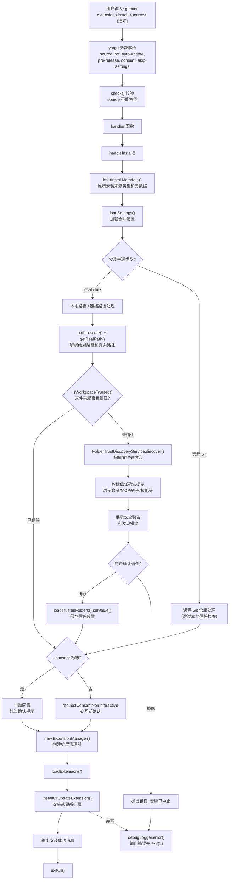

# install.ts

## 概述

`install.ts` 实现了 `gemini extensions install <source>` 子命令，用于**从 Git 仓库 URL 或本地路径安装扩展**。这是扩展管理系统中最复杂的子命令之一，包含完整的安全信任链验证机制：对本地路径来源的扩展进行文件夹信任检查与发现审计，对远程来源的扩展显示安全风险确认提示。安装完成后扩展自动启用。

## 架构图（Mermaid）



## 核心组件

### 1. `InstallArgs` 接口

定义命令处理函数的参数类型：

```typescript
interface InstallArgs {
  source: string;           // 安装来源（Git URL 或本地路径），必需
  ref?: string;             // Git 引用（分支、标签、commit hash）
  autoUpdate?: boolean;     // 是否启用自动更新
  allowPreRelease?: boolean; // 是否允许预发布版本
  consent?: boolean;        // 是否预先同意安全风险（跳过确认提示）
  skipSettings?: boolean;   // 是否跳过安装后的配置流程
}
```

### 2. `handleInstall(args: InstallArgs)` 函数

**导出的异步函数**，封装了安装扩展的完整逻辑。这是所有扩展子命令中最复杂的 handler。

#### 阶段 1：推断安装元数据

```typescript
const installMetadata = await inferInstallMetadata(source, {
  ref: args.ref,
  autoUpdate: args.autoUpdate,
  allowPreRelease: args.allowPreRelease,
});
```

`inferInstallMetadata()` 根据 `source` 字符串自动推断安装来源类型（`local`、`link`、`git` 等）以及相关的元数据。这个函数定义在 `../../config/extension-manager.js` 中。

#### 阶段 2：本地路径信任验证

当安装来源为本地路径（`type === 'local'` 或 `type === 'link'`）时，需要进行文件夹信任验证：

1. **路径解析**：
   ```typescript
   const absolutePath = path.resolve(source);
   const realPath = getRealPath(absolutePath);
   installMetadata.source = absolutePath;
   ```
   将相对路径转换为绝对路径，并通过 `getRealPath()` 解析符号链接得到真实路径。

2. **信任检查**：调用 `isWorkspaceTrusted()` 检查路径是否已被信任。

3. **文件夹发现扫描**（仅未信任时执行）：
   ```typescript
   const discoveryResults = await FolderTrustDiscoveryService.discover(realPath);
   ```
   扫描文件夹中包含的内容，包括：
   - `commands`：自定义命令
   - `mcps`：MCP 服务器
   - `hooks`：钩子
   - `skills`：技能
   - `agents`：代理
   - `settings`：设置覆盖
   - `discoveryErrors`：扫描过程中的错误
   - `securityWarnings`：安全警告

4. **构建并展示信任提示**：使用 `chalk` 库格式化丰富的彩色终端输出，包含：
   - 粗体的信任确认标题
   - 未信任路径的说明
   - 信任含义的解释（可能执行代码、改变 CLI 行为）
   - 发现错误（红色）
   - 安全警告（黄色）
   - 文件夹内容清单（分组展示各类资源及数量）
   - 最终确认提示（黄色）

5. **用户确认与信任保存**：
   ```typescript
   const confirmed = await promptForConsentNonInteractive(promptLines.join('\n'), false);
   if (confirmed) {
     const trustedFolders = loadTrustedFolders();
     await trustedFolders.setValue(realPath, TrustLevel.TRUST_FOLDER);
   } else {
     throw new Error(`Installation aborted: Folder "${absolutePath}" is not trusted.`);
   }
   ```

#### 阶段 3：安全同意处理

```typescript
const requestConsent = args.consent
  ? () => Promise.resolve(true)
  : requestConsentNonInteractive;
```

如果用户传了 `--consent` 标志，则跳过交互式确认，自动同意；否则使用 `requestConsentNonInteractive` 进行交互式确认。使用 `--consent` 时会输出安全警告消息 `INSTALL_WARNING_MESSAGE`。

#### 阶段 4：执行安装

```typescript
const extensionManager = new ExtensionManager({
  workspaceDir,
  requestConsent,
  requestSetting: args.skipSettings ? null : promptForSetting,
  settings,
});
await extensionManager.loadExtensions();
const extension = await extensionManager.installOrUpdateExtension(installMetadata);
```

关键细节：
- `requestSetting`：如果 `--skip-settings` 为 `true`，传入 `null` 跳过安装后的配置流程；否则使用 `promptForSetting` 进行交互式配置
- `installOrUpdateExtension()`：核心安装方法，如果扩展已存在则执行更新

#### 阶段 5：结果处理

成功时输出安装成功消息，失败时通过 `debugLogger.error()` 输出错误并 `process.exit(1)` 退出。

### 3. `installCommand: CommandModule`

导出的 yargs 命令模块。

| 属性 | 值 | 说明 |
|------|------|------|
| `command` | `'install <source> [--auto-update] [--pre-release]'` | 命令格式，source 为必需参数 |
| `describe` | `'Installs an extension from a git repository URL or a local path.'` | 命令描述 |

### 4. `builder` 函数

配置 yargs 解析规则：

| 参数/选项 | 类型 | 必需 | 默认值 | 说明 |
|-----------|------|------|--------|------|
| `source`（位置参数） | string | 是 | - | Git 仓库 URL 或本地路径 |
| `--ref` | string | 否 | - | 指定安装的 Git 引用（分支/标签/commit） |
| `--auto-update` | boolean | 否 | - | 启用自动更新 |
| `--pre-release` | boolean | 否 | - | 允许安装预发布版本 |
| `--consent` | boolean | 否 | `false` | 预先同意安全风险，跳过确认提示 |
| `--skip-settings` | boolean | 否 | `false` | 跳过安装后的配置流程 |

自定义校验：确保 `source` 参数不为空。

### 5. `handler` 函数

从 `argv` 提取所有参数（包括驼峰命名转换：`auto-update` -> `autoUpdate`），调用 `handleInstall()`，最后调用 `exitCli()`。

## 依赖关系

### 内部依赖

| 模块路径 | 导入内容 | 用途 |
|---------|---------|------|
| `../../config/extensions/consent.js` | `INSTALL_WARNING_MESSAGE`, `promptForConsentNonInteractive`, `requestConsentNonInteractive` | 安装警告消息文本、交互式同意确认函数 |
| `../../config/extension-manager.js` | `ExtensionManager`, `inferInstallMetadata` | 扩展管理器类、安装元数据推断函数 |
| `../../config/settings.js` | `loadSettings` | 加载合并配置 |
| `../../config/trustedFolders.js` | `isWorkspaceTrusted`, `loadTrustedFolders`, `TrustLevel` | 文件夹信任状态检查、加载/保存信任列表、信任级别枚举 |
| `../../config/extensions/extensionSettings.js` | `promptForSetting` | 交互式设置值输入提示 |
| `../utils.js` | `exitCli` | 安全退出 CLI 进程 |

### 外部依赖

| 包名 | 导入内容 | 用途 |
|------|---------|------|
| `yargs` | `CommandModule`（类型导入） | yargs 命令模块类型定义 |
| `node:path` | `path`（全量导入） | 路径解析（`path.resolve()`） |
| `chalk` | `chalk`（默认导入） | 终端彩色文本输出（粗体、红色、黄色） |
| `@google/gemini-cli-core` | `debugLogger`, `FolderTrustDiscoveryService`, `getRealPath`, `getErrorMessage` | 调试日志、文件夹信任发现服务、真实路径解析、错误消息提取 |

## 关键实现细节

### 多层安全机制

`install` 命令实现了**两层独立的安全确认机制**：

1. **文件夹信任层**（仅本地路径）：
   - 检查本地路径是否在已信任列表中
   - 如果不受信任，扫描文件夹内容并详细展示给用户
   - 用户确认后将路径加入信任列表

2. **安装同意层**（所有来源）：
   - 通过 `requestConsent` 回调展示安装风险警告
   - 可通过 `--consent` 标志跳过（适用于自动化场景）

这种分层设计确保：
- 本地路径需要同时通过信任验证和安装同意
- 远程仓库只需通过安装同意
- 自动化脚本可以通过 `--consent` 标志跳过交互

### FolderTrustDiscoveryService 的发现结果展示

发现结果使用分组展示策略，每组包含标签和数量：

```
This folder contains:
  * Commands (3):
    - command1
    - command2
    - command3
  * MCP Servers (1):
    - server1
  * Hooks (2):
    - hook1
    - hook2
```

空组（无内容的类别）会被 `.filter((g) => g.items.length > 0)` 过滤掉，不会展示。

### installOrUpdateExtension 的幂等性

`extensionManager.installOrUpdateExtension(installMetadata)` 方法名暗示了幂等行为：
- 如果扩展尚未安装，执行安装
- 如果扩展已安装，执行更新
- 安装成功后扩展自动启用

### requestSetting 的条件传入

```typescript
requestSetting: args.skipSettings ? null : promptForSetting,
```

当 `--skip-settings` 为 `true` 时，传入 `null` 而非回调函数。`ExtensionManager` 会检查此值，如果为 `null` 则跳过安装后的配置流程。这在 CI/CD 或自动化安装场景中非常有用，避免交互式提示阻塞流程。

### 符号链接的处理

```typescript
const absolutePath = path.resolve(source);
const realPath = getRealPath(absolutePath);
installMetadata.source = absolutePath;
```

注意这里同时使用了 `absolutePath`（可能包含符号链接）和 `realPath`（解析后的真实路径）：
- `absolutePath` 被存储为安装元数据的 source，保留用户原始指定的路径
- `realPath` 被用于文件夹信任发现和信任保存，确保信任关系基于真实的文件系统位置

这种设计避免了通过符号链接绕过信任检查的安全漏洞。

### chalk 的使用

安装命令大量使用 `chalk` 库来增强终端输出的可读性：
- `chalk.bold()`：粗体文本，用于标题和重点
- `chalk.red()`：红色文本，用于发现错误
- `chalk.yellow()`：黄色文本，用于安全警告和确认提示

这是所有扩展子命令中唯一直接使用 `chalk` 的文件，体现了 install 命令对用户交互体验的更高要求。
