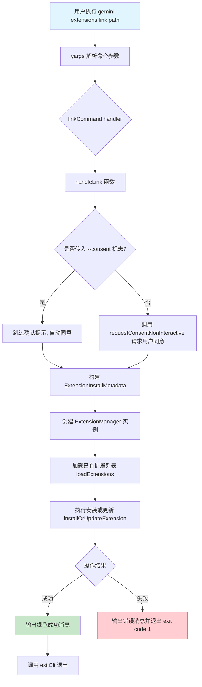

# link.ts

## 概述

`link.ts` 实现了 Gemini CLI 扩展系统中的 **本地链接（link）** 命令。该命令允许用户将本地文件系统路径上的扩展链接到 CLI 中，与常规安装不同的是，链接方式会实时反映本地路径中的更改，非常适合扩展开发阶段使用。

该文件导出两个核心成员：
- `handleLink` 异步函数：执行链接逻辑的核心处理器
- `linkCommand` 对象：符合 yargs `CommandModule` 接口的命令定义

## 架构图（Mermaid）



## 核心组件

### 1. `InstallArgs` 接口

```typescript
interface InstallArgs {
  path: string;
  consent?: boolean;
}
```

定义了 `handleLink` 函数所需的参数类型：
- **`path`**（必填）：本地扩展的文件系统路径，作为 yargs 的位置参数（positional argument）传入。
- **`consent`**（可选）：布尔值，若为 `true` 则跳过安全风险确认提示，直接同意安装。

### 2. `handleLink(args: InstallArgs)` 异步函数

这是链接命令的核心业务逻辑处理器。执行流程如下：

1. **构建安装元数据**：创建 `ExtensionInstallMetadata` 对象，将 `source` 设为用户指定的路径，`type` 设为 `'link'`（而非 `'install'`），标识这是一个符号链接式安装。

2. **处理用户同意逻辑**：
   - 若 `args.consent` 为 `true`，则创建一个始终返回 `true` 的 Promise 函数，同时在调试日志中输出安装警告信息 `INSTALL_WARNING_MESSAGE`。
   - 若未传入 `consent`，则使用 `requestConsentNonInteractive` 函数以非交互方式请求用户同意。

3. **初始化 ExtensionManager**：以当前工作目录（`process.cwd()`）为基准，创建 `ExtensionManager` 实例，传入同意回调、设置提示回调以及合并后的全局设置。

4. **加载并安装扩展**：先调用 `loadExtensions()` 加载已有扩展，再调用 `installOrUpdateExtension(installMetadata)` 执行实际的链接操作。

5. **结果反馈**：成功时输出绿色提示信息；失败时通过 `getErrorMessage` 提取错误信息并以 `process.exit(1)` 退出。

### 3. `linkCommand: CommandModule` 对象

yargs 命令模块定义，结构如下：

| 属性 | 值 | 说明 |
|------|-----|------|
| `command` | `'link <path>'` | 命令格式，`<path>` 为必填位置参数 |
| `describe` | `'Links an extension from a local path...'` | 命令描述 |
| `builder` | 函数 | 配置 yargs 参数：`path`（位置参数，string）和 `--consent`（可选，boolean，默认 false） |
| `handler` | 异步函数 | 解析 argv 后调用 `handleLink`，然后调用 `exitCli()` 清理退出 |

`builder` 中的 `.check((_) => true)` 是一个始终通过的验证器，确保 yargs 的校验链不会中断。

## 依赖关系

### 内部依赖

| 模块路径 | 导入内容 | 用途 |
|----------|----------|------|
| `@google/gemini-cli-core` | `debugLogger`, `getErrorMessage`, `ExtensionInstallMetadata` | 调试日志输出、错误消息提取、扩展安装元数据类型 |
| `../../config/extensions/consent.js` | `INSTALL_WARNING_MESSAGE`, `requestConsentNonInteractive` | 安装警告文本、非交互式同意请求函数 |
| `../../config/extension-manager.js` | `ExtensionManager` | 扩展管理器，负责加载/安装/更新扩展 |
| `../../config/settings.js` | `loadSettings` | 加载项目与全局合并设置 |
| `../../config/extensions/extensionSettings.js` | `promptForSetting` | 提示用户输入扩展所需配置项 |
| `../utils.js` | `exitCli` | CLI 退出清理函数 |

### 外部依赖

| 包名 | 导入内容 | 用途 |
|------|----------|------|
| `yargs` | `CommandModule`（类型） | yargs 命令模块类型定义 |
| `chalk` | `chalk` | 终端文本着色（成功消息使用绿色） |

## 关键实现细节

1. **链接 vs 安装的区别**：`type: 'link'` 元数据标记使得 `ExtensionManager` 知道这是一个符号链接式安装。链接的扩展会实时反映源路径中的文件变更，无需重新安装，这对开发者调试扩展非常有用。

2. **同意机制的双模式设计**：
   - **自动同意模式**（`--consent` 标志）：适用于 CI/CD 管道或脚本化场景，用户预先确认安全风险。
   - **非交互式请求模式**（默认）：通过 `requestConsentNonInteractive` 向用户展示安全警告并请求确认。

3. **工作目录感知**：`ExtensionManager` 使用 `process.cwd()` 作为工作区目录，意味着扩展的链接操作与当前工作目录相关联，设置也从该目录加载。

4. **错误处理策略**：整个 `handleLink` 函数体被 try-catch 包裹。捕获到任何错误后，通过 `getErrorMessage` 安全提取错误信息（处理非 Error 类型的抛出值），然后以非零退出码终止进程。

5. **退出机制**：`handler` 在 `handleLink` 完成后调用 `exitCli()`，确保所有异步资源和连接得到正确清理后再退出 CLI 进程。
