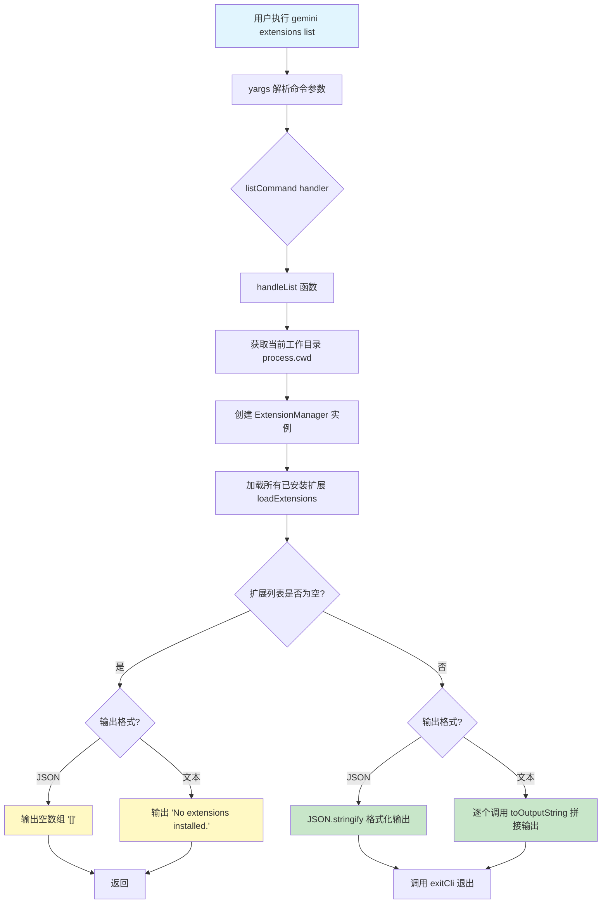

# list.ts

## 概述

`list.ts` 实现了 Gemini CLI 扩展系统中的 **列出扩展（list）** 命令。该命令用于列出当前工作区中所有已安装的扩展信息，支持两种输出格式：人类可读的文本格式和机器可解析的 JSON 格式。

该文件导出两个核心成员：
- `handleList` 异步函数：列出扩展的核心处理逻辑
- `listCommand` 对象：符合 yargs `CommandModule` 接口的命令定义

## 架构图（Mermaid）



## 核心组件

### 1. `handleList(options?)` 异步函数

这是列出扩展命令的核心业务逻辑处理器。

**参数类型：**

```typescript
options?: {
  outputFormat?: 'text' | 'json';
}
```

- **`outputFormat`**（可选）：控制输出格式，可选值为 `'text'`（默认）或 `'json'`。

**执行流程：**

1. **初始化 ExtensionManager**：获取当前工作目录，创建 `ExtensionManager` 实例，传入非交互式同意回调、设置提示回调和合并后的全局设置。

2. **加载扩展列表**：调用 `extensionManager.loadExtensions()` 获取所有已安装的扩展数组。

3. **处理空列表**：
   - JSON 格式：输出 `[]`（空 JSON 数组字符串）。
   - 文本格式：输出 `'No extensions installed.'` 提示信息。
   - 处理完后直接 `return`，不再继续执行。

4. **格式化输出**：
   - **JSON 格式**：使用 `JSON.stringify(extensions, null, 2)` 将扩展对象数组序列化为带缩进的 JSON 字符串。
   - **文本格式**：对每个扩展调用 `extensionManager.toOutputString(extension)` 方法生成人类可读的字符串表示，各扩展之间以双换行符 `\n\n` 分隔。

5. **错误处理**：整体 try-catch 捕获异常，通过 `getErrorMessage` 提取错误消息并以 `process.exit(1)` 退出。

### 2. `listCommand: CommandModule` 对象

yargs 命令模块定义：

| 属性 | 值 | 说明 |
|------|-----|------|
| `command` | `'list'` | 命令名称，无位置参数 |
| `describe` | `'Lists installed extensions.'` | 命令描述 |
| `builder` | 函数 | 配置 `--output-format` / `-o` 选项，可选 `text` 或 `json`，默认 `text` |
| `handler` | 异步函数 | 解析 argv 后调用 `handleList`，然后调用 `exitCli()` 退出 |

**命令行选项详情：**

| 选项 | 别名 | 类型 | 可选值 | 默认值 | 说明 |
|------|------|------|--------|--------|------|
| `--output-format` | `-o` | `string` | `text`, `json` | `text` | 控制 CLI 输出格式 |

## 依赖关系

### 内部依赖

| 模块路径 | 导入内容 | 用途 |
|----------|----------|------|
| `@google/gemini-cli-core` | `debugLogger`, `getErrorMessage` | 调试日志输出、错误消息安全提取 |
| `../../config/extension-manager.js` | `ExtensionManager` | 扩展管理器，负责加载扩展并提供格式化输出方法 |
| `../../config/extensions/consent.js` | `requestConsentNonInteractive` | 非交互式同意请求函数（创建 ExtensionManager 时需要） |
| `../../config/settings.js` | `loadSettings` | 加载项目与全局合并设置 |
| `../../config/extensions/extensionSettings.js` | `promptForSetting` | 提示用户输入扩展所需配置项 |
| `../utils.js` | `exitCli` | CLI 退出清理函数 |

### 外部依赖

| 包名 | 导入内容 | 用途 |
|------|----------|------|
| `yargs` | `CommandModule`（类型） | yargs 命令模块类型定义 |

## 关键实现细节

1. **双格式输出设计**：该命令支持 `text` 和 `json` 两种输出格式，文本格式适合人类阅读和终端展示，JSON 格式适合脚本集成和程序化处理（例如管道传输给 `jq` 工具或被其他脚本解析）。

2. **空列表的特殊处理**：当没有安装任何扩展时，命令不会报错，而是输出友好的提示信息。JSON 模式下输出有效的空数组 `[]` 保证了下游 JSON 解析器不会出错。

3. **`toOutputString` 方法委托**：文本格式的渲染逻辑并不在 `list.ts` 中实现，而是委托给了 `ExtensionManager.toOutputString()` 方法。这种设计将展示逻辑与管理逻辑封装在一起，使得扩展的字符串表示在整个系统中保持一致。

4. **`map` 回调中的未使用参数**：`extensions.map((extension, _): string => ...)` 中的第二个参数 `_` 是索引值，当前未使用，以下划线命名遵循 TypeScript 的惯例。

5. **无需同意确认**：与 `link`/`install` 等修改性命令不同，`list` 命令仅读取扩展信息，不需要用户的安全确认。但 `ExtensionManager` 构造函数要求传入 `requestConsent` 回调，因此这里传入了 `requestConsentNonInteractive` 作为占位。

6. **JSON 美化输出**：`JSON.stringify(extensions, null, 2)` 使用 2 空格缩进，确保输出的 JSON 具有良好的可读性。
