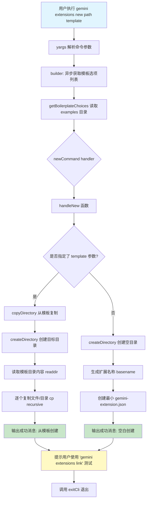

# new.ts

## 概述

`new.ts` 实现了 Gemini CLI 扩展系统中的 **新建扩展（new）** 命令。该命令帮助开发者快速创建新的扩展项目骨架，支持两种模式：

1. **从模板创建**：从内置的样板示例（boilerplate examples）目录复制完整的扩展模板。
2. **空白创建**：仅创建目录和最小化的 `gemini-extension.json` 清单文件。

该文件导出一个核心成员：
- `newCommand` 对象：符合 yargs `CommandModule` 接口的命令定义

内部还包含多个辅助函数：`pathExists`、`createDirectory`、`copyDirectory`、`handleNew`、`getBoilerplateChoices`。

## 架构图（Mermaid）



## 核心组件

### 1. `NewArgs` 接口

```typescript
interface NewArgs {
  path: string;
  template?: string;
}
```

- **`path`**（必填）：新扩展的目标创建路径。
- **`template`**（可选）：要使用的样板模板名称，对应 `examples` 目录下的子目录名。

### 2. 模块级常量

```typescript
const __filename = fileURLToPath(import.meta.url);
const __dirname = dirname(__filename);
const EXAMPLES_PATH = join(__dirname, 'examples');
```

由于 ESM 模块中没有 `__dirname` 全局变量，这里通过 `import.meta.url` 手动计算当前文件所在目录，进而定位到 `examples` 样板目录的绝对路径。

### 3. `pathExists(path: string)` 辅助函数

```typescript
async function pathExists(path: string): Promise<boolean>
```

使用 `fs/promises` 的 `access` 函数检查文件或目录是否存在。存在返回 `true`，不存在（抛出异常）返回 `false`。这是一种常见的 Node.js 文件存在性检查模式。

### 4. `createDirectory(path: string)` 辅助函数

```typescript
async function createDirectory(path: string): Promise<void>
```

创建目录前先检查路径是否已存在：
- **已存在**：抛出错误 `Path already exists: ${path}`，防止覆盖用户已有文件。
- **不存在**：调用 `mkdir(path, { recursive: true })` 递归创建目录结构。

### 5. `copyDirectory(template: string, path: string)` 辅助函数

```typescript
async function copyDirectory(template: string, path: string): Promise<void>
```

从模板创建扩展的核心逻辑：
1. 调用 `createDirectory(path)` 创建目标目录（含存在性检查）。
2. 拼接模板源路径 `EXAMPLES_PATH + template`。
3. 读取模板目录中所有条目。
4. 逐个使用 `cp(srcPath, destPath, { recursive: true })` 复制文件和子目录。

### 6. `handleNew(args: NewArgs)` 核心处理函数

根据是否提供 `template` 参数分为两条路径：

**有模板**：
- 调用 `copyDirectory(args.template, args.path)` 复制模板内容。
- 输出成功消息，说明是从哪个模板创建的。

**无模板（空白创建）**：
- 调用 `createDirectory(args.path)` 仅创建目录。
- 用 `basename(args.path)` 提取目录名作为扩展名称。
- 生成最小化的 `gemini-extension.json` 清单文件，内容为：
  ```json
  {
    "name": "扩展名称",
    "version": "1.0.0"
  }
  ```
- 输出成功消息。

两条路径最终都会输出一条提示，引导用户使用 `gemini extensions link <path>` 命令来测试新创建的扩展。

### 7. `getBoilerplateChoices()` 辅助函数

```typescript
async function getBoilerplateChoices(): Promise<string[]>
```

读取 `EXAMPLES_PATH` 目录，过滤出所有子目录（`entry.isDirectory()`），返回目录名数组。这些名称作为 yargs `template` 参数的 `choices` 选项，使用户只能选择有效的模板名称。

### 8. `newCommand: CommandModule` 对象

| 属性 | 值 | 说明 |
|------|-----|------|
| `command` | `'new <path> [template]'` | 命令格式，`<path>` 必填，`[template]` 可选 |
| `describe` | `'Create a new extension from a boilerplate example.'` | 命令描述 |
| `builder` | **异步**函数 | 动态获取模板列表作为 `template` 的 choices |
| `handler` | 异步函数 | 解析参数后调用 `handleNew`，然后 `exitCli()` |

**命令行参数详情：**

| 参数 | 类型 | 必填 | 说明 |
|------|------|------|------|
| `path` | `string` | 是（位置参数） | 新扩展的创建路径 |
| `template` | `string` | 否（位置参数） | 模板名称，可选值从 examples 目录动态获取 |

## 依赖关系

### 内部依赖

| 模块路径 | 导入内容 | 用途 |
|----------|----------|------|
| `@google/gemini-cli-core` | `debugLogger` | 调试日志输出（成功消息和提示信息） |
| `../utils.js` | `exitCli` | CLI 退出清理函数 |

### 外部依赖

| 包名 | 导入内容 | 用途 |
|------|----------|------|
| `node:fs/promises` | `access`, `cp`, `mkdir`, `readdir`, `writeFile` | 文件系统操作：存在性检查、复制、创建目录、读取目录、写入文件 |
| `node:path` | `join`, `dirname`, `basename` | 路径拼接、提取目录名、提取文件/目录基名 |
| `node:url` | `fileURLToPath` | 将 `import.meta.url` 的 file:// URL 转换为文件系统路径 |
| `yargs` | `CommandModule`（类型） | yargs 命令模块类型定义 |

## 关键实现细节

1. **ESM 兼容的 `__dirname` 模拟**：ESM 模块不提供 CommonJS 的 `__dirname` 和 `__filename` 全局变量。该文件通过 `fileURLToPath(import.meta.url)` 和 `dirname()` 手动实现等价功能，以定位与源文件同级的 `examples` 目录。

2. **异步 builder**：`newCommand.builder` 是一个 `async` 函数，在命令定义阶段就异步读取文件系统来获取可用模板列表。这意味着 yargs 在解析命令参数之前就需要访问文件系统，确保 `--help` 输出中能正确显示有效的模板选项。

3. **防覆盖保护**：`createDirectory` 在创建目录前通过 `pathExists` 检查路径是否已存在，若已存在则抛出明确错误，避免意外覆盖用户已有项目。

4. **最小清单文件**：空白创建模式生成的 `gemini-extension.json` 仅包含 `name` 和 `version` 两个字段，这是 Gemini 扩展清单的最小可行配置。扩展名称自动从路径的末级目录名推导。

5. **逐文件复制策略**：`copyDirectory` 不直接复制整个目录，而是读取模板目录条目后逐个复制。这种方式可以在未来扩展中更灵活地过滤或转换特定文件（例如替换模板变量），尽管当前实现是直接全量复制。

6. **开发者体验引导**：命令执行完成后会输出 `gemini extensions link <path>` 的使用提示，形成从"创建扩展"到"本地测试扩展"的自然工作流衔接。

7. **递归创建与复制**：`mkdir` 使用 `{ recursive: true }` 支持创建深层嵌套路径；`cp` 同样使用 `{ recursive: true }` 确保子目录也被完整复制。
