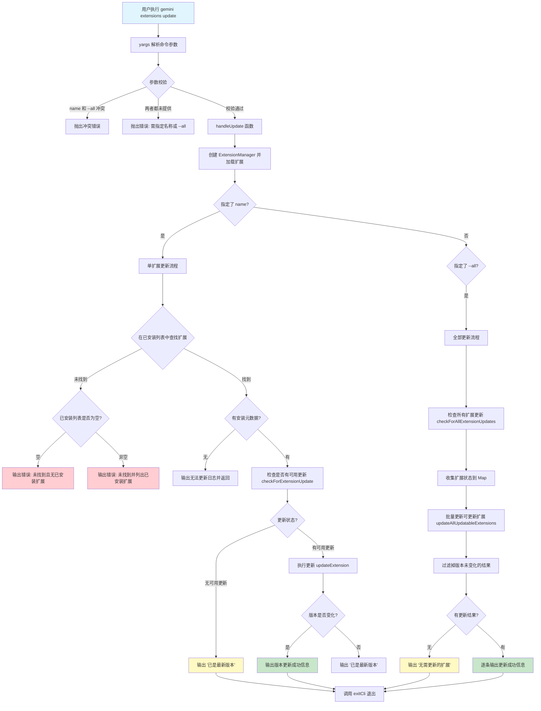

# update.ts

## 概述

`update.ts` 实现了 Gemini CLI 扩展系统中的 **更新扩展（update）** 命令。该命令支持两种更新模式：

1. **指定名称更新**：更新单个指定名称的扩展到最新版本。
2. **全部更新**：使用 `--all` 标志一次性检查并更新所有已安装的扩展。

该文件是扩展命令中逻辑最复杂的一个，涉及版本检查、状态管理、条件更新等多个环节。

该文件导出两个核心成员：
- `handleUpdate` 异步函数：更新逻辑的核心处理器
- `updateCommand` 对象：符合 yargs `CommandModule` 接口的命令定义

## 架构图（Mermaid）



## 核心组件

### 1. `UpdateArgs` 接口

```typescript
interface UpdateArgs {
  name?: string;
  all?: boolean;
}
```

- **`name`**（可选）：要更新的扩展名称。
- **`all`**（可选）：布尔值，为 `true` 时更新所有扩展。两个参数互斥。

### 2. `updateOutput` 格式化函数

```typescript
const updateOutput = (info: ExtensionUpdateInfo) =>
  `Extension "${info.name}" successfully updated: ${info.originalVersion} → ${info.updatedVersion}.`;
```

一个简洁的箭头函数，将 `ExtensionUpdateInfo` 对象格式化为可读的更新成功消息字符串，用于批量更新时的结果输出。使用了箭头符号 `→` 直观表示版本升级方向。

### 3. `handleUpdate(args: UpdateArgs)` 异步函数

这是更新命令的核心业务逻辑，分为两大独立分支：

#### 分支一：单扩展更新（`args.name` 存在时）

1. **查找扩展**：在已加载的扩展列表中按名称查找目标扩展。
2. **未找到处理**：
   - 若已安装扩展列表为空，通过 `coreEvents.emitFeedback('error', ...)` 发出反馈事件，提示无已安装扩展。
   - 若列表非空，列出所有已安装扩展的名称和版本，帮助用户确认正确名称。
3. **元数据检查**：若扩展缺少 `installMetadata`（可能是手动安装或老版本遗留），无法进行更新，输出日志后返回。
4. **检查更新**：调用 `checkForExtensionUpdate(extension, extensionManager)` 从 GitHub 检查是否有新版本。
5. **执行更新**：若状态为 `ExtensionUpdateState.UPDATE_AVAILABLE`，调用 `updateExtension()` 执行实际更新操作。传入空回调 `() => {}` 和实验性设置 `settings.experimental?.extensionReloading`。
6. **结果验证**：即使调用了更新函数，还会再次比较 `originalVersion` 和 `updatedVersion`，确认版本确实发生了变化。

#### 分支二：全部更新（`args.all` 为 `true` 时）

1. **批量检查更新**：调用 `checkForAllExtensionUpdates()`，传入一个回调函数收集各扩展的状态到 `extensionState` Map 中。回调处理 `SET_STATE` 类型的 action，记录每个扩展的更新状态。
2. **批量执行更新**：调用 `updateAllUpdatableExtensions()`，传入扩展列表、状态 Map 和 ExtensionManager。
3. **过滤结果**：过滤掉 `originalVersion === updatedVersion` 的条目（即实际版本未变化的）。
4. **输出结果**：若无实际更新，输出 `'No extensions to update.'`；否则使用 `updateOutput` 格式化每条更新信息。

### 4. `updateCommand: CommandModule` 对象

| 属性 | 值 | 说明 |
|------|-----|------|
| `command` | `'update [<name>] [--all]'` | 命令格式，`name` 和 `--all` 可选但互斥 |
| `describe` | `'Updates all extensions or a named extension...'` | 命令描述 |
| `builder` | 函数 | 配置参数并设置冲突和校验规则 |
| `handler` | 异步函数 | 解析参数后调用 `handleUpdate`，然后 `exitCli()` |

**命令行参数详情：**

| 参数 | 类型 | 必填 | 说明 |
|------|------|------|------|
| `name` | `string` | 否（位置参数） | 要更新的扩展名称 |
| `--all` | `boolean` | 否 | 更新所有已安装扩展 |

**参数约束：**
- `.conflicts('name', 'all')`：`name` 和 `--all` 互斥，不能同时提供。
- `.check()`：至少需要提供 `name` 或 `--all` 其中之一。

## 依赖关系

### 内部依赖

| 模块路径 | 导入内容 | 用途 |
|----------|----------|------|
| `@google/gemini-cli-core` | `coreEvents`, `debugLogger`, `getErrorMessage` | 核心事件发射器（反馈事件）、调试日志、错误消息提取 |
| `../../config/extensions/update.js` | `updateAllUpdatableExtensions`, `ExtensionUpdateInfo`, `checkForAllExtensionUpdates`, `updateExtension` | 批量更新、更新信息类型、批量检查更新、单个更新函数 |
| `../../config/extensions/github.js` | `checkForExtensionUpdate` | 从 GitHub 检查单个扩展的更新状态 |
| `../../ui/state/extensions.js` | `ExtensionUpdateState` | 扩展更新状态枚举（如 UPDATE_AVAILABLE） |
| `../../config/extension-manager.js` | `ExtensionManager` | 扩展管理器 |
| `../../config/extensions/consent.js` | `requestConsentNonInteractive` | 非交互式同意回调 |
| `../../config/settings.js` | `loadSettings` | 加载合并设置 |
| `../../config/extensions/extensionSettings.js` | `promptForSetting` | 扩展设置提示回调 |
| `../utils.js` | `exitCli` | CLI 退出清理函数 |

### 外部依赖

| 包名 | 导入内容 | 用途 |
|------|----------|------|
| `yargs` | `CommandModule`（类型） | yargs 命令模块类型定义 |

## 关键实现细节

1. **事件驱动的错误反馈**：与其他命令使用 `debugLogger.log/error` 不同，单扩展更新的"未找到"场景使用了 `coreEvents.emitFeedback('error', ...)` 发射反馈事件。这意味着错误信息可以被 UI 层（如终端 UI 或 Web UI）捕获并以更丰富的方式展示，而不仅仅是纯文本输出。

2. **状态机模式的批量更新**：全部更新流程采用了类 Redux 的模式：`checkForAllExtensionUpdates` 接受一个 dispatch 回调，该回调处理 `{ type: 'SET_STATE', payload: { name, state } }` 形式的 action，将状态收集到 `extensionState` Map 中。这种设计使得更新检查的状态可以被 UI 层实时追踪和渲染。

3. **双重版本变化验证**：单扩展更新即使在 `updateExtension` 成功返回后，仍会比较 `originalVersion` 和 `updatedVersion`，只有版本确实变化才输出"更新成功"。这是一种防御性编程，防止"虚假更新"（如网络错误导致重新安装了相同版本）误导用户。

4. **实验性扩展重载**：`updateExtension` 接受 `settings.experimental?.extensionReloading` 参数，表明扩展更新后的热重载功能仍处于实验阶段，通过设置开关控制。

5. **非阻塞错误处理**：两个分支（`args.name` 和 `args.all`）各自有独立的 try-catch，且不是 if-else 关系而是两个独立的 if 判断。理论上两个分支不会同时执行（受 yargs conflicts 约束），但代码结构上是解耦的。

6. **丰富的"未找到"提示**：当指定名称的扩展未找到时，命令不仅报告错误，还会列出所有已安装扩展的名称和版本信息，帮助用户快速定位可能的拼写错误，并提示使用 `gemini extensions list` 查看详情。

7. **空回调占位**：`updateExtension` 和 `updateAllUpdatableExtensions` 都传入了 `() => {}` 空回调。在交互式 UI 中，这些回调通常用于更新进度条或状态指示器，但在 CLI 命令模式下不需要实时 UI 反馈，因此使用空函数。

8. **非空断言操作符**：`(await updateExtension(...))!` 中的 `!` 是 TypeScript 的非空断言，表明开发者确信在 `UPDATE_AVAILABLE` 状态下调用 `updateExtension` 一定会返回非空结果。
