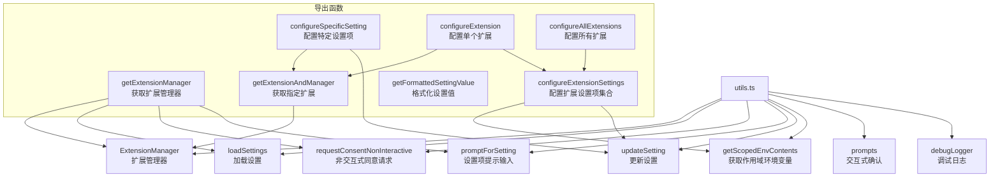

# utils.ts

## 概述

`packages/cli/src/commands/extensions/utils.ts` 是 Gemini CLI 扩展系统的核心工具模块。它提供了一组用于管理、配置和查询扩展（Extension）的实用函数和类型定义。该文件是扩展命令（如安装、配置、验证等）的底层支撑，封装了扩展管理器的获取、扩展查找、设置项的读取与更新等通用逻辑。

本模块的主要职责包括：
- 创建并初始化 `ExtensionManager` 实例
- 按名称查找已安装的扩展
- 配置单个设置项、单个扩展的所有设置项、以及所有扩展的设置项
- 格式化设置值的显示（敏感值脱敏）
- 提供默认的日志、用户输入、确认交互回调

## 架构图（Mermaid）



## 核心组件

### 1. 接口与类型定义

#### `ConfigLogger`
```typescript
export interface ConfigLogger {
  log(message: string): void;
  error(message: string): void;
}
```
日志接口，定义了 `log` 和 `error` 两个方法，用于在扩展配置过程中输出信息和错误。默认实现 `defaultLogger` 使用 `debugLogger`。

#### `RequestSettingCallback`
```typescript
export type RequestSettingCallback = (
  setting: ExtensionSetting,
) => Promise<string>;
```
设置项请求回调类型。当需要用户提供某个设置项的值时被调用，返回用户输入的字符串。默认实现为 `promptForSetting`。

#### `RequestConfirmationCallback`
```typescript
export type RequestConfirmationCallback = (message: string) => Promise<boolean>;
```
确认请求回调类型。当需要用户确认某个操作时被调用（如覆盖已有设置），返回布尔值。默认实现使用 `prompts` 库的 `confirm` 类型交互。

### 2. 默认回调实现

| 名称 | 类型 | 描述 |
|------|------|------|
| `defaultLogger` | `ConfigLogger` | 使用 `debugLogger` 的默认日志实现 |
| `defaultRequestSetting` | `RequestSettingCallback` | 委托给 `promptForSetting` 的默认设置输入实现 |
| `defaultRequestConfirmation` | `RequestConfirmationCallback` | 使用 `prompts` 库进行交互式 confirm 确认，默认值为 `false` |

### 3. 导出函数

#### `getExtensionManager()`
```typescript
export async function getExtensionManager(): Promise<ExtensionManager>
```
- 以当前工作目录（`process.cwd()`）作为工作区目录
- 创建 `ExtensionManager` 实例，传入非交互式同意请求回调、设置项提示回调及合并后的设置
- 调用 `loadExtensions()` 加载所有扩展
- 返回初始化完毕的扩展管理器实例

#### `getExtensionAndManager(extensionManager, name, logger?)`
```typescript
export async function getExtensionAndManager(
  extensionManager: ExtensionManager,
  name: string,
  logger?: ConfigLogger,
): Promise<{ extension: Extension | null }>
```
- 在已加载的扩展列表中按 `name` 查找指定扩展
- 若未找到，通过 `logger.error` 输出错误信息并返回 `{ extension: null }`
- 找到时返回 `{ extension }`

#### `configureSpecificSetting(extensionManager, extensionName, settingKey, scope, logger?, requestSetting?)`
```typescript
export async function configureSpecificSetting(
  extensionManager: ExtensionManager,
  extensionName: string,
  settingKey: string,
  scope: ExtensionSettingScope,
  logger?: ConfigLogger,
  requestSetting?: RequestSettingCallback,
): Promise<void>
```
- 配置指定扩展的某一个特定设置项
- 流程：查找扩展 -> 加载扩展配置 -> 调用 `updateSetting` 更新指定 key 的设置
- 成功后通过 logger 输出更新完成信息

#### `configureExtension(extensionManager, extensionName, scope, logger?, requestSetting?, requestConfirmation?)`
```typescript
export async function configureExtension(
  extensionManager: ExtensionManager,
  extensionName: string,
  scope: ExtensionSettingScope,
  logger?: ConfigLogger,
  requestSetting?: RequestSettingCallback,
  requestConfirmation?: RequestConfirmationCallback,
): Promise<void>
```
- 配置单个扩展的所有设置项
- 流程：查找扩展 -> 加载扩展配置 -> 检查是否有可配置的设置项 -> 委托给 `configureExtensionSettings`
- 若扩展没有设置项，输出相应提示

#### `configureAllExtensions(extensionManager, scope, logger?, requestSetting?, requestConfirmation?)`
```typescript
export async function configureAllExtensions(
  extensionManager: ExtensionManager,
  scope: ExtensionSettingScope,
  logger?: ConfigLogger,
  requestSetting?: RequestSettingCallback,
  requestConfirmation?: RequestConfirmationCallback,
): Promise<void>
```
- 遍历所有已安装扩展，对每个有设置项的扩展调用 `configureExtensionSettings`
- 若无已安装扩展，输出 "No extensions installed."

#### `configureExtensionSettings(extensionConfig, extensionId, scope, logger?, requestSetting?, requestConfirmation?)`
```typescript
export async function configureExtensionSettings(
  extensionConfig: ExtensionConfig,
  extensionId: string,
  scope: ExtensionSettingScope,
  logger?: ConfigLogger,
  requestSetting?: RequestSettingCallback,
  requestConfirmation?: RequestConfirmationCallback,
): Promise<void>
```
这是设置配置的核心函数，逻辑如下：
1. 通过 `getScopedEnvContents` 获取当前作用域（USER 或 WORKSPACE）的已有设置值
2. 若当前作用域为 USER，额外获取 WORKSPACE 作用域的设置值，用于提示用户
3. 遍历扩展配置中的每个设置项：
   - 若该设置在 WORKSPACE 作用域已有值，输出提示信息
   - 若该设置在当前作用域已有值，通过 `requestConfirmation` 询问是否覆盖
   - 用户确认后调用 `updateSetting` 更新设置

#### `getFormattedSettingValue(setting)`
```typescript
export function getFormattedSettingValue(
  setting: ResolvedExtensionSetting,
): string
```
- 格式化设置值用于显示：
  - 值为空时返回 `[not set]`
  - 敏感值（`setting.sensitive === true`）返回 `***`
  - 其他情况返回原始值

## 依赖关系

### 内部依赖

| 模块路径 | 导入内容 | 用途 |
|----------|----------|------|
| `../../config/extension-manager.js` | `ExtensionManager` | 扩展管理器类，管理扩展的加载、查询、配置加载 |
| `../../config/settings.js` | `loadSettings` | 加载用户与工作区合并后的设置 |
| `../../config/extensions/consent.js` | `requestConsentNonInteractive` | 非交互式的扩展安装同意请求处理 |
| `../../config/extension.js` | `ExtensionConfig`（类型） | 扩展配置的类型定义 |
| `../../config/extensions/extensionSettings.js` | `promptForSetting`, `updateSetting`, `ExtensionSetting`（类型）, `getScopedEnvContents`, `ExtensionSettingScope` | 扩展设置项的提示、更新、作用域枚举及作用域环境变量读取 |
| `@google/gemini-cli-core` | `debugLogger`, `ResolvedExtensionSetting`（类型） | 调试日志工具及已解析设置项的类型定义 |

### 外部依赖

| 包名 | 用途 |
|------|------|
| `prompts` | 提供交互式命令行提示（confirm 确认框），用于 `defaultRequestConfirmation` |

## 关键实现细节

1. **回调模式设计**：所有核心函数都接受可选的 `logger`、`requestSetting`、`requestConfirmation` 回调参数，并提供默认实现。这种设计使得这些函数既可以在 CLI 交互环境中使用（使用默认回调），也可以在测试或非交互环境中使用（注入自定义回调）。

2. **作用域感知**：设置项的配置区分 `USER`（用户级）和 `WORKSPACE`（工作区级）两个作用域。在配置 USER 级设置时，会额外检查 WORKSPACE 级是否已有该设置，并给出提示，避免用户困惑。

3. **覆盖保护**：当某个设置项已有值时，不会直接覆盖，而是通过 `requestConfirmation` 询问用户是否覆盖，默认为 `false`（不覆盖），保护用户已有配置。

4. **敏感值脱敏**：`getFormattedSettingValue` 对标记为 `sensitive` 的设置值（如 API Key、Token 等）进行脱敏处理，显示为 `***`。

5. **工作目录绑定**：`getExtensionManager` 和各 `configure*` 函数均使用 `process.cwd()` 作为工作区目录，这意味着扩展的加载和设置的作用域与当前工作目录绑定。

6. **异步流水线**：所有配置函数均为异步函数，通过 `await` 串行处理每个设置项，确保用户交互（输入值、确认覆盖）按顺序进行，不会并发混乱。
