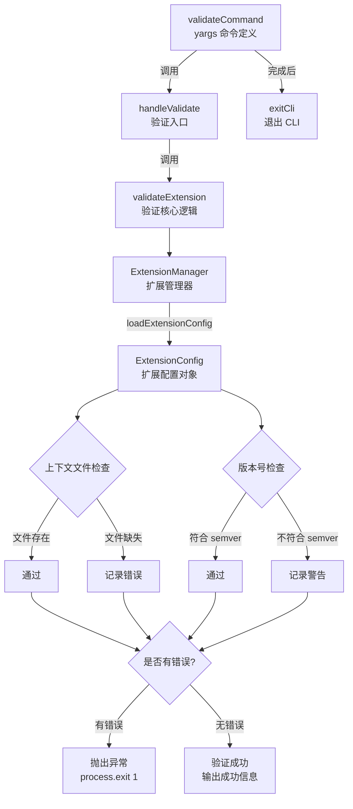

# validate.ts

## 概述

`packages/cli/src/commands/extensions/validate.ts` 是 Gemini CLI 的扩展验证命令模块。它实现了 `gemini extensions validate <path>` 子命令，用于对本地路径下的扩展进行结构和配置的合法性校验。

该模块的核心功能是：
- 从指定本地路径加载扩展配置（`gemini-extension.json`）
- 验证上下文文件（context files）是否实际存在
- 验证版本号是否符合 semver 规范
- 将验证结果以警告和错误的形式输出，验证失败时以非零退出码终止进程

## 架构图（Mermaid）



## 核心组件

### 1. 接口定义

#### `ValidateArgs`
```typescript
interface ValidateArgs {
  path: string;
}
```
验证命令的参数接口，包含一个必需的 `path` 字段，指向要验证的扩展的本地路径。

### 2. 函数

#### `handleValidate(args: ValidateArgs)`
```typescript
export async function handleValidate(args: ValidateArgs): Promise<void>
```
验证的入口函数，是 `validateExtension` 的封装层：
- 调用 `validateExtension` 执行验证
- 成功时通过 `debugLogger.log` 输出成功信息
- 失败时捕获异常，通过 `debugLogger.error` 输出错误信息，并调用 `process.exit(1)` 终止进程

#### `validateExtension(args: ValidateArgs)`（内部函数）
```typescript
async function validateExtension(args: ValidateArgs): Promise<void>
```
验证的核心逻辑，执行流程：

1. **初始化扩展管理器**：
   - 使用当前工作目录创建 `ExtensionManager` 实例
   - 配置非交互式同意请求和设置提示回调

2. **加载扩展配置**：
   - 将输入路径解析为绝对路径
   - 通过 `extensionManager.loadExtensionConfig` 加载扩展配置

3. **上下文文件验证**：
   - 检查 `extensionConfig.contextFileName` 是否存在
   - 支持单个文件名（string）和文件名数组（string[]）
   - 将每个上下文文件路径解析为绝对路径，检查文件是否存在
   - 缺失的文件记录到 `errors` 数组

4. **版本号验证**：
   - 使用 `semver.valid` 检查版本号是否符合语义化版本规范
   - 不符合时记录到 `warnings` 数组（注意：这只是警告，不会导致验证失败）

5. **结果输出**：
   - 若有警告，逐条输出
   - 若有错误，逐条输出后抛出 `Error('Extension validation failed.')`

### 3. 命令定义

#### `validateCommand`
```typescript
export const validateCommand: CommandModule = {
  command: 'validate <path>',
  describe: 'Validates an extension from a local path.',
  builder: (yargs) => yargs.positional('path', { ... }),
  handler: async (args) => { ... },
};
```
yargs `CommandModule` 格式的命令定义：
- **命令格式**：`validate <path>`，`<path>` 为必需的位置参数
- **描述**：验证本地路径下的扩展
- **handler**：调用 `handleValidate` 后调用 `exitCli()` 正常退出

## 依赖关系

### 内部依赖

| 模块路径 | 导入内容 | 用途 |
|----------|----------|------|
| `@google/gemini-cli-core` | `debugLogger`, `getErrorMessage` | 调试日志输出及错误信息提取 |
| `../../config/extension.js` | `ExtensionConfig`（类型） | 扩展配置的类型定义 |
| `../../config/extension-manager.js` | `ExtensionManager` | 扩展管理器，用于加载扩展配置 |
| `../../config/extensions/consent.js` | `requestConsentNonInteractive` | 非交互式同意请求回调 |
| `../../config/extensions/extensionSettings.js` | `promptForSetting` | 设置项提示输入回调 |
| `../../config/settings.js` | `loadSettings` | 加载用户/工作区合并后的设置 |
| `../utils.js` | `exitCli` | CLI 正常退出工具函数 |

### 外部依赖

| 包名 | 用途 |
|------|------|
| `yargs` | CLI 命令框架，提供 `CommandModule` 类型定义 |
| `semver` | 语义化版本号验证，使用 `semver.valid` 校验版本格式 |
| `node:fs` | Node.js 文件系统模块，使用 `fs.existsSync` 检查上下文文件是否存在 |
| `node:path` | Node.js 路径模块，使用 `path.resolve` 解析绝对路径 |

## 关键实现细节

1. **错误与警告分级**：验证结果分为两个级别——`errors`（错误，导致验证失败）和 `warnings`（警告，仅输出提示但不阻断流程）。当前实现中：
   - 上下文文件缺失 -> **错误**（阻断）
   - 版本号不符合 semver -> **警告**（不阻断）

2. **上下文文件支持数组**：`contextFileName` 字段同时支持 `string` 和 `string[]` 类型。代码通过 `Array.isArray` 判断并统一转换为数组处理，体现了良好的兼容性设计。

3. **路径解析**：使用 `path.resolve(args.path)` 将用户输入的相对路径转换为绝对路径，确保后续文件检查不受当前工作目录变化的影响。上下文文件路径则是相对于扩展根目录解析的（`path.resolve(absoluteInputPath, contextFilePath)`）。

4. **进程退出控制**：
   - 验证失败时通过 `process.exit(1)` 直接退出，返回非零退出码，适合在 CI/CD 管道中使用
   - handler 正常完成后调用 `exitCli()` 确保 CLI 进程正常终止

5. **ExtensionManager 复用模式**：虽然本模块也创建了 `ExtensionManager` 实例，但与 `utils.ts` 中的 `getExtensionManager` 不同，这里并未调用 `loadExtensions()`，仅使用其 `loadExtensionConfig` 方法加载单个扩展的配置文件，属于轻量级使用。

6. **验证范围有限**：当前验证仅覆盖上下文文件存在性和版本号格式两项。这意味着该命令主要用于基础的结构检查，更深层的功能验证（如 MCP 服务连接测试等）不在此命令的范围内。
