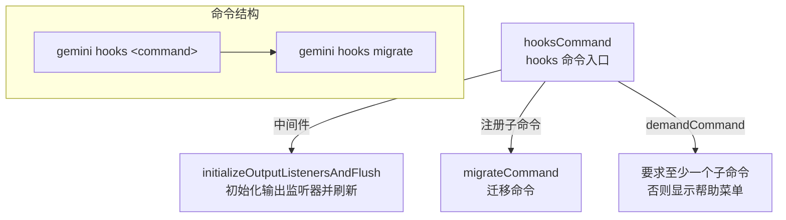

# hooks.tsx

## 概述

`packages/cli/src/commands/hooks.tsx` 是 Gemini CLI 的钩子（Hooks）命令入口模块。它定义了 `gemini hooks <command>` 顶层命令，作为所有钩子相关子命令的路由和容器。

当前该模块注册了一个子命令 `migrate`（迁移），用于钩子配置的迁移操作。该文件本身非常精简，主要职责是：
- 定义 `hooks` 命令及其别名 `hook`
- 注册中间件以初始化输出监听器
- 注册子命令并要求至少提供一个子命令

## 架构图（Mermaid）



## 核心组件

### 1. 命令定义

#### `hooksCommand`
```typescript
export const hooksCommand: CommandModule = {
  command: 'hooks <command>',
  aliases: ['hook'],
  describe: 'Manage Gemini CLI hooks.',
  builder: (yargs) => yargs
    .middleware(...)
    .command(migrateCommand)
    .demandCommand(1, '...')
    .version(false),
  handler: () => { /* 无操作 */ },
};
```

| 属性 | 值 | 说明 |
|------|----|------|
| `command` | `'hooks <command>'` | 命令格式，`<command>` 表示必须提供子命令 |
| `aliases` | `['hook']` | 命令别名，支持 `gemini hook` 作为 `gemini hooks` 的简写 |
| `describe` | `'Manage Gemini CLI hooks.'` | 帮助文档中的命令描述 |
| `handler` | 空函数 | 当提供子命令时不会被调用；无子命令时 yargs 会显示帮助菜单 |

### 2. 中间件逻辑

在 `builder` 中注册的中间件执行两个操作：
1. **`initializeOutputListenersAndFlush()`**：初始化输出监听器并刷新缓冲区，确保子命令执行前输出系统已就绪
2. **`argv['isCommand'] = true`**：在参数中设置 `isCommand` 标志，标识当前执行的是一个子命令而非主交互模式

### 3. yargs 配置

- **`.command(migrateCommand)`**：注册 `migrate` 子命令
- **`.demandCommand(1, '...')`**：要求至少提供一个子命令，否则输出提示信息并显示帮助
- **`.version(false)`**：禁用自动生成的 `--version` 选项

## 依赖关系

### 内部依赖

| 模块路径 | 导入内容 | 用途 |
|----------|----------|------|
| `./hooks/migrate.js` | `migrateCommand` | 钩子迁移子命令定义 |
| `../gemini.js` | `initializeOutputListenersAndFlush` | 初始化输出监听器并刷新缓冲的输出内容 |

### 外部依赖

| 包名 | 用途 |
|------|------|
| `yargs` | CLI 命令框架，提供 `CommandModule` 类型定义 |

## 关键实现细节

1. **文件扩展名为 `.tsx`**：虽然文件内容未直接使用 JSX 语法，但采用 `.tsx` 扩展名，这可能是为了与项目中其他使用 Ink（React 终端 UI 框架）渲染的命令文件保持一致，或为后续可能的 UI 渲染预留扩展性。

2. **路由器模式**：`hooksCommand` 自身的 `handler` 是空函数，它仅作为子命令的路由容器。当用户输入 `gemini hooks` 而不提供子命令时，由 `demandCommand` 规则触发帮助菜单显示。

3. **中间件初始化**：通过 yargs 中间件机制在子命令执行前初始化输出系统，这确保了所有钩子子命令都能正确使用日志/输出功能。`isCommand` 标志的设置允许后续逻辑区分命令模式和交互模式。

4. **可扩展设计**：当前只注册了 `migrateCommand` 一个子命令，但框架结构允许通过简单地添加 `.command(newCommand)` 来扩展更多钩子管理子命令（如 `list`、`add`、`remove` 等）。

5. **命令别名**：支持 `hook`（单数）作为 `hooks`（复数）的别名，提升了用户体验，避免用户因为单复数混淆而输入错误。
