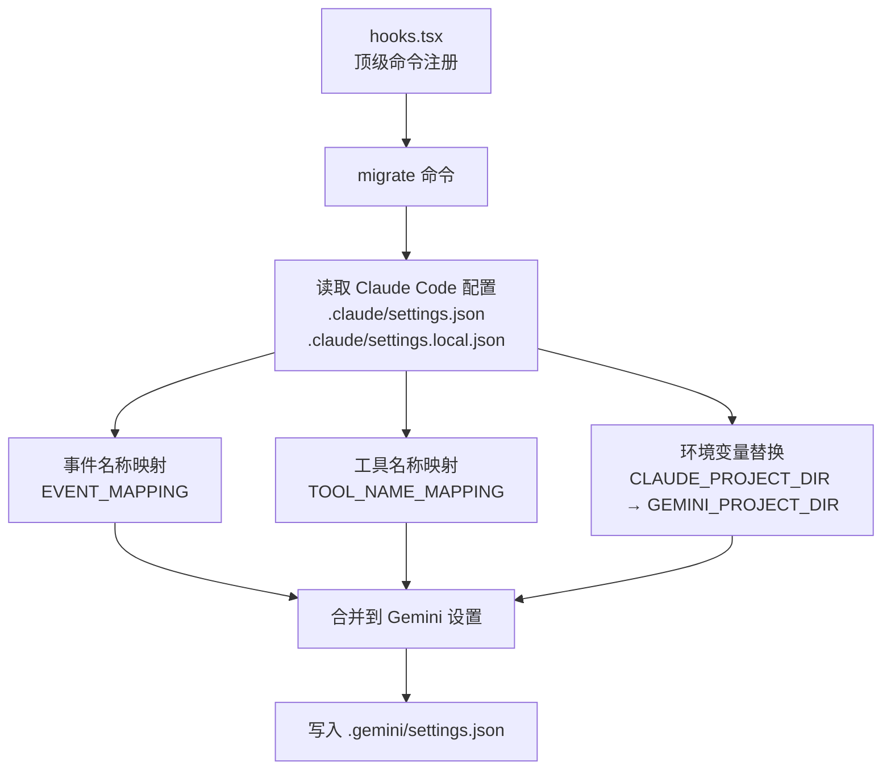
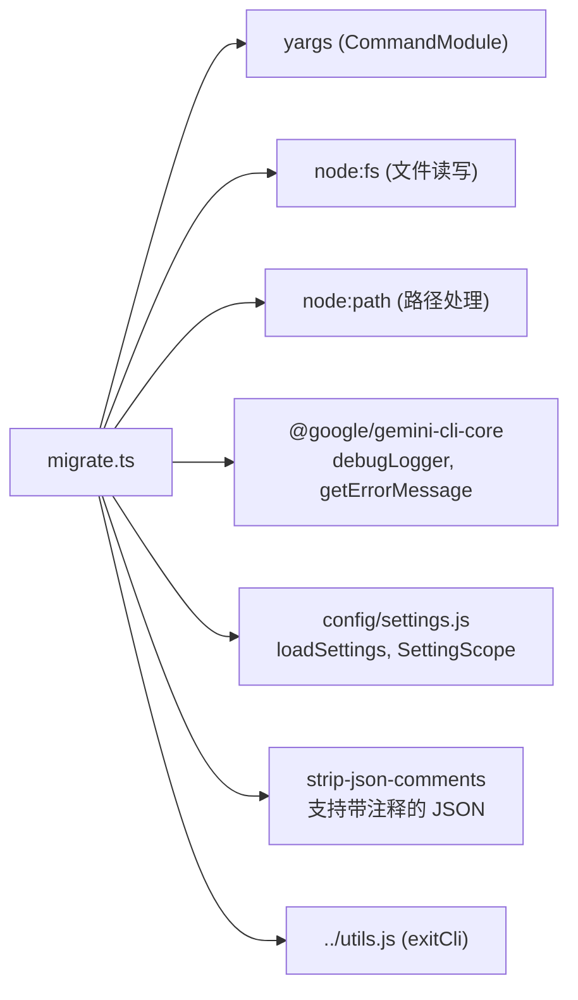
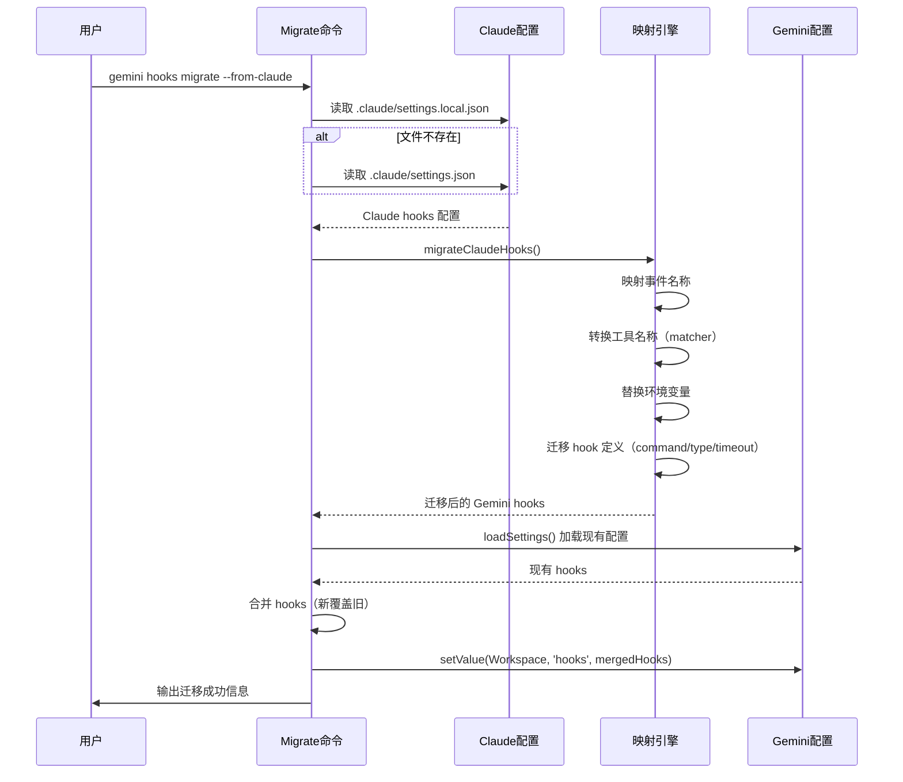

# hooks 目录

## 概述

`hooks/` 目录实现了 Gemini CLI 的 **Hooks 迁移工具**，目前仅包含一个子命令 `migrate`，用于将 Claude Code 的 hooks 配置自动迁移为 Gemini CLI 格式。该工具完成事件名称映射、工具名称转换和环境变量替换，实现无缝迁移。

## 目录结构

```
hooks/
├── migrate.ts          # hooks 迁移命令（从 Claude Code 迁移到 Gemini CLI）
└── migrate.test.ts     # migrate 测试
```

## 架构图



## 核心组件

### 1. 事件名称映射（EVENT_MAPPING）

将 Claude Code 的钩子事件名自动转换为 Gemini CLI 对应事件：

| Claude Code 事件 | Gemini CLI 事件 | 说明 |
|------------------|----------------|------|
| `PreToolUse` | `BeforeTool` | 工具调用前 |
| `PostToolUse` | `AfterTool` | 工具调用后 |
| `UserPromptSubmit` | `BeforeAgent` | 用户提交前 |
| `Stop` | `AfterAgent` | Agent 停止后 |
| `SubAgentStop` | `AfterAgent` | 子 Agent 停止（Gemini 无子 Agent 概念） |
| `SessionStart` | `SessionStart` | 会话开始 |
| `SessionEnd` | `SessionEnd` | 会话结束 |
| `PreCompact` | `PreCompress` | 压缩前 |
| `Notification` | `Notification` | 通知 |

### 2. 工具名称映射（TOOL_NAME_MAPPING）

在 matcher 正则中替换工具名称：

| Claude Code 工具 | Gemini CLI 工具 |
|------------------|----------------|
| `Edit` | `replace` |
| `Bash` | `run_shell_command` |
| `Read` | `read_file` |
| `Write` | `write_file` |
| `Glob` | `glob` |
| `Grep` | `grep` |
| `LS` | `ls` |

### 3. 迁移流程（handleMigrateFromClaude）

```typescript
// 核心迁移逻辑
1. 查找 .claude/settings.local.json 或 .claude/settings.json
2. 解析 JSON（支持注释，通过 strip-json-comments）
3. 遍历 hooks 配置：
   - 映射事件名称 (EVENT_MAPPING)
   - 转换 matcher 中的工具名 (TOOL_NAME_MAPPING)
   - 替换环境变量 ($CLAUDE_PROJECT_DIR → $GEMINI_PROJECT_DIR)
   - 迁移 command / type / timeout 字段
4. 与现有 Gemini hooks 合并（新配置覆盖同名事件）
5. 写入 .gemini/settings.json（workspace 作用域）
```

## 依赖关系



## 数据流


