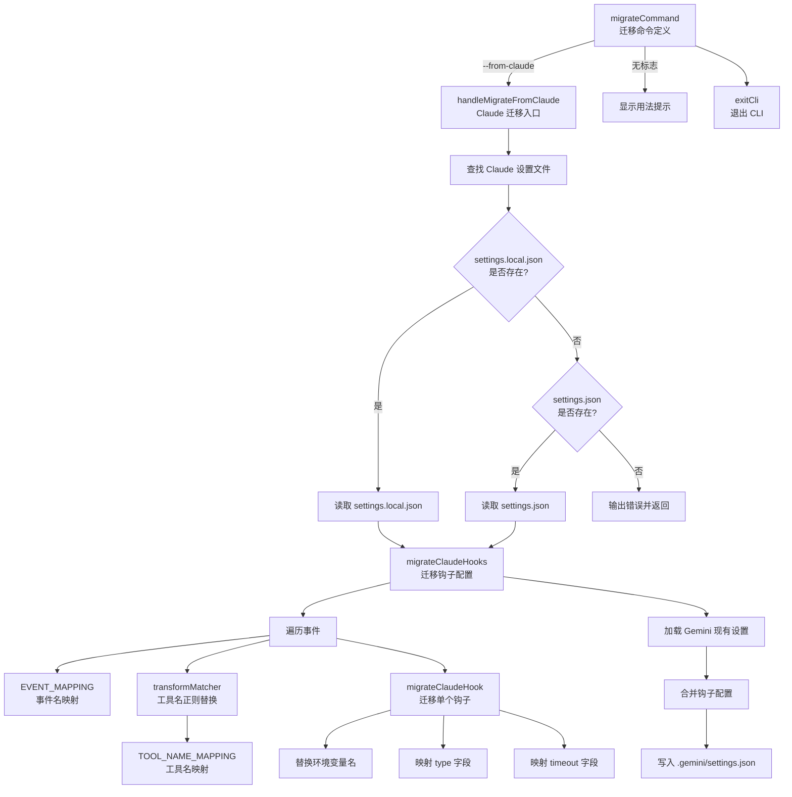

# migrate.ts

## 概述

`packages/cli/src/commands/hooks/migrate.ts` 是 Gemini CLI 的钩子迁移命令模块，实现了 `gemini hooks migrate --from-claude` 子命令。该模块的核心功能是将 Claude Code 的钩子配置自动迁移为 Gemini CLI 兼容的格式。

迁移过程涉及：
- 读取 Claude Code 的设置文件（`.claude/settings.json` 或 `.claude/settings.local.json`）
- 将 Claude Code 的事件名映射为 Gemini 的事件名
- 将 Claude Code 的工具名映射为 Gemini 的工具名
- 转换 matcher 正则表达式中的工具名引用
- 替换环境变量名称（如 `$CLAUDE_PROJECT_DIR` -> `$GEMINI_PROJECT_DIR`）
- 将迁移后的钩子写入 Gemini 的工作区设置（`.gemini/settings.json`）

## 架构图（Mermaid）



## 核心组件

### 1. 接口定义

#### `MigrateArgs`
```typescript
interface MigrateArgs {
  fromClaude: boolean;
}
```
迁移命令的参数接口，`fromClaude` 标志指示是否从 Claude Code 迁移。

### 2. 映射常量

#### `EVENT_MAPPING` -- 事件名映射
```typescript
const EVENT_MAPPING: Record<string, string> = {
  PreToolUse: 'BeforeTool',
  PostToolUse: 'AfterTool',
  UserPromptSubmit: 'BeforeAgent',
  Stop: 'AfterAgent',
  SubAgentStop: 'AfterAgent',
  SessionStart: 'SessionStart',
  SessionEnd: 'SessionEnd',
  PreCompact: 'PreCompress',
  Notification: 'Notification',
};
```

将 Claude Code 的钩子事件名映射为 Gemini CLI 的对应事件名：

| Claude Code 事件 | Gemini CLI 事件 | 说明 |
|-------------------|-----------------|------|
| `PreToolUse` | `BeforeTool` | 工具调用前 |
| `PostToolUse` | `AfterTool` | 工具调用后 |
| `UserPromptSubmit` | `BeforeAgent` | 用户提交提示词时 |
| `Stop` | `AfterAgent` | Agent 停止时 |
| `SubAgentStop` | `AfterAgent` | 子 Agent 停止时（Gemini 无子 Agent 概念，映射到 AfterAgent） |
| `SessionStart` | `SessionStart` | 会话开始 |
| `SessionEnd` | `SessionEnd` | 会话结束 |
| `PreCompact` | `PreCompress` | 压缩/紧凑操作前 |
| `Notification` | `Notification` | 通知事件 |

#### `TOOL_NAME_MAPPING` -- 工具名映射
```typescript
const TOOL_NAME_MAPPING: Record<string, string> = {
  Edit: 'replace',
  Bash: 'run_shell_command',
  Read: 'read_file',
  Write: 'write_file',
  Glob: 'glob',
  Grep: 'grep',
  LS: 'ls',
};
```

将 Claude Code 的工具名映射为 Gemini CLI 的对应工具名：

| Claude Code 工具 | Gemini CLI 工具 | 说明 |
|-------------------|-----------------|------|
| `Edit` | `replace` | 文件编辑/替换 |
| `Bash` | `run_shell_command` | Shell 命令执行 |
| `Read` | `read_file` | 文件读取 |
| `Write` | `write_file` | 文件写入 |
| `Glob` | `glob` | 文件模式匹配 |
| `Grep` | `grep` | 内容搜索 |
| `LS` | `ls` | 目录列表 |

### 3. 内部函数

#### `transformMatcher(matcher)`
```typescript
function transformMatcher(matcher: string | undefined): string | undefined
```
- 将 matcher 正则表达式中的 Claude 工具名替换为 Gemini 工具名
- 使用 `\b` 词边界确保只替换完整的工具名（不误伤部分匹配）
- 全局替换（`g` 标志）
- 返回 `undefined` 若输入为 falsy

#### `migrateClaudeHook(claudeHook)`
```typescript
function migrateClaudeHook(claudeHook: unknown): unknown
```
迁移单个钩子定义对象，处理以下字段：
- **`command`**：保留原始命令，并将 `$CLAUDE_PROJECT_DIR` 替换为 `$GEMINI_PROJECT_DIR`
- **`type`**：若值为 `'command'`，保留
- **`timeout`**：若为数字类型，直接保留（Claude 和 Gemini 都使用秒作为单位）

#### `migrateClaudeHooks(claudeConfig)`
```typescript
function migrateClaudeHooks(claudeConfig: unknown): Record<string, unknown>
```
迁移整个 Claude Code 钩子配置：
1. 提取 `config.hooks` 部分
2. 遍历每个事件及其配置数组
3. 对每个事件名进行 `EVENT_MAPPING` 映射
4. 对每个钩子定义：
   - 转换 `matcher` 中的工具名
   - 保留 `sequential` 标志
   - 对 `hooks` 数组中的每个钩子调用 `migrateClaudeHook`
5. 返回迁移后的钩子配置对象

### 4. 导出函数

#### `handleMigrateFromClaude()`
```typescript
export async function handleMigrateFromClaude(): Promise<void>
```
Claude Code 迁移的完整流程：
1. **查找 Claude 设置文件**：按优先级查找 `.claude/settings.local.json`，其次 `.claude/settings.json`
2. **读取并解析**：读取文件内容，使用 `stripJsonComments` 去除注释后解析 JSON
3. **迁移钩子**：调用 `migrateClaudeHooks` 执行转换
4. **合并设置**：加载当前 Gemini 设置，将迁移后的钩子与已有钩子合并（迁移钩子优先级更高，会覆盖同名事件）
5. **保存设置**：通过 `settings.setValue` 写入工作区级别的 `.gemini/settings.json`

### 5. 命令定义

#### `migrateCommand`
```typescript
export const migrateCommand: CommandModule = {
  command: 'migrate',
  describe: 'Migrate hooks from Claude Code to Gemini CLI',
  builder: (yargs) => yargs.option('from-claude', { ... }),
  handler: async (argv) => { ... },
};
```

| 属性 | 说明 |
|------|------|
| `command` | `'migrate'` |
| `describe` | 从 Claude Code 迁移钩子到 Gemini CLI |
| `--from-claude` | 布尔选项，默认 `false`，指示从 Claude Code 迁移 |
| handler | 根据 `fromClaude` 标志调用 `handleMigrateFromClaude` 或显示用法提示 |

## 依赖关系

### 内部依赖

| 模块路径 | 导入内容 | 用途 |
|----------|----------|------|
| `@google/gemini-cli-core` | `debugLogger`, `getErrorMessage` | 调试日志输出及错误信息提取 |
| `../../config/settings.js` | `loadSettings`, `SettingScope` | 加载设置、定义设置作用域枚举 |
| `../utils.js` | `exitCli` | CLI 正常退出工具函数 |

### 外部依赖

| 包名 | 用途 |
|------|------|
| `yargs` | CLI 命令框架，提供 `CommandModule` 类型定义 |
| `node:fs` | Node.js 文件系统模块，读取 Claude 设置文件 |
| `node:path` | Node.js 路径模块，拼接文件路径 |
| `strip-json-comments` | 移除 JSON 文件中的注释（`//` 和 `/* */`），使其可被 `JSON.parse` 正确解析 |

## 关键实现细节

1. **设置文件优先级**：优先读取 `settings.local.json`（本地覆盖），其次读取 `settings.json`（共享设置）。这与 Claude Code 的设置加载优先级一致，确保迁移的是用户实际生效的配置。

2. **JSON 注释支持**：使用 `strip-json-comments` 库预处理 JSON 内容，因为 Claude Code 的设置文件可能包含注释（JSONC 格式），而标准 `JSON.parse` 不支持注释。

3. **合并策略**：使用展开运算符 `{ ...existingHooks, ...migratedHooks }` 合并钩子，这意味着对于同名事件，迁移来的钩子会**完全覆盖**已有的钩子定义，而非追加。这是一个需要用户注意的行为。

4. **工作区级别写入**：迁移后的钩子写入 `SettingScope.Workspace` 级别（即 `.gemini/settings.json`），而非用户级别。这确保了迁移的钩子仅在当前项目中生效。

5. **SubAgentStop 特殊处理**：由于 Gemini CLI 没有子 Agent 的概念，Claude Code 的 `SubAgentStop` 事件被映射到 `AfterAgent`，这可能导致原本区分主 Agent 和子 Agent 停止行为的钩子在迁移后合并为同一触发点。

6. **环境变量替换**：命令字符串中的 `$CLAUDE_PROJECT_DIR` 被替换为 `$GEMINI_PROJECT_DIR`，确保项目目录引用在新环境中正确工作。

7. **防御性编程**：大量使用 `typeof` 检查和空值判断来处理 `unknown` 类型的配置数据，避免在遇到意外配置格式时崩溃。

8. **词边界替换**：`transformMatcher` 使用 `\b`（word boundary）进行正则替换，确保不会误替换工具名的部分匹配（如不会把 "EditFile" 中的 "Edit" 替换掉）。
