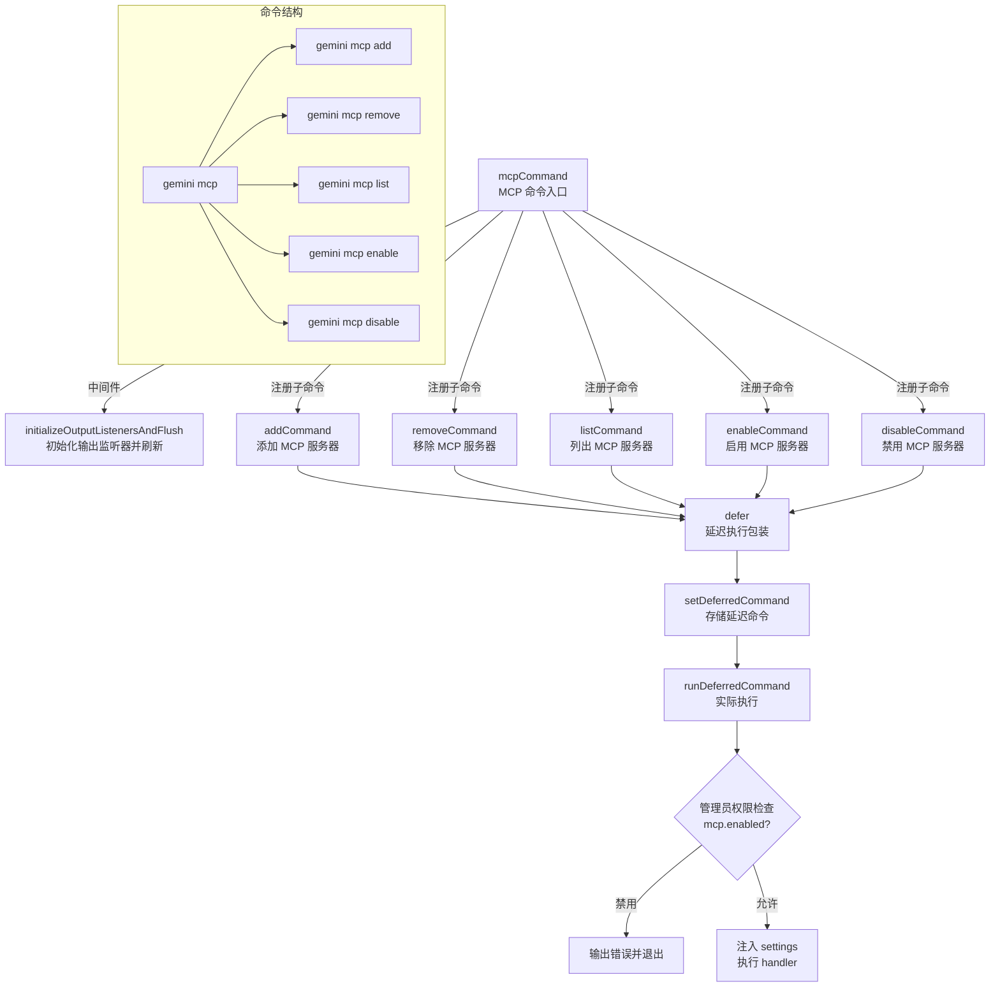

# mcp.ts

## 概述

`packages/cli/src/commands/mcp.ts` 是 Gemini CLI 的 MCP（Model Context Protocol）服务器管理命令入口模块。它定义了 `gemini mcp` 顶层命令，作为所有 MCP 相关子命令的路由容器。

MCP 是一种标准协议，用于将外部工具和数据源连接到 AI 模型。该模块提供了完整的 MCP 服务器生命周期管理能力，包括：
- **添加**（add）MCP 服务器
- **移除**（remove）MCP 服务器
- **列出**（list）已配置的 MCP 服务器
- **启用**（enable）MCP 服务器
- **禁用**（disable）MCP 服务器

所有子命令均通过 `defer` 机制进行延迟执行，以便在实际执行前进行管理员权限检查和设置注入。

## 架构图（Mermaid）



## 核心组件

### 1. 命令定义

#### `mcpCommand`
```typescript
export const mcpCommand: CommandModule = {
  command: 'mcp',
  describe: 'Manage MCP servers',
  builder: (yargs: Argv) => yargs
    .middleware(...)
    .command(defer(addCommand, 'mcp'))
    .command(defer(removeCommand, 'mcp'))
    .command(defer(listCommand, 'mcp'))
    .command(defer(enableCommand, 'mcp'))
    .command(defer(disableCommand, 'mcp'))
    .demandCommand(1, '...')
    .version(false),
  handler: () => { /* 无操作 */ },
};
```

| 属性 | 值 | 说明 |
|------|----|------|
| `command` | `'mcp'` | 命令名称 |
| `describe` | `'Manage MCP servers'` | 帮助文档中的命令描述 |
| `handler` | 空函数 | 作为路由容器，自身不执行逻辑；`demandCommand(1)` 确保必须提供子命令 |

### 2. 子命令注册

所有 5 个子命令均通过 `defer()` 函数包装后注册：

| 子命令 | 来源模块 | 功能 |
|--------|----------|------|
| `addCommand` | `./mcp/add.js` | 添加新的 MCP 服务器配置 |
| `removeCommand` | `./mcp/remove.js` | 移除已有的 MCP 服务器配置 |
| `listCommand` | `./mcp/list.js` | 列出所有已配置的 MCP 服务器 |
| `enableCommand` | `./mcp/enableDisable.js` | 启用已禁用的 MCP 服务器 |
| `disableCommand` | `./mcp/enableDisable.js` | 禁用已启用的 MCP 服务器 |

### 3. 中间件逻辑

与 `hooks.tsx` 类似，在 `builder` 中注册的中间件执行两个操作：
1. **`initializeOutputListenersAndFlush()`**：初始化输出监听器并刷新缓冲区
2. **`argv['isCommand'] = true`**：设置命令模式标志

### 4. `defer` 延迟执行机制

`defer` 函数（来自 `../deferred.js`）是 MCP 命令架构的关键设计。它包装子命令的 `handler`，使其不会立即执行，而是：
1. 将原始 handler 和参数存储到全局单例 `deferredCommand` 中
2. 记录父命令名称（此处为 `'mcp'`）
3. 后续由 `runDeferredCommand` 在合适的时机执行，此时会：
   - 检查管理员设置中 `mcp.enabled` 是否为 `false`，若被禁用则输出错误并以 `FATAL_CONFIG_ERROR` 退出码终止
   - 将 `settings` 注入到命令参数中
   - 执行实际的 handler
   - 执行退出清理并正常退出

这种延迟执行模式的优势在于：
- 允许在命令解析完成后、实际执行前进行全局权限和配置检查
- 统一了设置注入的时机，确保所有子命令都能获取到完整的设置数据
- 提供了统一的退出清理流程

## 依赖关系

### 内部依赖

| 模块路径 | 导入内容 | 用途 |
|----------|----------|------|
| `./mcp/add.js` | `addCommand` | MCP 服务器添加子命令 |
| `./mcp/remove.js` | `removeCommand` | MCP 服务器移除子命令 |
| `./mcp/list.js` | `listCommand` | MCP 服务器列表子命令 |
| `./mcp/enableDisable.js` | `enableCommand`, `disableCommand` | MCP 服务器启用/禁用子命令 |
| `../gemini.js` | `initializeOutputListenersAndFlush` | 初始化输出监听器并刷新缓冲区 |
| `../deferred.js` | `defer` | 延迟执行包装函数，用于推迟子命令的实际执行 |

### 外部依赖

| 包名 | 用途 |
|------|------|
| `yargs` | CLI 命令框架，提供 `CommandModule` 和 `Argv` 类型定义 |

## 关键实现细节

1. **延迟执行模式（Deferred Execution）**：这是本模块最重要的设计模式。所有子命令都通过 `defer` 包装，handler 不会在 yargs 解析阶段立即执行，而是被存储为全局单例，等待后续 `runDeferredCommand` 调用。这种模式将命令解析（parsing）与命令执行（execution）分离，使得中间可以插入权限检查、设置加载等全局逻辑。

2. **管理员权限控制**：`runDeferredCommand` 会检查 `adminSettings.mcp.enabled` 配置。如果管理员禁用了 MCP 功能，所有 MCP 子命令都会被拦截并以错误退出，这为企业环境提供了集中管控能力。

3. **路由器模式**：与 `hooks.tsx` 一样，`mcpCommand` 自身的 `handler` 是空函数，仅作为子命令的路由容器。通过 `demandCommand(1)` 确保用户必须提供子命令。

4. **版本禁用**：`.version(false)` 禁用了 `--version` 选项，避免与主 CLI 的版本信息冲突。

5. **启用/禁用命令共模块**：`enableCommand` 和 `disableCommand` 来自同一个模块 `enableDisable.js`，体现了功能相关的命令共享实现的设计原则。

6. **设置注入**：通过 `defer` 机制，`settings` 对象在 `runDeferredCommand` 中被注入到 `argv`，使得所有子命令的 handler 都能通过 `argv.settings` 访问完整的应用设置，而无需各自重复加载。

7. **统一退出流程**：`runDeferredCommand` 在执行完 handler 后统一调用 `runExitCleanup()` 和 `process.exit(ExitCodes.SUCCESS)`，确保所有子命令都有一致的退出行为和资源清理。
