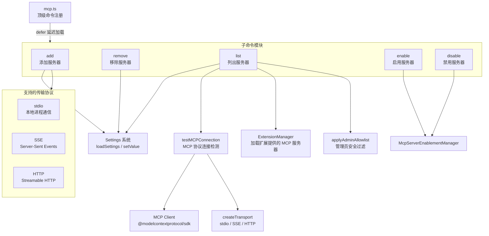
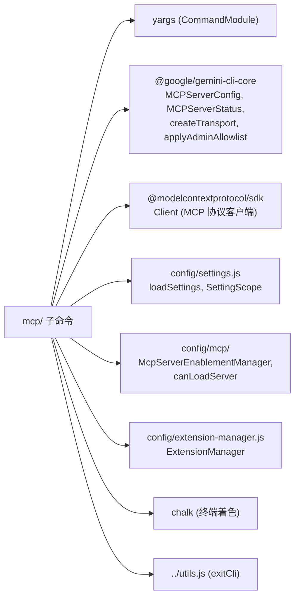
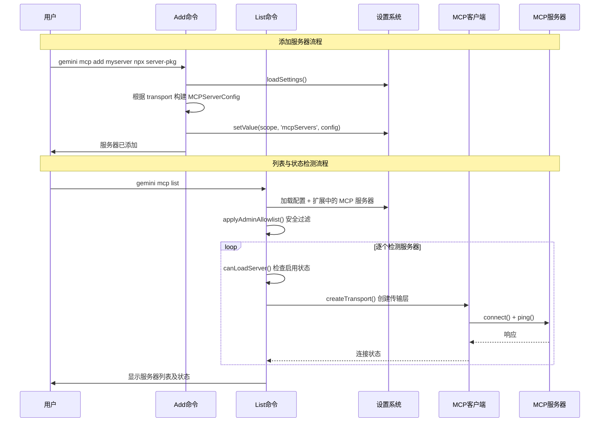

# mcp 目录

## 概述

`mcp/` 目录实现了 Gemini CLI 的 **MCP（Model Context Protocol）服务器管理系统**，提供 MCP 服务器的添加、删除、列表、启用和禁用功能。支持三种传输协议（stdio、SSE、HTTP），具备完善的安全控制（信任检查、管理员白名单、工具过滤）和连接状态检测能力。

## 目录结构

```
mcp/
├── add.ts              # 添加 MCP 服务器（支持 stdio/SSE/HTTP 传输）
├── add.test.ts         # add 测试
├── remove.ts           # 移除 MCP 服务器
├── remove.test.ts      # remove 测试
├── list.ts             # 列出所有 MCP 服务器及连接状态
├── list.test.ts        # list 测试
└── enableDisable.ts    # 启用/禁用 MCP 服务器（支持会话级别）
```

## 架构图



## 核心组件

### 1. add.ts - 添加 MCP 服务器

支持三种传输协议，根据 `--transport` 参数构建不同的服务器配置：

| 传输类型 | 必需参数 | 可选参数 |
|---------|---------|---------|
| `stdio`（默认） | `command`、`args` | `env`、`timeout`、`trust` |
| `sse` | `url` | `headers`、`timeout`、`trust` |
| `http` | `url` | `headers`、`timeout`、`trust` |

支持两种配置作用域：
- `project`（默认）：写入工作区 `.gemini/settings.json`
- `user`：写入用户级全局配置

其他关键选项：
- `--trust`：信任服务器，跳过工具调用确认
- `--include-tools` / `--exclude-tools`：工具白名单/黑名单过滤
- `--description`：服务器描述

### 2. list.ts - 列出 MCP 服务器

最复杂的子命令，核心功能：

**服务器发现**：合并两个来源的 MCP 服务器
1. `settings.mcpServers` — 用户直接配置的服务器
2. 已安装扩展提供的 MCP 服务器

**管理员安全过滤**：通过 `applyAdminAllowlist()` 过滤被管理员阻止的服务器。

**连接状态检测**：对每个服务器进行实际 MCP 协议连接测试，状态包括：

| 状态 | 图标 | 说明 |
|------|------|------|
| `CONNECTED` | 绿色勾 | 连接正常 |
| `CONNECTING` | 黄色省略号 | 连接中 |
| `BLOCKED` | 红色禁止 | 被管理员/白名单阻止 |
| `DISABLED` | 灰色圆圈 | 已禁用 |
| `DISCONNECTED` | 红色叉 | 连接失败 |

**安全特性**：stdio 类型服务器在不受信任的工作区中不会执行连接测试。

### 3. enableDisable.ts - 启用/禁用

通过 `McpServerEnablementManager` 单例管理服务器启用状态，支持：
- **持久化启用/禁用**：写入配置文件
- **会话级禁用**（`--session`）：仅对当前会话生效，不写入配置

启用前会检查多层安全策略：管理员限制 > 白名单 > 黑名单 > 用户启用状态。

## 依赖关系



## 数据流


