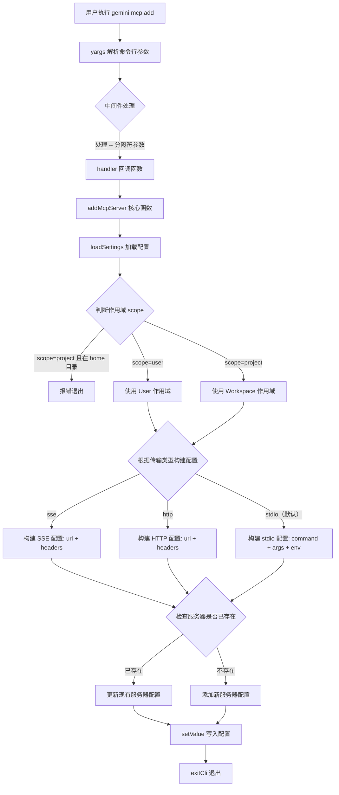

# add.ts

## 概述

`add.ts` 是 Gemini CLI 中 `gemini mcp add` 子命令的实现文件。它负责将一个新的 MCP（Model Context Protocol）服务器配置添加到用户级别或项目级别的设置文件中。该命令支持三种传输类型：`stdio`（标准输入输出）、`sse`（Server-Sent Events）和 `http`，并允许用户通过丰富的命令行选项来自定义服务器配置，包括环境变量、HTTP 头部、超时时间、信任设置、工具过滤等。

## 架构图（Mermaid）



## 核心组件

### 1. `addMcpServer` 异步函数

这是该文件的核心业务逻辑函数，负责将 MCP 服务器配置写入设置文件。

**函数签名：**
```typescript
async function addMcpServer(
  name: string,
  commandOrUrl: string,
  args: Array<string | number> | undefined,
  options: {
    scope: string;
    transport: string;
    env: string[] | undefined;
    header: string[] | undefined;
    timeout?: number;
    trust?: boolean;
    description?: string;
    includeTools?: string[];
    excludeTools?: string[];
  },
)
```

**参数说明：**

| 参数 | 类型 | 说明 |
|------|------|------|
| `name` | `string` | MCP 服务器的名称标识 |
| `commandOrUrl` | `string` | stdio 模式下为命令路径，sse/http 模式下为 URL |
| `args` | `Array<string \| number> \| undefined` | 传递给 stdio 命令的参数列表 |
| `options.scope` | `string` | 配置作用域，`user` 或 `project` |
| `options.transport` | `string` | 传输类型，`stdio`、`sse` 或 `http` |
| `options.env` | `string[] \| undefined` | 环境变量数组，格式为 `KEY=value` |
| `options.header` | `string[] \| undefined` | HTTP 头部数组，格式为 `Key: value` |
| `options.timeout` | `number \| undefined` | 连接超时时间（毫秒） |
| `options.trust` | `boolean \| undefined` | 是否信任该服务器（跳过工具调用确认提示） |
| `options.description` | `string \| undefined` | 服务器描述信息 |
| `options.includeTools` | `string[] \| undefined` | 要包含的工具白名单 |
| `options.excludeTools` | `string[] \| undefined` | 要排除的工具黑名单 |

**核心逻辑步骤：**

1. **加载配置**：通过 `loadSettings(process.cwd())` 加载当前目录的设置。
2. **作用域校验**：如果 scope 为 `project` 但当前在 home 目录下，报错退出（因为 home 目录下的 workspace 配置与 user 配置路径相同，会产生冲突）。
3. **解析 HTTP 头部**：将 `Key: value` 格式的字符串数组解析为 `Record<string, string>` 对象。使用 `split(':')` 分割，并正确处理值中可能包含冒号的情况（如 `Authorization: Bearer token:abc`）。
4. **按传输类型构建配置对象**：
   - `sse`/`http`：使用 `url` + `headers` 字段。
   - `stdio`（默认）：使用 `command` + `args` + `env` 字段。环境变量从 `KEY=value` 格式解析为对象。
5. **检查是否已存在同名服务器**：如果已存在则日志提示为更新操作。
6. **写入配置**：通过 `settings.setValue()` 将新的 `mcpServers` 写入对应作用域的配置文件。

### 2. `addCommand` 命令模块（CommandModule）

导出的 yargs 命令模块，定义了命令的结构、参数和处理逻辑。

**命令格式：**
```
gemini mcp add <name> <commandOrUrl> [args...]
```

**位置参数：**
- `name`：服务器名称（必填）
- `commandOrUrl`：命令或 URL（必填）
- `args...`：可变参数列表（可选）

**选项参数：**

| 选项 | 别名 | 类型 | 默认值 | 说明 |
|------|------|------|--------|------|
| `--scope` | `-s` | `string` | `project` | 配置作用域，可选 `user` 或 `project` |
| `--transport` | `-t`, `--type` | `string` | `stdio` | 传输类型，可选 `stdio`、`sse`、`http` |
| `--env` | `-e` | `array` | - | 环境变量，格式 `KEY=value` |
| `--header` | `-H` | `array` | - | HTTP 头部（仅 SSE/HTTP 传输） |
| `--timeout` | - | `number` | - | 连接超时（毫秒） |
| `--trust` | - | `boolean` | - | 信任服务器（跳过确认） |
| `--description` | - | `string` | - | 服务器描述 |
| `--include-tools` | - | `array` | - | 工具白名单 |
| `--exclude-tools` | - | `array` | - | 工具黑名单 |

**yargs 解析器配置：**
- `unknown-options-as-args: true`：将未知选项作为服务器参数传递，而非报错。
- `populate--: true`：支持 `--` 分隔符之后的参数收集。

**中间件（middleware）：**
处理 `--` 分隔符后的参数，将其合并到 `args` 数组中。这允许用户使用 `gemini mcp add myserver npx -- --some-flag` 语法来传递可能与 gemini 自身选项冲突的参数。

## 依赖关系

### 内部依赖

| 模块路径 | 导入内容 | 用途 |
|----------|----------|------|
| `../../config/settings.js` | `loadSettings`, `SettingScope` | 加载和操作配置文件的核心模块。`loadSettings` 根据当前工作目录加载用户和项目级配置；`SettingScope` 枚举区分 `User` 和 `Workspace` 作用域 |
| `@google/gemini-cli-core` | `debugLogger`, `MCPServerConfig` | 核心包。`debugLogger` 用于日志输出；`MCPServerConfig` 是 MCP 服务器配置的类型定义 |
| `../utils.js` | `exitCli` | 工具函数，用于安全退出 CLI 进程 |

### 外部依赖

| 包名 | 导入内容 | 用途 |
|------|----------|------|
| `yargs` | `CommandModule`（类型） | CLI 命令框架，提供命令定义、参数解析、中间件等功能 |

## 关键实现细节

### 1. 作用域冲突检测

```typescript
const inHome = settings.workspace.path === settings.user.path;
if (scope === 'project' && inHome) {
  debugLogger.error(
    'Error: Please use --scope user to edit settings in the home directory.',
  );
  process.exit(1);
}
```

当用户在 home 目录下运行命令时，workspace（项目级）的配置路径与 user（用户级）的配置路径相同。此时如果使用 `--scope project` 会造成混淆，因此强制要求使用 `--scope user`。

### 2. HTTP 头部解析的健壮性

```typescript
const headers = header?.reduce((acc, curr) => {
  const [key, ...valueParts] = curr.split(':');
  const value = valueParts.join(':').trim();
  if (key.trim() && value) {
    acc[key.trim()] = value;
  }
  return acc;
}, {} as Record<string, string>);
```

使用解构 `[key, ...valueParts]` 并将剩余部分用 `:` 重新拼接，确保 header 值中包含冒号时（如 `Authorization: Bearer token:abc`）不会被错误截断。同时对 key 和 value 进行 trim 和空值检查。

### 3. 传输类型的差异化配置构建

- **SSE 和 HTTP 传输**：配置对象包含 `url`（服务器地址）、`type`（传输类型标识）、`headers`（HTTP 头部），不包含 `command`、`args`、`env` 字段。
- **stdio 传输（默认）**：配置对象包含 `command`（可执行命令）、`args`（命令参数，统一转为字符串）、`env`（环境变量对象），不包含 `url`、`type`、`headers` 字段。
- 所有传输类型共享的字段：`timeout`、`trust`、`description`、`includeTools`、`excludeTools`。

### 4. 更新与新增的自动判断

函数会检查同名服务器是否已存在于配置中。如果已存在，不会报错，而是直接覆盖更新，并在日志中区分提示"updated"或"added"。这使得 `gemini mcp add` 命令同时具备"添加"和"更新"两种语义。

### 5. `--` 分隔符参数处理

通过 yargs 中间件处理 `--` 分隔符之后的参数：

```typescript
.middleware((argv) => {
  if (argv['--']) {
    const existingArgs = (argv['args'] as Array<string | number>) || [];
    argv['args'] = [...existingArgs, ...(argv['--'] as string[])];
  }
})
```

这允许用户通过 `--` 分隔符传递可能被 yargs 误解析的参数，例如以 `-` 开头的服务器参数。
