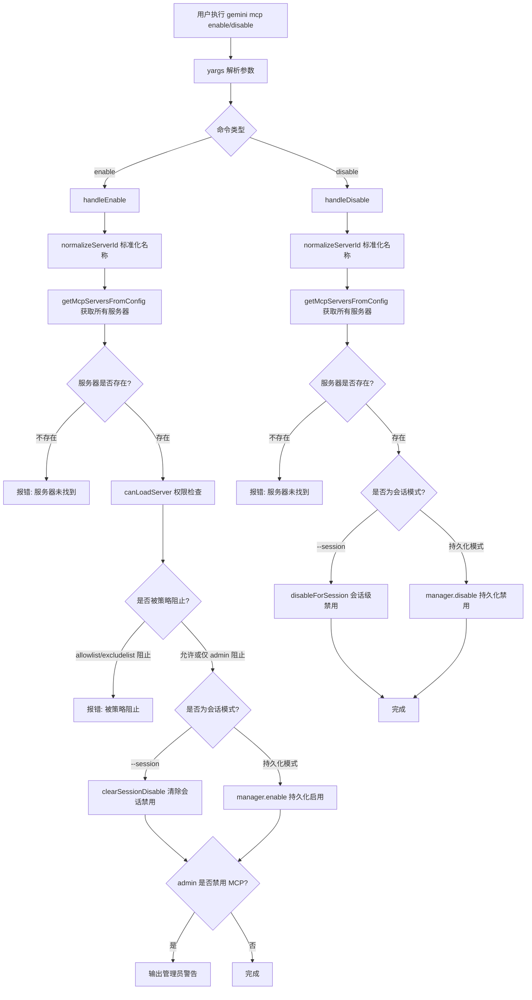

# enableDisable.ts

## 概述

`enableDisable.ts` 实现了 Gemini CLI 中 `gemini mcp enable` 和 `gemini mcp disable` 两个子命令。它们用于启用或禁用已配置的 MCP（Model Context Protocol）服务器。该文件支持两种禁用/启用模式：**持久化模式**（写入配置文件，跨会话生效）和**会话模式**（仅在当前会话内生效）。在启用操作前，还会进行管理员策略检查（allowlist/excludelist/admin 级别的权限控制），确保遵守安全策略。

## 架构图（Mermaid）



## 核心组件

### 1. `Args` 接口

```typescript
interface Args {
  name: string;
  session?: boolean;
}
```

定义了 enable/disable 命令共用的参数类型：
- `name`：必填，MCP 服务器的名称标识。
- `session`：可选布尔值，指定是否仅在当前会话中生效。

### 2. `handleEnable` 异步函数

处理 MCP 服务器启用逻辑的核心函数。

**执行流程：**

1. **获取管理器实例**：通过 `McpServerEnablementManager.getInstance()` 获取单例管理器。
2. **标准化名称**：使用 `normalizeServerId(args.name)` 统一服务器名称格式。
3. **验证服务器存在性**：调用 `getMcpServersFromConfig()` 获取所有已配置服务器（包括扩展服务器），检查目标服务器是否存在。
4. **权限检查**：通过 `canLoadServer()` 检查服务器是否被管理员策略阻止：
   - 检查 `admin.mcp.enabled` 全局开关（默认为 `true`）。
   - 检查 `mcp.allowed`（白名单）和 `mcp.excluded`（黑名单）。
   - 如果被 `allowlist` 或 `excludelist` 阻止，输出错误并返回。
5. **执行启用操作**：
   - 如果指定了 `--session`，调用 `manager.clearSessionDisable(name)` 清除当前会话的禁用状态。
   - 否则，调用 `manager.enable(name)` 进行持久化启用。
6. **管理员警告**：如果 `blockType === 'admin'`（管理员全局禁用了 MCP），即使启用了具体服务器，也会输出警告提示。

### 3. `handleDisable` 异步函数

处理 MCP 服务器禁用逻辑的核心函数。

**执行流程：**

1. **获取管理器实例和标准化名称**：与 `handleEnable` 相同。
2. **验证服务器存在性**：与 `handleEnable` 相同。
3. **执行禁用操作**：
   - 如果指定了 `--session`，调用 `manager.disableForSession(name)` 进行会话级禁用。
   - 否则，调用 `manager.disable(name)` 进行持久化禁用。

注意：`handleDisable` 不需要进行权限检查，因为禁用操作不会产生安全风险。

### 4. `enableCommand` 命令模块

```typescript
export const enableCommand: CommandModule<object, Args>
```

**命令格式：**
```
gemini mcp enable <name> [--session]
```

| 参数/选项 | 类型 | 必填 | 默认值 | 说明 |
|-----------|------|------|--------|------|
| `name` | `string` | 是 | - | 要启用的 MCP 服务器名称 |
| `--session` | `boolean` | 否 | `false` | 仅清除当前会话的禁用状态 |

### 5. `disableCommand` 命令模块

```typescript
export const disableCommand: CommandModule<object, Args>
```

**命令格式：**
```
gemini mcp disable <name> [--session]
```

| 参数/选项 | 类型 | 必填 | 默认值 | 说明 |
|-----------|------|------|--------|------|
| `name` | `string` | 是 | - | 要禁用的 MCP 服务器名称 |
| `--session` | `boolean` | 否 | `false` | 仅在当前会话内禁用 |

### 6. ANSI 颜色常量

```typescript
const GREEN = '\x1b[32m';
const YELLOW = '\x1b[33m';
const RED = '\x1b[31m';
const RESET = '\x1b[0m';
```

用于终端输出的 ANSI 转义码，为成功（绿色）、警告（黄色）和错误（红色）信息提供视觉区分。

## 依赖关系

### 内部依赖

| 模块路径 | 导入内容 | 用途 |
|----------|----------|------|
| `../../config/mcp/mcpServerEnablement.js` | `McpServerEnablementManager`, `canLoadServer`, `normalizeServerId` | MCP 服务器启用/禁用的管理器单例，负责持久化和会话级的启用/禁用状态管理；`canLoadServer` 检查管理员策略权限；`normalizeServerId` 统一服务器名称格式 |
| `../../config/settings.js` | `loadSettings` | 加载配置文件，获取管理员策略设置（admin.mcp.enabled、mcp.allowed、mcp.excluded） |
| `../utils.js` | `exitCli` | 安全退出 CLI 进程 |
| `./list.js` | `getMcpServersFromConfig` | 获取所有已配置的 MCP 服务器列表（包括扩展服务器），用于验证服务器名称是否有效 |

### 外部依赖

| 包名 | 导入内容 | 用途 |
|------|----------|------|
| `yargs` | `CommandModule`（类型） | CLI 命令框架，提供命令定义和参数解析 |
| `@google/gemini-cli-core` | `debugLogger` | 日志输出工具，用于输出成功、错误和警告信息 |

## 关键实现细节

### 1. 三层权限检查机制

`handleEnable` 中的 `canLoadServer` 实现了三层权限检查：

```typescript
const result = await canLoadServer(name, {
  adminMcpEnabled: settings.merged.admin?.mcp?.enabled ?? true,
  allowedList: settings.merged.mcp?.allowed,
  excludedList: settings.merged.mcp?.excluded,
});
```

- **Admin 层**：`admin.mcp.enabled` 全局开关控制所有 MCP 服务器是否可用。即使被 admin 阻止，启用操作仍然执行，但会输出警告。
- **Allowlist 层**：如果配置了白名单 `mcp.allowed`，只有在名单中的服务器才能被启用，否则硬性阻止。
- **Excludelist 层**：如果服务器在黑名单 `mcp.excluded` 中，将被硬性阻止启用。

### 2. 持久化模式 vs 会话模式

| 模式 | 启用方式 | 禁用方式 | 生命周期 |
|------|----------|----------|----------|
| 持久化 | `manager.enable(name)` | `manager.disable(name)` | 写入配置文件，跨会话持续生效 |
| 会话 | `manager.clearSessionDisable(name)` | `manager.disableForSession(name)` | 仅在当前进程/会话中生效 |

会话模式适用于临时调试场景：临时禁用某个服务器而不修改配置文件，或清除之前的会话级禁用。

### 3. Enable 与 Disable 的非对称设计

- **Enable**：需要进行完整的权限检查（allowlist/excludelist/admin），因为启用一个被策略阻止的服务器可能产生安全风险。
- **Disable**：只需验证服务器是否存在即可，不做权限检查，因为禁用操作本身是安全的。

### 4. 服务器名称标准化

通过 `normalizeServerId()` 对服务器名称进行标准化处理，确保不同输入格式的名称能正确匹配。比较时也对所有已配置服务器名称进行同样的标准化：

```typescript
const normalizedServerNames = Object.keys(servers).map(normalizeServerId);
if (!normalizedServerNames.includes(name)) { ... }
```
