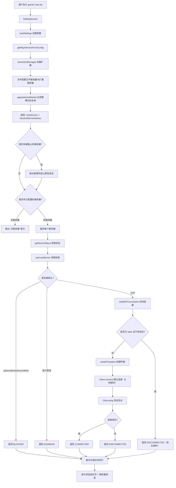

# list.ts

## 概述

`list.ts` 实现了 Gemini CLI 中 `gemini mcp list` 子命令，用于列出所有已配置的 MCP（Model Context Protocol）服务器及其连接状态。该文件不仅显示在配置文件中直接定义的 MCP 服务器，还会自动合并从扩展（Extension）中加载的服务器。对于每个服务器，命令会实际尝试建立 MCP 连接（带 5 秒超时），以验证其可用性，并用不同的状态指示符（Connected/Disconnected/Blocked/Disabled）展示结果。

此外，`list.ts` 还导出了 `getMcpServersFromConfig` 函数，被其他 MCP 命令（如 `enableDisable.ts`）复用，用于获取完整的服务器列表。

## 架构图（Mermaid）



## 核心组件

### 1. `getMcpServersFromConfig` 导出函数

从配置文件和扩展中收集所有 MCP 服务器配置，并应用管理员白名单过滤。

```typescript
export async function getMcpServersFromConfig(
  settings?: MergedSettings,
): Promise<{
  mcpServers: Record<string, MCPServerConfig>;
  blockedServerNames: string[];
}>
```

**参数：**
- `settings`：可选的已合并配置对象。如果未提供，则调用 `loadSettings().merged` 自动加载。

**返回值：**
- `mcpServers`：允许使用的服务器配置映射（名称 -> 配置）。
- `blockedServerNames`：被管理员白名单阻止的服务器名称列表。

**核心逻辑：**
1. 创建 `ExtensionManager` 实例并加载所有扩展。
2. 将配置文件中的服务器 `settings.mcpServers` 与扩展中的服务器合并。配置文件中的同名服务器优先（扩展中的同名服务器会被跳过）。
3. 为来自扩展的服务器附加 `extension` 引用。
4. 调用 `applyAdminAllowlist()` 应用管理员白名单过滤。

### 2. `testMCPConnection` 内部函数

实际测试与 MCP 服务器的连接。

```typescript
async function testMCPConnection(
  serverName: string,
  config: MCPServerConfig,
  isTrusted: boolean,
  activeSettings: MergedSettings,
): Promise<MCPServerStatus>
```

**安全机制：**
- **stdio 服务器 + 不受信任的工作区**：直接返回 `DISCONNECTED`，不执行任何命令。这是一个重要的安全措施——stdio 类型的服务器会执行本地命令，在不受信任的工作区中运行可能导致安全风险。

**连接测试流程：**
1. 创建 MCP 客户端（`Client`），标识为 `mcp-test-client v0.0.1`。
2. 构建 `mcpContext`，包含：
   - **环境变量清理配置**：启用环境变量脱敏，配置排除的环境变量列表。
   - **诊断事件发射器**：将 info/warning/error 级别的诊断信息通过 `debugLogger` 和 `chalk` 输出。
   - **信任文件夹回调**：返回当前的信任状态。
3. 使用 `createTransport()` 创建传输层。
4. 通过 `client.connect(transport, { timeout: 5000 })` 尝试连接（5 秒超时）。
5. 执行 `client.ping()` 验证 MCP 协议可用性。
6. 成功则返回 `CONNECTED`，任何异常则返回 `DISCONNECTED`。

### 3. `getServerStatus` 内部函数

综合权限检查和连接测试，返回最终的服务器状态。

```typescript
async function getServerStatus(
  serverName: string,
  server: MCPServerConfig,
  isTrusted: boolean,
  activeSettings: MergedSettings,
): Promise<MCPServerStatus>
```

**状态判定逻辑：**

| 条件 | 返回状态 |
|------|----------|
| 被 admin/allowlist/excludelist 阻止 | `BLOCKED` |
| 被用户禁用（enablement 检查未通过） | `DISABLED` |
| 权限通过，连接成功 | `CONNECTED` |
| 权限通过，连接失败 | `DISCONNECTED` |

### 4. `listMcpServers` 导出函数

主要的列表展示函数，协调配置加载、状态获取和格式化输出。

```typescript
export async function listMcpServers(
  loadedSettingsArg?: LoadedSettings,
): Promise<void>
```

**输出格式：**

每个服务器一行，格式为：
```
<状态指示符> <服务器名称> [来源信息]: <连接信息> (<传输类型>) - <状态文本>
```

**状态指示符映射：**

| 状态 | 符号 | 颜色 | 文本 |
|------|------|------|------|
| `CONNECTED` | `✓` | 绿色 | Connected |
| `CONNECTING` | `…` | 黄色 | Connecting |
| `BLOCKED` | `⛔` | 红色 | Blocked |
| `DISABLED` | `○` | 灰色 | Disabled |
| `DISCONNECTED` | `✗` | 红色 | Disconnected |

**服务器信息展示逻辑：**
- 来自扩展的服务器会附加 `(from <extensionName>)` 标识。
- `httpUrl` 类型：显示 URL + `(http)`。
- `url` 类型：显示 URL + `(type)`，type 默认为 `http`。
- `command` 类型：显示命令 + 参数 + `(stdio)`。

### 5. `listCommand` 命令模块

```typescript
export const listCommand: CommandModule<object, ListArgs>
```

**命令格式：**
```
gemini mcp list
```

无额外参数。handler 调用 `listMcpServers()` 后执行 `exitCli()`。

## 依赖关系

### 内部依赖

| 模块路径 | 导入内容 | 用途 |
|----------|----------|------|
| `../../config/settings.js` | `MergedSettings`, `loadSettings`, `LoadedSettings` | 配置加载和类型定义 |
| `../../config/extension-manager.js` | `ExtensionManager` | 扩展管理器，负责加载扩展中定义的 MCP 服务器 |
| `../../config/mcp/index.js` | `canLoadServer`, `McpServerEnablementManager` | MCP 服务器权限检查和启用状态管理 |
| `../../config/extensions/consent.js` | `requestConsentNonInteractive` | 非交互模式下的扩展同意请求处理 |
| `../../config/extensions/extensionSettings.js` | `promptForSetting` | 扩展设置的提示函数 |
| `../utils.js` | `exitCli` | 安全退出 CLI 进程 |

### 外部依赖

| 包名 | 导入内容 | 用途 |
|------|----------|------|
| `yargs` | `CommandModule`（类型） | CLI 命令框架 |
| `@google/gemini-cli-core` | `MCPServerStatus`, `createTransport`, `debugLogger`, `applyAdminAllowlist`, `getAdminBlockedMcpServersMessage`, `MCPServerConfig` | MCP 核心库：状态枚举、传输层创建、日志工具、管理员白名单过滤和阻止信息生成 |
| `@modelcontextprotocol/sdk` | `Client` | MCP 协议 SDK 客户端，用于建立连接和 ping 测试 |
| `chalk` | `chalk` | 终端文字着色库，用于状态指示符的颜色渲染 |

## 关键实现细节

### 1. 扩展服务器的优先级合并策略

```typescript
const mcpServers = { ...settings.mcpServers };
for (const extension of extensions) {
  Object.entries(extension.mcpServers || {}).forEach(([key, server]) => {
    if (mcpServers[key]) {
      return; // 配置文件中的同名服务器优先
    }
    mcpServers[key] = {
      ...server,
      extension, // 附加扩展来源信息
    };
  });
}
```

用户在配置文件中直接定义的服务器具有最高优先级。如果扩展中定义了同名服务器，将被忽略。这保证了用户的手动配置始终优先于扩展的自动配置。

### 2. 不受信任工作区的安全保护

```typescript
const isStdio = !!config.command;
if (isStdio && !isTrusted) {
  return MCPServerStatus.DISCONNECTED;
}
```

这是一个关键的安全措施：stdio 类型的服务器需要执行本地命令（如 `npx`、`node` 等），如果在不受信任的工作区中执行，攻击者可能通过恶意的 `.gemini/settings.json` 配置来执行任意命令。因此在不受信任的工作区中，stdio 服务器直接返回 `DISCONNECTED` 状态而不尝试任何连接。

### 3. 真实连接测试而非配置验证

`list` 命令不仅仅检查配置是否存在和格式正确，还会真实地尝试建立 MCP 连接并执行 `ping` 操作。这意味着：
- 用户可以立即看到哪些服务器真正可用。
- 但命令执行可能因为网络超时（每个服务器最多 5 秒）而较慢。
- 连接测试使用与核心模块相同的 `createTransport` 逻辑，确保一致性。

### 4. 管理员白名单的两层过滤

服务器被阻止的信息有两个来源：
1. `applyAdminAllowlist()`：在 `getMcpServersFromConfig` 中过滤掉不在管理员白名单中的服务器，并返回 `blockedServerNames`。
2. `canLoadServer()`：在 `getServerStatus` 中检查 admin 开关、allowlist 和 excludelist。

被第一层过滤的服务器不会出现在列表中，但会有一条汇总警告信息。被第二层检查阻止的服务器仍会显示在列表中，但标记为 `BLOCKED` 状态。

### 5. 环境变量安全脱敏

```typescript
const mcpContext = {
  sanitizationConfig: {
    enableEnvironmentVariableRedaction: true,
    allowedEnvironmentVariables: [],
    blockedEnvironmentVariables: activeSettings.advanced.excludedEnvVars,
  },
  ...
};
```

在连接测试过程中，环境变量传递启用了脱敏机制，防止敏感环境变量（如 API 密钥）泄露到 MCP 服务器进程中。`excludedEnvVars` 配置指定了需要屏蔽的环境变量列表。
