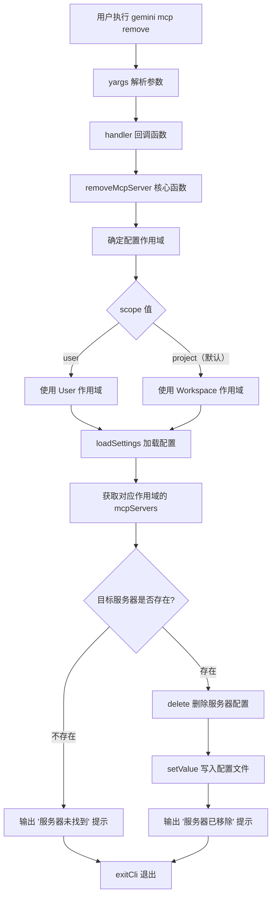

# remove.ts

## 概述

`remove.ts` 实现了 Gemini CLI 中 `gemini mcp remove` 子命令，用于从用户级别或项目级别的配置文件中移除一个已配置的 MCP（Model Context Protocol）服务器。该命令是 `add` 命令的逆操作，实现简洁明了：根据服务器名称和配置作用域定位目标，删除配置条目并保存。

## 架构图（Mermaid）



## 核心组件

### 1. `removeMcpServer` 异步函数

核心业务逻辑函数，负责从指定作用域的配置中移除 MCP 服务器。

```typescript
async function removeMcpServer(
  name: string,
  options: {
    scope: string;
  },
)
```

**参数说明：**

| 参数 | 类型 | 说明 |
|------|------|------|
| `name` | `string` | 要移除的 MCP 服务器名称 |
| `options.scope` | `string` | 配置作用域，`user` 或 `project` |

**执行流程：**

1. **确定作用域**：根据 `scope` 参数映射到 `SettingScope.User` 或 `SettingScope.Workspace`。
2. **加载配置**：调用 `loadSettings()` 加载当前配置。
3. **获取服务器列表**：从对应作用域获取 `mcpServers` 对象。
4. **检查存在性**：如果目标服务器不在配置中，输出提示并返回（不报错）。
5. **删除并保存**：使用 `delete` 操作符移除服务器配置条目，然后通过 `settings.setValue()` 写回配置文件。
6. **输出结果**：日志提示服务器已成功移除。

### 2. `removeCommand` 命令模块

```typescript
export const removeCommand: CommandModule
```

**命令格式：**
```
gemini mcp remove [options] <name>
```

**位置参数：**

| 参数 | 类型 | 必填 | 说明 |
|------|------|------|------|
| `name` | `string` | 是 | 要移除的 MCP 服务器名称 |

**选项参数：**

| 选项 | 别名 | 类型 | 默认值 | 可选值 | 说明 |
|------|------|------|--------|--------|------|
| `--scope` | `-s` | `string` | `project` | `user`, `project` | 配置作用域 |

## 依赖关系

### 内部依赖

| 模块路径 | 导入内容 | 用途 |
|----------|----------|------|
| `../../config/settings.js` | `loadSettings`, `SettingScope` | 加载配置和确定作用域。`loadSettings` 加载完整配置；`SettingScope` 枚举区分 `User` 和 `Workspace` 作用域 |
| `../utils.js` | `exitCli` | 安全退出 CLI 进程 |

### 外部依赖

| 包名 | 导入内容 | 用途 |
|------|----------|------|
| `yargs` | `CommandModule`（类型） | CLI 命令框架，提供命令定义和参数解析 |
| `@google/gemini-cli-core` | `debugLogger` | 日志输出工具 |

## 关键实现细节

### 1. 与 `add` 命令的对比

`remove` 的实现比 `add` 简洁得多，体现了删除操作的单一性：

| 特性 | `add` | `remove` |
|------|-------|----------|
| 作用域冲突检测（home 目录） | 有 | 无 |
| 传输类型处理 | 需要按类型构建不同配置 | 不需要 |
| 环境变量/头部解析 | 有 | 不需要 |
| 更新/新增判断 | 有 | 不需要 |

`remove` 不需要检查 home 目录冲突，因为删除操作只影响指定作用域，不会产生配置混淆。

### 2. 静默处理不存在的服务器

```typescript
if (!mcpServers[name]) {
  debugLogger.log(`Server "${name}" not found in ${scope} settings.`);
  return;
}
```

当要删除的服务器不存在时，命令不会报错或以非零退出码退出，而是输出一条提示信息后正常返回。这是一种幂等设计——多次执行同一删除操作不会产生副作用。

### 3. 作用域精确匹配

```typescript
const existingSettings = settings.forScope(settingsScope).settings;
const mcpServers = existingSettings.mcpServers || {};
```

删除操作仅在用户指定的作用域中查找和删除服务器。这意味着：
- 如果用户在 `project` 作用域中添加了服务器但尝试从 `user` 作用域删除，会提示"未找到"。
- 用户需要知道服务器配置在哪个作用域中，才能正确删除。

### 4. 不涉及扩展服务器

与 `list` 命令不同，`remove` 不加载扩展中的服务器。它只操作用户直接在配置文件中定义的服务器（通过 `gemini mcp add` 添加的）。扩展提供的服务器需要通过扩展管理机制来控制，而非直接删除。
