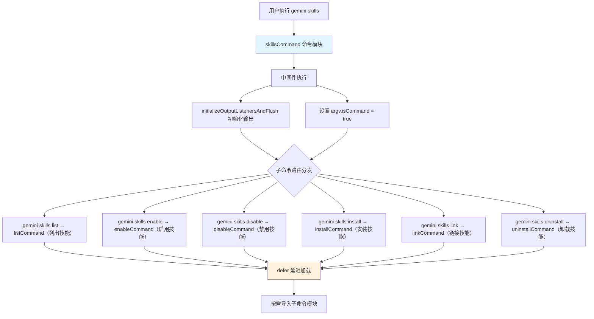

# skills.tsx

## 概述

`skills.tsx` 是 Gemini CLI 中 `gemini skills` 命令的入口文件和路由分发器。它本身不包含具体业务逻辑，而是作为一个命令组（command group），将六个子命令（`list`、`enable`、`disable`、`install`、`link`、`uninstall`）组织在一起。该命令支持 `skills` 和 `skill` 两个别名，用于管理 Agent 技能（Skills）。

文件使用 `.tsx` 扩展名，表明项目中可能使用了 JSX/TSX 语法（如 Ink 框架），但此入口文件本身并未使用 JSX 语法。

## 架构图（Mermaid）



## 核心组件

### 1. `skillsCommand` 命令模块

```typescript
export const skillsCommand: CommandModule = {
  command: 'skills <command>',
  aliases: ['skill'],
  describe: 'Manage agent skills.',
  ...
}
```

这是文件唯一导出的组件，定义了 `gemini skills` 命令组。

**命令格式：**
```
gemini skills <command>
gemini skill <command>     # 别名
```

**关键属性：**

| 属性 | 值 | 说明 |
|------|----|------|
| `command` | `'skills <command>'` | 必须提供子命令 |
| `aliases` | `['skill']` | 支持单数别名 `skill` |
| `describe` | `'Manage agent skills.'` | 命令描述 |

### 2. 中间件（middleware）

```typescript
.middleware((argv) => {
  initializeOutputListenersAndFlush();
  argv['isCommand'] = true;
})
```

在任何子命令执行之前，中间件执行两个关键操作：
1. **初始化输出监听器**：调用 `initializeOutputListenersAndFlush()` 设置输出管道并刷新缓冲区，确保子命令的输出能正确显示。
2. **标记命令模式**：设置 `argv.isCommand = true`，这个标志可能被下游模块用于区分交互模式和命令模式的行为。

### 3. 子命令注册与延迟加载

```typescript
.command(defer(listCommand, 'skills'))
.command(defer(enableCommand, 'skills'))
.command(defer(disableCommand, 'skills'))
.command(defer(installCommand, 'skills'))
.command(defer(linkCommand, 'skills'))
.command(defer(uninstallCommand, 'skills'))
```

所有六个子命令都通过 `defer()` 函数进行延迟加载注册。`defer` 函数接收命令模块和上下文标识（`'skills'`），返回一个包装后的命令定义。这种模式的目的是：
- **性能优化**：避免在 CLI 启动时加载所有子命令的完整实现，只在实际执行时才导入。
- **上下文传递**：通过 `'skills'` 参数为子命令提供所属命令组的上下文信息。

### 4. 子命令一览

| 子命令 | 来源模块 | 功能说明 |
|--------|----------|----------|
| `list` | `./skills/list.js` | 列出所有已安装/可用的技能 |
| `enable` | `./skills/enable.js` | 启用指定技能 |
| `disable` | `./skills/disable.js` | 禁用指定技能 |
| `install` | `./skills/install.js` | 安装新技能 |
| `link` | `./skills/link.js` | 链接本地技能（开发模式） |
| `uninstall` | `./skills/uninstall.js` | 卸载已安装的技能 |

### 5. `handler` 处理器

```typescript
handler: () => {
  // This handler is not called when a subcommand is provided.
  // Yargs will show the help menu.
},
```

顶层 handler 为空函数。由于 `.demandCommand(1, ...)` 的约束，当用户直接执行 `gemini skills` 而不带子命令时，yargs 会自动显示帮助菜单。此 handler 实际上不会被调用。

## 依赖关系

### 内部依赖

| 模块路径 | 导入内容 | 用途 |
|----------|----------|------|
| `./skills/list.js` | `listCommand` | `gemini skills list` 子命令：列出技能 |
| `./skills/enable.js` | `enableCommand` | `gemini skills enable` 子命令：启用技能 |
| `./skills/disable.js` | `disableCommand` | `gemini skills disable` 子命令：禁用技能 |
| `./skills/install.js` | `installCommand` | `gemini skills install` 子命令：安装技能 |
| `./skills/link.js` | `linkCommand` | `gemini skills link` 子命令：链接本地技能 |
| `./skills/uninstall.js` | `uninstallCommand` | `gemini skills uninstall` 子命令：卸载技能 |
| `../gemini.js` | `initializeOutputListenersAndFlush` | 初始化输出监听器并刷新缓冲区，确保终端输出正常工作 |
| `../deferred.js` | `defer` | 延迟加载工具函数，用于按需加载子命令模块以优化启动性能 |

### 外部依赖

| 包名 | 导入内容 | 用途 |
|------|----------|------|
| `yargs` | `CommandModule`（类型） | CLI 命令框架，提供命令定义、子命令注册和参数解析 |

## 关键实现细节

### 1. 延迟加载模式（Deferred Loading）

```typescript
.command(defer(listCommand, 'skills'))
```

`defer` 函数是一个性能优化模式。在大型 CLI 应用中，所有命令模块在启动时全部导入会显著增加初始化时间。通过延迟加载，只有当用户实际执行某个子命令时，才会加载该命令的实现模块。

第二个参数 `'skills'` 是上下文标识符，可以让子命令知道自己是通过 `skills` 命令组被调用的。

### 2. `demandCommand` 强制子命令

```typescript
.demandCommand(1, 'You need at least one command before continuing.')
```

确保用户必须提供至少一个子命令。如果只输入 `gemini skills` 而不带子命令，yargs 将显示帮助信息和可用子命令列表，并附带错误提示。

### 3. 版本号禁用

```typescript
.version(false)
```

禁用 yargs 自动添加的 `--version` 选项。这是因为子命令组不需要独立的版本号，版本信息由顶层 CLI 命令统一管理。

### 4. 命令别名设计

```typescript
aliases: ['skill']
```

支持单数形式 `skill` 作为别名，符合 CLI 的人机工程学设计——用户可以自然地输入 `gemini skill list` 或 `gemini skills list`，二者等价。

### 5. 与 MCP 命令组的架构对比

`skills` 命令组与 `mcp` 命令组在架构上高度相似，都采用了：
- 顶层文件作为路由分发器
- 子命令分文件实现
- 中间件进行通用初始化
- `defer` 延迟加载

但 `skills` 多了两个子命令（`install` 和 `link`），反映了技能管理比 MCP 服务器管理多出了"安装"和"本地开发链接"两个生命周期阶段。
