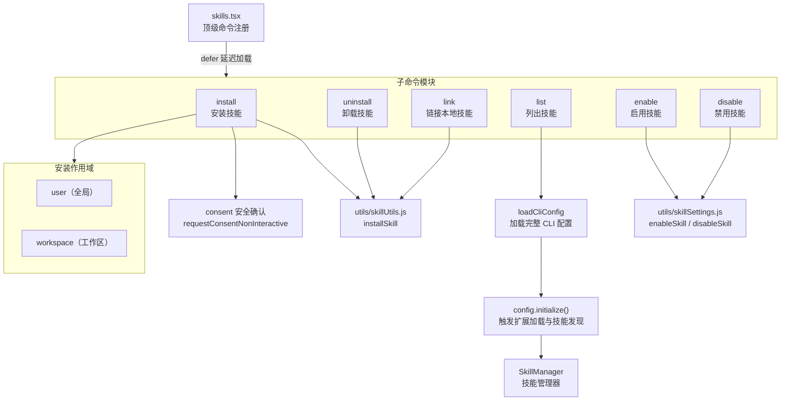
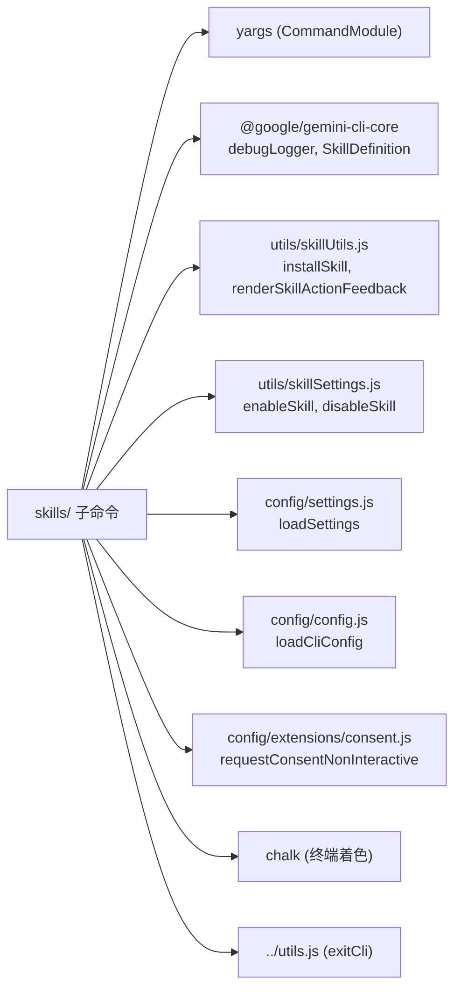
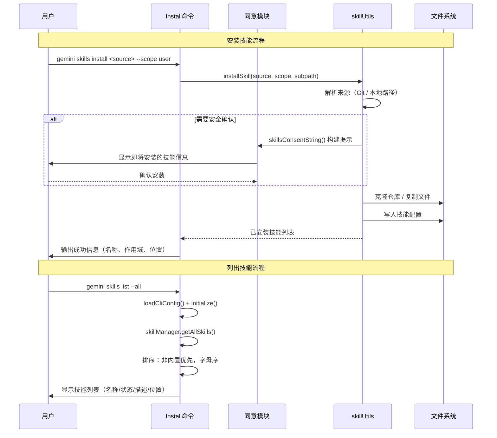

# skills 目录

## 概述

`skills/` 目录实现了 Gemini CLI 的 **Agent 技能（Skills）管理系统**，提供技能的安装、卸载、链接、列表和启用/禁用功能。Skills 是可复用的 Agent 能力模块，可以从 Git 仓库或本地路径安装，支持 `user`（全局）和 `workspace`（工作区）两种作用域。

## 目录结构

```
skills/
├── install.ts          # 安装技能（Git URL / 本地路径）
├── install.test.ts     # install 测试
├── uninstall.ts        # 卸载技能
├── uninstall.test.ts   # uninstall 测试
├── link.ts             # 链接本地开发技能
├── link.test.ts        # link 测试
├── list.ts             # 列出已发现的技能
├── list.test.ts        # list 测试
├── enable.ts           # 启用技能
├── enable.test.ts      # enable 测试
├── disable.ts          # 禁用技能
└── disable.test.ts     # disable 测试
```

## 架构图



## 核心组件

### 1. install.ts - 安装技能

支持从两种来源安装技能：

| 来源 | 示例 |
|------|------|
| Git 仓库 URL | `gemini skills install https://github.com/user/skill-repo` |
| 本地路径 | `gemini skills install ./my-skill` |

关键参数：
```typescript
interface InstallArgs {
  source: string;              // Git URL 或本地路径
  scope?: 'user' | 'workspace'; // 安装作用域（默认 user）
  path?: string;               // Git 仓库内的子路径
  consent?: boolean;           // 跳过安全确认提示
}
```

安装前会触发安全确认流程，展示即将安装的技能定义（`SkillDefinition`），用户确认后才执行安装。

### 2. list.ts - 列出技能

通过完整的 CLI 配置初始化流程来发现所有技能：

1. `loadCliConfig()` 加载配置
2. `config.initialize()` 触发扩展加载与技能发现
3. `skillManager.getAllSkills()` 获取全部技能

输出信息包括：
- 技能名称
- 启用/禁用状态（彩色标记）
- 是否为内置技能
- 描述信息
- 安装位置

排序规则：非内置技能优先显示，同类按名称字母序排列。`--all` 参数可显示内置技能。

### 3. enable.ts / disable.ts - 启用/禁用

通过 `skillSettings.js` 工具模块修改技能的启用状态，并通过 `renderSkillActionFeedback()` 提供格式化的操作反馈。操作直接写入 settings 配置文件。

### 4. link.ts - 链接本地技能

类似 `npm link`，将本地开发目录的技能链接到 Gemini CLI 配置中，便于开发调试。

## 依赖关系



## 数据流


