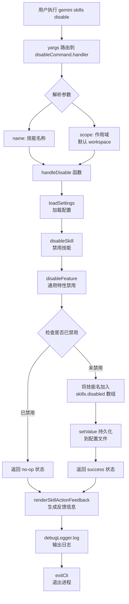

# disable.ts

## 概述

`disable.ts` 是 Gemini CLI 技能（Skill）管理子命令之一，负责**禁用**指定的 Agent 技能。它通过 `yargs` 框架注册为 `skills disable <name>` 子命令，允许用户在 `user`（用户级别）或 `workspace`（工作区级别）范围内禁用某个技能。

禁用操作的本质是将技能名称添加到对应作用域的 `skills.disabled` 数组中，持久化到相应的配置文件（用户级别为全局 settings.json，工作区级别为项目内的 settings.json）。

文件路径: `packages/cli/src/commands/skills/disable.ts`

## 架构图（Mermaid）



## 核心组件

### 1. `DisableArgs` 接口

```typescript
interface DisableArgs {
  name: string;        // 要禁用的技能名称
  scope: SettingScope; // 禁用的作用域: User 或 Workspace
}
```

定义了 `handleDisable` 函数的参数类型，包含技能名称和作用域两个必需字段。

### 2. `handleDisable` 异步函数

```typescript
export async function handleDisable(args: DisableArgs)
```

核心业务逻辑函数，执行以下步骤：

1. **解构参数**: 从 `args` 中提取 `name`（技能名称）和 `scope`（作用域）。
2. **获取工作目录**: 使用 `process.cwd()` 获取当前工作目录。
3. **加载配置**: 调用 `loadSettings(workspaceDir)` 从磁盘加载多层级配置（系统、用户、工作区）。
4. **执行禁用**: 调用 `disableSkill(settings, name, scope)`，内部会：
   - 通过 `skillStrategy.isExplicitlyDisabled` 检查技能是否已在目标作用域中被禁用。
   - 如果已禁用，返回 `no-op` 状态。
   - 如果未禁用，通过 `skillStrategy.disable` 将技能名追加到 `skills.disabled` 数组。
   - 通过 `settings.setValue` 持久化到磁盘。
5. **生成反馈**: 调用 `renderSkillActionFeedback` 将操作结果格式化为人类可读的字符串，使用 `chalk` 进行终端着色（加粗作用域标签，弱化路径）。
6. **输出日志**: 通过 `debugLogger.log` 输出反馈信息。

### 3. `disableCommand` 命令模块

```typescript
export const disableCommand: CommandModule
```

yargs `CommandModule` 导出对象，定义了完整的命令行接口：

| 属性 | 值 | 说明 |
|---|---|---|
| `command` | `'disable <name> [--scope]'` | 命令格式，`<name>` 为必需位置参数 |
| `describe` | `'Disables an agent skill.'` | 命令描述文字 |
| `builder` | 函数 | 定义位置参数和选项 |
| `handler` | 异步函数 | 执行入口，调用 `handleDisable` 后退出 |

**builder 配置的参数:**

- **`name`** (位置参数): 必需，字符串类型，指定要禁用的技能名称。
- **`scope`** (选项参数): 可选，别名 `-s`，默认值 `'workspace'`，可选值为 `['user', 'workspace']`。

**handler 逻辑:**

1. 将字符串形式的 `scope` 转换为 `SettingScope` 枚举值（`'workspace'` -> `SettingScope.Workspace`，其他 -> `SettingScope.User`）。
2. 调用 `handleDisable` 执行禁用。
3. 调用 `exitCli()` 清理资源并退出进程。

## 依赖关系

### 内部依赖

| 模块 | 导入内容 | 用途 |
|---|---|---|
| `../../config/settings.js` | `loadSettings`, `SettingScope` | 加载多层级配置系统，提供作用域枚举 |
| `../utils.js` | `exitCli` | 执行退出清理（`runExitCleanup`）并终止进程 |
| `../../utils/skillSettings.js` | `disableSkill` | 技能禁用核心逻辑，将技能名添加到 `skills.disabled` 数组 |
| `../../utils/skillUtils.js` | `renderSkillActionFeedback` | 将 `SkillActionResult` 格式化为人类可读的反馈字符串 |

### 外部依赖

| 包名 | 导入内容 | 用途 |
|---|---|---|
| `yargs` | `CommandModule` 类型 | 命令行框架，定义子命令结构 |
| `@google/gemini-cli-core` | `debugLogger` | 调试日志输出工具 |
| `chalk` | 默认导入 | 终端文本着色库（加粗、弱化等样式） |

## 关键实现细节

### 1. 禁用操作的策略模式

`disableSkill` 并非直接操作配置，而是通过 `featureToggleUtils.ts` 中的通用 **特性开关框架** 实现。具体使用了 `FeatureToggleStrategy` 接口定义的策略对象 `skillStrategy`：

```typescript
const skillStrategy: FeatureToggleStrategy = {
  isExplicitlyDisabled: (settings, scope, skillName) => {
    // 检查 settings.skills.disabled 数组中是否包含该技能名
    const currentScopeDisabled =
      settings.forScope(scope).settings.skills?.disabled ?? [];
    return currentScopeDisabled.includes(skillName);
  },
  disable: (settings, scope, skillName) => {
    // 将技能名追加到 skills.disabled 数组
    const currentScopeDisabled =
      settings.forScope(scope).settings.skills?.disabled ?? [];
    const newDisabled = [...currentScopeDisabled, skillName];
    settings.setValue(scope, 'skills.disabled', newDisabled);
  },
};
```

### 2. 作用域隔离

禁用操作是**作用域隔离的**，即在 `workspace` 作用域禁用不影响 `user` 作用域的配置，反之亦然。这通过 `settings.forScope(scope)` 实现，它返回特定作用域的 `SettingsFile` 对象。

### 3. 幂等性保证

通过 `isExplicitlyDisabled` 检查，如果技能已经在目标作用域中被禁用，操作返回 `no-op` 状态而非重复添加，保证了幂等性。

### 4. 配置持久化

`settings.setValue(scope, 'skills.disabled', newDisabled)` 不仅更新内存中的配置，还会通过 `saveSettings` -> `updateSettingsFilePreservingFormat` 将更改写入磁盘，且保留原有 JSON 文件格式（如注释、缩进）。

### 5. 反馈信息渲染

`renderSkillActionFeedback` 根据操作结果的不同状态生成差异化的反馈文本：

- **`error`**: 输出错误信息。
- **`no-op`**: 输出 `Skill "xxx" is already disabled.`。
- **`success`**: 输出 `Skill "xxx" disabled by adding it to the disabled list in workspace (path) settings.`。

### 6. 命令退出流程

`handler` 在执行完 `handleDisable` 后，显式调用 `exitCli()` 而非自然结束。`exitCli` 内部先执行 `runExitCleanup()` 进行资源清理（如关闭文件句柄、清理临时文件等），然后调用 `process.exit(exitCode)` 终止进程。默认退出码为 0（成功）。
