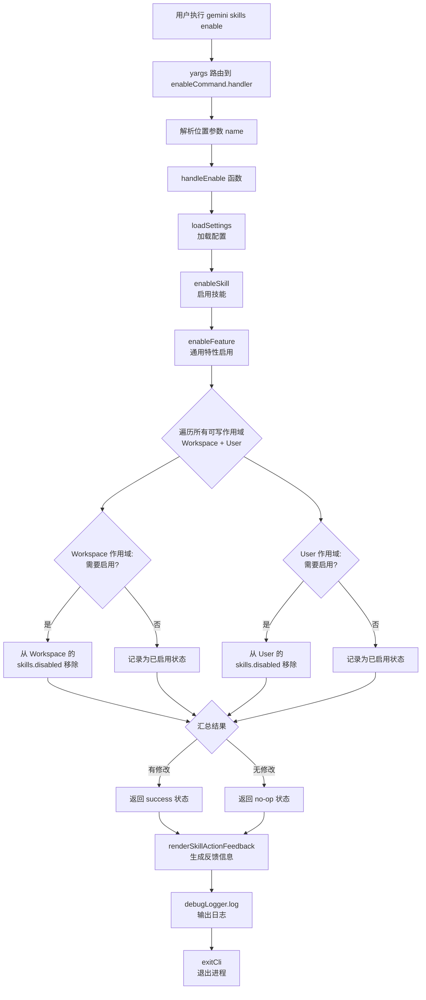

# enable.ts

## 概述

`enable.ts` 是 Gemini CLI 技能（Skill）管理子命令之一，负责**启用**指定的 Agent 技能。它通过 `yargs` 框架注册为 `skills enable <name>` 子命令，将技能从**所有可写作用域**（`User` 和 `Workspace`）的禁用列表中移除，从而恢复技能的可用状态。

与 `disable` 命令不同的是，`enable` 命令**不需要指定作用域**，而是自动扫描所有可写作用域并执行启用。这是因为启用操作的语义是"确保技能在任何地方都不被禁用"，需要清除所有作用域中的禁用记录。

文件路径: `packages/cli/src/commands/skills/enable.ts`

## 架构图（Mermaid）



## 核心组件

### 1. `EnableArgs` 接口

```typescript
interface EnableArgs {
  name: string;  // 要启用的技能名称
}
```

与 `DisableArgs` 相比，`EnableArgs` 没有 `scope` 字段，因为启用操作会自动覆盖所有可写作用域。

### 2. `handleEnable` 异步函数

```typescript
export async function handleEnable(args: EnableArgs)
```

核心业务逻辑函数，执行以下步骤：

1. **解构参数**: 从 `args` 中提取 `name`（技能名称）。
2. **获取工作目录**: 使用 `process.cwd()` 获取当前工作目录。
3. **加载配置**: 调用 `loadSettings(workspaceDir)` 加载多层级配置。
4. **执行启用**: 调用 `enableSkill(settings, name)`，内部会：
   - 遍历 `Workspace` 和 `User` 两个可写作用域。
   - 对每个作用域调用 `skillStrategy.needsEnabling` 检查技能是否在该作用域的 `skills.disabled` 数组中。
   - 如果在禁用列表中，调用 `skillStrategy.enable` 将其从数组中过滤移除。
   - 如果所有作用域都不需要修改，返回 `no-op` 状态。
5. **生成反馈**: 调用 `renderSkillActionFeedback` 格式化操作结果。
6. **输出日志**: 通过 `debugLogger.log` 输出。

### 3. `enableCommand` 命令模块

```typescript
export const enableCommand: CommandModule
```

yargs `CommandModule` 导出对象，定义了完整的命令行接口：

| 属性 | 值 | 说明 |
|---|---|---|
| `command` | `'enable <name>'` | 命令格式，仅有 `<name>` 必需位置参数 |
| `describe` | `'Enables an agent skill.'` | 命令描述文字 |
| `builder` | 函数 | 仅定义 `name` 位置参数 |
| `handler` | 异步函数 | 执行入口 |

**builder 配置的参数:**

- **`name`** (位置参数): 必需，字符串类型，指定要启用的技能名称。

**注意**: 与 `disable` 命令不同，`enable` 命令**没有 `--scope` 选项**。

**handler 逻辑:**

1. 直接将 `argv['name']` 传入 `handleEnable`。
2. 调用 `exitCli()` 清理资源并退出进程。

## 依赖关系

### 内部依赖

| 模块 | 导入内容 | 用途 |
|---|---|---|
| `../../config/settings.js` | `loadSettings` | 加载多层级配置系统 |
| `../utils.js` | `exitCli` | 执行退出清理并终止进程 |
| `../../utils/skillSettings.js` | `enableSkill` | 技能启用核心逻辑，从 `skills.disabled` 数组中移除技能名 |
| `../../utils/skillUtils.js` | `renderSkillActionFeedback` | 将操作结果格式化为人类可读的反馈字符串 |

### 外部依赖

| 包名 | 导入内容 | 用途 |
|---|---|---|
| `yargs` | `CommandModule` 类型 | 命令行框架，定义子命令结构 |
| `@google/gemini-cli-core` | `debugLogger` | 调试日志输出工具 |
| `chalk` | 默认导入 | 终端文本着色库 |

## 关键实现细节

### 1. 启用操作的全作用域扫描

与 `disable` 仅操作指定作用域不同，`enable` 会扫描**所有可写作用域** (`Workspace` 和 `User`)。这是通过 `enableFeature` 函数实现的：

```typescript
export function enableFeature(
  settings: LoadedSettings,
  featureName: string,
  strategy: FeatureToggleStrategy,
): FeatureActionResult {
  const writableScopes = [SettingScope.Workspace, SettingScope.User];
  // ... 遍历每个作用域检查并启用
}
```

**设计理由**: 如果技能同时在 User 和 Workspace 两个作用域中被禁用，只在一个作用域启用是不够的——合并配置后技能仍然会被另一个作用域禁用。因此启用操作需要清除所有禁用记录。

### 2. 启用操作的底层实现

`skillStrategy.enable` 通过过滤数组来移除技能名，而非直接删除：

```typescript
enable: (settings, scope, skillName) => {
  const currentScopeDisabled =
    settings.forScope(scope).settings.skills?.disabled ?? [];
  const newDisabled = currentScopeDisabled.filter(
    (name) => name !== skillName,
  );
  settings.setValue(scope, 'skills.disabled', newDisabled);
},
```

这种实现方式是安全的——即使数组中不存在该技能名，过滤操作也不会报错。

### 3. 反馈信息区分单/双作用域修改

`renderSkillActionFeedback` 会根据受影响的作用域数量生成不同的反馈文本：

- **双作用域**: `Skill "xxx" enabled by removing it from the disabled list in workspace (path) and user (path) settings.`
- **单作用域**: `Skill "xxx" enabled by removing it from the disabled list in workspace (path) settings.`
- **无修改**: `Skill "xxx" is already enabled.`

### 4. 与 disable 命令的对称性设计

| 特征 | enable | disable |
|---|---|---|
| 作用域参数 | 无（自动扫描全部） | 必需 `--scope` |
| 操作对象 | 所有可写作用域 | 指定的单个作用域 |
| 底层操作 | 从 `skills.disabled` 数组移除 | 向 `skills.disabled` 数组添加 |
| 幂等性 | 已启用返回 `no-op` | 已禁用返回 `no-op` |

### 5. 命令退出流程

与 `disable` 命令相同，`handler` 在执行完 `handleEnable` 后显式调用 `exitCli()`，内部先执行资源清理再终止进程，默认退出码为 0。
