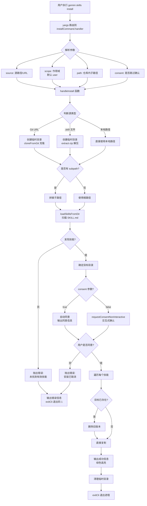

# install.ts

## 概述

`install.ts` 是 Gemini CLI 技能（Skill）管理子命令之一，负责从 **Git 仓库 URL**、**本地路径** 或 **`.skill` 压缩包** 安装 Agent 技能。它通过 `yargs` 框架注册为 `skills install <source>` 子命令，支持用户级别和工作区级别的安装，并内置了安全同意流程。

安装过程包括：克隆/解压源代码 -> 扫描 `SKILL.md` 文件发现技能 -> 请求用户安全确认 -> 复制技能到目标目录。

文件路径: `packages/cli/src/commands/skills/install.ts`

## 架构图（Mermaid）



## 核心组件

### 1. `InstallArgs` 接口

```typescript
interface InstallArgs {
  source: string;                    // 源：Git URL、本地路径或 .skill 文件
  scope?: 'user' | 'workspace';     // 安装作用域，默认 'user'
  path?: string;                     // 仓库内的子路径
  consent?: boolean;                 // 是否跳过确认提示
}
```

### 2. `handleInstall` 异步函数

```typescript
export async function handleInstall(args: InstallArgs)
```

核心业务逻辑函数，用 `try/catch` 包裹整个流程以处理各种错误场景：

**执行步骤：**

1. **参数解析**: 解构 `source`、`consent`，设置 `scope` 默认值为 `'user'`，提取 `subpath`。

2. **构建同意回调**: 创建 `requestConsent` 闭包函数：
   - 如果 `consent` 为 `true`（用户通过 `--consent` 标志预先同意），输出同意内容并直接返回 `true`。
   - 否则调用 `requestConsentNonInteractive`，通过 stdin 交互式询问用户 `[Y/n]`。

3. **调用 `installSkill`**: 将 `source`、`scope`、`subpath`、日志回调和同意回调传入。内部流程：
   - **源类型判断**: 根据 `source` 前缀判断是 Git URL（`git@`、`http://`、`https://`）、`.skill` 文件还是本地路径。
   - **获取源代码**: Git URL 使用 `cloneFromGit` 克隆到临时目录；`.skill` 文件使用 `extract-zip` 解压到临时目录；本地路径直接使用。
   - **子路径处理**: 如果提供了 `--path` 参数，将其拼接到源路径上。
   - **安全检查**: 如果源是克隆/解压的临时目录，验证最终路径不会通过 `..` 穿越到临时目录之外。
   - **技能发现**: 调用 `loadSkillsFromDir` 递归扫描目录中的 `SKILL.md` 文件。
   - **确定目标目录**: `workspace` 作用域使用 `storage.getProjectSkillsDir()`，`user` 作用域使用 `Storage.getUserSkillsDir()`。
   - **请求同意**: 调用传入的 `requestConsent` 回调。
   - **复制安装**: 对每个发现的技能，将其目录复制到目标位置。如果已存在同名技能则覆盖。
   - **清理临时目录**: 在 `finally` 块中删除临时目录。

4. **成功输出**: 遍历已安装的技能，使用 `chalk.green` 绿色高亮输出成功信息，包含技能名、作用域和安装位置。

5. **错误处理**: 捕获任何异常，通过 `debugLogger.error` 输出错误信息，并以退出码 `1` 调用 `exitCli`。

### 3. `installCommand` 命令模块

```typescript
export const installCommand: CommandModule
```

| 属性 | 值 | 说明 |
|---|---|---|
| `command` | `'install <source> [--scope] [--path]'` | 命令格式 |
| `describe` | `'Installs an agent skill from a git repository URL or a local path.'` | 描述 |

**builder 配置的参数:**

| 参数 | 类型 | 必需 | 默认值 | 说明 |
|---|---|---|---|---|
| `source` | 位置参数，字符串 | 是 | - | Git 仓库 URL 或本地路径 |
| `--scope` | 选项，字符串 | 否 | `'user'` | 安装作用域 (`user` / `workspace`) |
| `--path` | 选项，字符串 | 否 | - | 仓库内子路径（仅 Git 源时有用） |
| `--consent` | 选项，布尔值 | 否 | `false` | 跳过确认提示 |

**builder 中的额外验证:**

```typescript
.check((argv) => {
  if (!argv.source) {
    throw new Error('The source argument must be provided.');
  }
  return true;
})
```

在命令解析阶段即验证 `source` 是否提供，提前报错。

## 依赖关系

### 内部依赖

| 模块 | 导入内容 | 用途 |
|---|---|---|
| `../utils.js` | `exitCli` | 执行退出清理并终止进程 |
| `../../utils/skillUtils.js` | `installSkill` | 技能安装核心逻辑（克隆、解压、复制） |
| `../../config/extensions/consent.js` | `requestConsentNonInteractive`, `skillsConsentString` | 安全同意流程：生成同意文本、交互式确认 |

**`installSkill` 间接依赖:**

| 模块 | 用途 |
|---|---|
| `@google/gemini-cli-core` → `Storage` | 获取用户级/项目级技能目录路径 |
| `@google/gemini-cli-core` → `loadSkillsFromDir` | 递归扫描 `SKILL.md` 文件发现技能定义 |
| `../../config/extensions/github.js` → `cloneFromGit` | Git 仓库克隆（支持 GitHub Token 认证） |
| `extract-zip` | `.skill` 压缩包解压 |

### 外部依赖

| 包名 | 导入内容 | 用途 |
|---|---|---|
| `yargs` | `CommandModule` 类型 | 命令行框架 |
| `@google/gemini-cli-core` | `debugLogger`, `SkillDefinition`, `getErrorMessage` | 日志、类型定义、错误消息提取 |
| `chalk` | 默认导入 | 终端着色（绿色成功信息、加粗技能名） |

## 关键实现细节

### 1. 三种源类型支持

`installSkill` 支持三种来源的技能安装：

| 源类型 | 判断条件 | 处理方式 |
|---|---|---|
| **Git URL** | `source` 以 `git@`、`http://`、`https://` 开头 | 创建临时目录，使用 `simple-git` 库的 `cloneFromGit` 克隆 |
| **`.skill` 文件** | `source` 以 `.skill` 结尾（不区分大小写） | 创建临时目录，使用 `extract-zip` 解压 ZIP 格式文件 |
| **本地路径** | 以上条件均不满足 | 直接使用 `source` 路径 |

### 2. 安全同意机制

安装技能涉及安全风险（注入系统提示词），因此内置了两层同意机制：

**自动同意模式** (`--consent` 标志):
```typescript
if (consent) {
  debugLogger.log('You have consented to the following:');
  debugLogger.log(await skillsConsentString(skills, source, targetDir));
  return true;
}
```

**交互式同意模式** (默认):
```typescript
return requestConsentNonInteractive(
  await skillsConsentString(skills, source, targetDir),
);
```

同意文本包括：
- 操作描述（"Installing agent skill(s) from ..."）
- 技能列表（名称、描述、源路径、目录项数量）
- 安装目标目录
- 安全警告（黄色高亮：技能会修改 Agent 的系统提示词）

### 3. 目录穿越安全检查

克隆/解压到临时目录后，如果用户提供了 `--path` 子路径，代码会验证最终路径是否仍在临时目录内：

```typescript
if (tempDirToClean && !sourcePath.startsWith(path.resolve(tempDirToClean))) {
  throw new Error('Invalid path: Directory traversal not allowed.');
}
```

这防止了通过 `--path ../../etc` 之类的路径穿越攻击。

### 4. 覆盖安装

如果目标位置已存在同名技能，会先删除旧版本再复制新版本：

```typescript
const exists = await fs.stat(destPath).catch(() => null);
if (exists) {
  onLog(`Skill "${skillName}" already exists. Overwriting...`);
  await fs.rm(destPath, { recursive: true, force: true });
}
await fs.cp(skillDir, destPath, { recursive: true });
```

### 5. 临时目录清理保证

使用 `try/finally` 确保临时目录在任何情况下都会被清理：

```typescript
try {
  // ... 克隆、安装逻辑
} finally {
  if (tempDirToClean) {
    await fs.rm(tempDirToClean, { recursive: true, force: true });
  }
}
```

### 6. 错误处理策略

`handleInstall` 使用顶层 `try/catch` 处理所有错误：

- **正常退出**: 成功安装后调用 `exitCli()` (退出码 0)。
- **错误退出**: 捕获异常后，通过 `getErrorMessage(error)` 提取错误消息输出，然后以退出码 `1` 调用 `exitCli(1)`。

这包括但不限于：
- Git 克隆失败
- ZIP 解压失败
- 未找到有效的 `SKILL.md` 文件
- 用户拒绝同意
- 文件系统操作失败（权限、磁盘空间等）

### 7. 作用域与目标目录

| 作用域 | 目标目录获取方式 | 说明 |
|---|---|---|
| `user` (默认) | `Storage.getUserSkillsDir()` | 用户全局技能目录，通常在 `~/.gemini/skills/` |
| `workspace` | `storage.getProjectSkillsDir()` | 项目级技能目录，通常在 `.gemini/skills/` |
