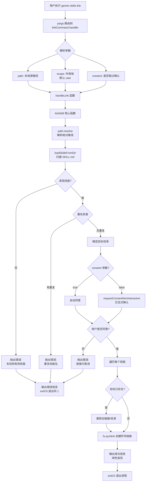

# link.ts

## 概述

`link.ts` 是 Gemini CLI 技能（Skill）管理子命令之一，负责通过**符号链接（symlink）** 将本地路径中的 Agent 技能链接到技能目录。它通过 `yargs` 框架注册为 `skills link <path>` 子命令。

与 `install` 命令不同，`link` 使用文件系统符号链接（`fs.symlink`）而非文件复制。这意味着对源目录的任何修改会**立即反映**到链接位置，非常适合技能开发阶段的调试和迭代场景。

文件路径: `packages/cli/src/commands/skills/link.ts`

## 架构图（Mermaid）



## 核心组件

### 1. `LinkArgs` 接口

```typescript
interface LinkArgs {
  path: string;                      // 本地技能源路径
  scope?: 'user' | 'workspace';     // 链接作用域，默认 'user'
  consent?: boolean;                 // 是否跳过确认提示
}
```

与 `InstallArgs` 相比，没有 `source` 和 `path`（子路径）的区分，因为 `link` 仅支持本地路径。

### 2. `handleLink` 异步函数

```typescript
export async function handleLink(args: LinkArgs)
```

核心业务逻辑函数，用 `try/catch` 包裹：

**执行步骤：**

1. **参数解析**: 解构 `scope`（默认 `'user'`）和 `consent`。

2. **调用 `linkSkill`**: 传入 `args.path`、`scope`、日志回调和同意回调。内部流程：
   - **路径解析**: 使用 `path.resolve(source)` 将输入路径转为绝对路径。
   - **技能发现**: 调用 `loadSkillsFromDir(sourcePath)` 扫描目录中的 `SKILL.md` 文件。
   - **重名检查**: 使用 `Map` 检查发现的技能是否存在内部名称冲突。如果同一源目录中有两个技能同名，抛出详细错误。
   - **确定目标目录**: 根据 `scope` 选择 `storage.getProjectSkillsDir()` 或 `Storage.getUserSkillsDir()`。
   - **请求同意**: 调用传入的同意回调。
   - **创建符号链接**: 对每个技能，在目标目录中创建指向源技能目录的符号链接（`fs.symlink(skillSourceDir, destPath, 'dir')`）。如果目标已存在，先删除再创建。

3. **成功输出**: 使用 `chalk.green` 输出 `Successfully linked skills.`。

4. **错误处理**: 与 `install` 相同，捕获异常并以退出码 `1` 退出。

### 3. `linkCommand` 命令模块

```typescript
export const linkCommand: CommandModule
```

| 属性 | 值 | 说明 |
|---|---|---|
| `command` | `'link <path>'` | 命令格式 |
| `describe` | `'Links an agent skill from a local path. Updates to the source will be reflected immediately.'` | 描述，明确强调源更新立即反映 |

**builder 配置的参数:**

| 参数 | 类型 | 必需 | 默认值 | 说明 |
|---|---|---|---|---|
| `path` | 位置参数，字符串 | 是 | - | 本地技能源路径 |
| `--scope` | 选项，字符串 | 否 | `'user'` | 链接作用域 (`user` / `workspace`) |
| `--consent` | 选项，布尔值 | 否 | `false` | 跳过确认提示 |

**builder 中的额外验证:**

```typescript
.check((argv) => {
  if (!argv.path) {
    throw new Error('The path argument must be provided.');
  }
  return true;
})
```

## 依赖关系

### 内部依赖

| 模块 | 导入内容 | 用途 |
|---|---|---|
| `../utils.js` | `exitCli` | 执行退出清理并终止进程 |
| `../../utils/skillUtils.js` | `linkSkill` | 技能链接核心逻辑（扫描、符号链接创建） |
| `../../config/extensions/consent.js` | `requestConsentNonInteractive`, `skillsConsentString` | 安全同意流程 |

**`linkSkill` 间接依赖:**

| 模块 | 用途 |
|---|---|
| `@google/gemini-cli-core` -> `Storage` | 获取用户级/项目级技能目录路径 |
| `@google/gemini-cli-core` -> `loadSkillsFromDir` | 递归扫描 `SKILL.md` 文件发现技能定义 |

### 外部依赖

| 包名 | 导入内容 | 用途 |
|---|---|---|
| `yargs` | `CommandModule` 类型 | 命令行框架 |
| `@google/gemini-cli-core` | `debugLogger`, `getErrorMessage` | 日志输出、错误消息提取 |
| `chalk` | 默认导入 | 终端着色 |

## 关键实现细节

### 1. 符号链接 vs 文件复制

`link` 与 `install` 的核心区别在于文件系统操作：

| 特性 | link (符号链接) | install (文件复制) |
|---|---|---|
| 文件系统操作 | `fs.symlink(src, dest, 'dir')` | `fs.cp(src, dest, { recursive: true })` |
| 源更新反映 | 立即反映 | 需要重新安装 |
| 源删除影响 | 链接失效（悬挂链接） | 无影响（已独立复制） |
| 适用场景 | 开发/调试 | 生产/分发 |
| 支持的源 | 仅本地路径 | Git URL、.skill 文件、本地路径 |

### 2. 内部名称冲突检测

`linkSkill` 独有的安全检查——在 `installSkill` 中没有这个检查：

```typescript
const seenNames = new Map<string, string>();
for (const skill of skills) {
  if (seenNames.has(skill.name)) {
    throw new Error(
      `Duplicate skill name "${skill.name}" found at multiple locations:\n` +
      `  - ${seenNames.get(skill.name)}\n` +
      `  - ${skill.location}`,
    );
  }
  seenNames.set(skill.name, skill.location);
}
```

这是因为链接操作通常处理的是开发中的源目录，可能存在多个 `SKILL.md` 文件意外使用相同名称。而 `install` 从远程仓库安装，通常假设仓库维护者已确保名称唯一。

### 3. 同意文本的差异

`link` 命令在调用 `skillsConsentString` 时传入 `isLink = true`，导致同意文本的措辞有所不同：

- **install**: `"Installing agent skill(s) from..."`, 目标标签为 `"Install Destination"`
- **link**: `"Linking agent skill(s) from..."`, 目标标签为 `"Link Destination"`

### 4. 覆盖已有链接

使用 `fs.lstat`（而非 `fs.stat`）检查目标是否存在，这样可以检测到悬挂的符号链接（目标已被删除但链接仍在）：

```typescript
const exists = await fs.lstat(destPath).catch(() => null);
if (exists) {
  onLog(`Skill "${skillName}" already exists at destination. Overwriting...`);
  await fs.rm(destPath, { recursive: true, force: true });
}
await fs.symlink(skillSourceDir, destPath, 'dir');
```

注意：`install` 使用的是 `fs.stat`，而 `link` 使用 `fs.lstat`。差异在于 `lstat` 不跟随符号链接，能正确检测到符号链接本身的存在。

### 5. 错误处理策略

与 `install` 完全一致：

- 成功路径: 输出绿色成功信息 -> `exitCli()` (退出码 0)
- 错误路径: `debugLogger.error(getErrorMessage(error))` -> `exitCli(1)` (退出码 1)

### 6. 无临时目录清理

与 `install` 不同，`link` 不创建临时目录，因此没有 `finally` 清理逻辑。源路径由用户直接指定，不存在中间产物需要清理。
