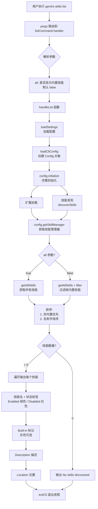

# list.ts

## 概述

`list.ts` 是 Gemini CLI 技能（Skill）管理子命令之一，负责**列出**当前已发现的所有 Agent 技能。它通过 `yargs` 框架注册为 `skills list` 子命令，展示每个技能的名称、状态（启用/禁用）、描述和位置信息。

与 `disable`/`enable` 等命令不同，`list` 需要完整初始化 CLI 配置（包括扩展加载和技能发现），因为它需要展示运行时实际可用的所有技能。默认情况下隐藏内置技能，使用 `--all` 标志可显示全部。

文件路径: `packages/cli/src/commands/skills/list.ts`

## 架构图（Mermaid）



## 核心组件

### 1. `handleList` 异步函数

```typescript
export async function handleList(args: { all?: boolean })
```

核心业务逻辑函数，执行以下步骤：

#### 1.1 配置加载与初始化

```typescript
const workspaceDir = process.cwd();
const settings = loadSettings(workspaceDir);

const config = await loadCliConfig(
  settings.merged,
  'skills-list-session',
  { debug: false } as Partial<CliArgs> as CliArgs,
  { cwd: workspaceDir },
);

await config.initialize();
```

- **`loadSettings`**: 从磁盘加载多层级配置（系统、用户、工作区）。
- **`loadCliConfig`**: 创建 `Config` 对象，传入合并后的配置、一个专用的 session ID（`'skills-list-session'`），以及最小化的 `CliArgs`（仅设 `debug: false`）。
- **`config.initialize()`**: 触发完整的初始化流程，包括：
  - 扩展管理器加载所有已注册的扩展。
  - 技能管理器（`SkillManager`）执行 `discoverSkills`，从用户级目录、工作区级目录和扩展中发现技能。
  - 根据配置中的 `skills.disabled` 数组设置技能的禁用状态。

#### 1.2 技能获取与过滤

```typescript
const skillManager = config.getSkillManager();
const skills = args.all
  ? skillManager.getAllSkills()
  : skillManager.getAllSkills().filter((s) => !s.isBuiltin);
```

- **`getSkillManager()`**: 获取 `Config` 内部的 `SkillManager` 实例。
- **`getAllSkills()`**: 返回所有已发现的技能定义数组 (`SkillDefinition[]`)。
- **过滤逻辑**: 默认过滤掉 `isBuiltin === true` 的内置技能，`--all` 标志时显示全部。

#### 1.3 排序

```typescript
skills.sort((a, b) => {
  if (a.isBuiltin === b.isBuiltin) {
    return a.name.localeCompare(b.name);
  }
  return a.isBuiltin ? 1 : -1;
});
```

双重排序规则：
1. **非内置技能排在前面**: 内置技能排到列表末尾。
2. **同类型内按名称字母序排列**: 使用 `localeCompare` 进行本地化字符串比较。

#### 1.4 格式化输出

每个技能输出三行信息：

```
<技能名 加粗> [Enabled 绿色 | Disabled 红色] [Built-in 灰色（可选）]
  Description: <描述>
  Location:    <文件位置>
```

颜色编码：
- **`[Enabled]`**: `chalk.green` 绿色
- **`[Disabled]`**: `chalk.red` 红色
- **`[Built-in]`**: `chalk.gray` 灰色
- **技能名**: `chalk.bold` 加粗

### 2. `listCommand` 命令模块

```typescript
export const listCommand: CommandModule
```

| 属性 | 值 | 说明 |
|---|---|---|
| `command` | `'list [--all]'` | 命令格式 |
| `describe` | `'Lists discovered agent skills.'` | 描述 |

**builder 配置的参数:**

| 参数 | 类型 | 必需 | 默认值 | 说明 |
|---|---|---|---|---|
| `--all` | 布尔值 | 否 | `false` | 是否显示内置技能 |

## 依赖关系

### 内部依赖

| 模块 | 导入内容 | 用途 |
|---|---|---|
| `../../config/settings.js` | `loadSettings` | 加载多层级配置系统 |
| `../../config/config.js` | `loadCliConfig`, `CliArgs` | 创建完整的 CLI 配置对象，包含扩展加载和技能发现 |
| `../utils.js` | `exitCli` | 执行退出清理并终止进程 |

**间接依赖（通过 `Config` 对象）:**

| 模块 | 用途 |
|---|---|
| `@google/gemini-cli-core` -> `SkillManager` | 技能管理器，负责发现、过滤和管理所有技能 |
| `@google/gemini-cli-core` -> `Storage` | 文件系统存储，提供技能目录路径 |
| 扩展管理器（`ExtensionManager`） | 加载扩展中包含的技能 |

### 外部依赖

| 包名 | 导入内容 | 用途 |
|---|---|---|
| `yargs` | `CommandModule` 类型 | 命令行框架 |
| `@google/gemini-cli-core` | `debugLogger` | 调试日志输出 |
| `chalk` | 默认导入 | 终端着色 |

## 关键实现细节

### 1. 完整初始化的必要性

`list` 是技能管理子命令中唯一需要完整初始化 `Config` 对象的命令。其他命令（`disable`、`enable`、`install`、`link`）只需要操作配置文件或文件系统，不需要运行时的技能发现。

```typescript
const config = await loadCliConfig(...);
await config.initialize();  // 触发扩展加载和技能发现
```

初始化过程中会：
1. 加载所有已安装的扩展。
2. 从用户全局目录（`~/.gemini/skills/`）扫描技能。
3. 从工作区目录（`.gemini/skills/`）扫描技能。
4. 从各个扩展中提取捆绑的技能。
5. 根据 `skills.disabled` 配置标记禁用状态。

### 2. 最小化 CliArgs

为避免触发不必要的副作用（如沙盒模式、调试日志等），`handleList` 传入最小化的 `CliArgs`：

```typescript
{ debug: false } as Partial<CliArgs> as CliArgs
```

使用双重类型断言（`Partial<CliArgs>` -> `CliArgs`）来满足 TypeScript 类型要求，同时仅设置 `debug: false`。其余字段为 `undefined`，确保不会意外激活任何功能。

### 3. 专用 Session ID

使用固定的 session ID `'skills-list-session'`，而非动态生成。因为 `list` 命令不产生实际的会话交互，不需要唯一标识。

### 4. 内置技能的定义

技能的 `isBuiltin` 属性由 `SkillManager` 在技能发现阶段设置。内置技能通常是 Gemini CLI 自带的核心技能（如代码审查、文档生成等），而用户安装或链接的技能是非内置的。

默认隐藏内置技能的设计理由：用户通常关心的是自己安装/管理的技能，内置技能始终存在且用户通常不需要单独管理。

### 5. 输出格式示例

```
Discovered Agent Skills:

my-custom-skill [Enabled]
  Description: A custom skill for project-specific tasks
  Location:    /Users/user/.gemini/skills/my-custom-skill/SKILL.md

another-skill [Disabled]
  Description: Another skill that has been disabled
  Location:    /project/.gemini/skills/another-skill/SKILL.md

code-review [Enabled] [Built-in]
  Description: Built-in code review skill
  Location:    /usr/lib/gemini-cli/skills/code-review/SKILL.md
```

（注：`[Built-in]` 后缀仅在 `--all` 模式下可见）

### 6. 空结果处理

如果没有发现任何技能（或所有技能都是内置的且未使用 `--all`），输出 `'No skills discovered.'` 并直接返回，不会输出表头。

### 7. 与其他 skills 子命令的关系

| 命令 | 操作对象 | 是否需要初始化 |
|---|---|---|
| `list` | 运行时技能状态 | 是（需完整初始化） |
| `disable` | 配置文件 (`skills.disabled` 数组) | 否（仅加载配置） |
| `enable` | 配置文件 (`skills.disabled` 数组) | 否（仅加载配置） |
| `install` | 文件系统（复制技能文件） | 否 |
| `link` | 文件系统（创建符号链接） | 否 |
