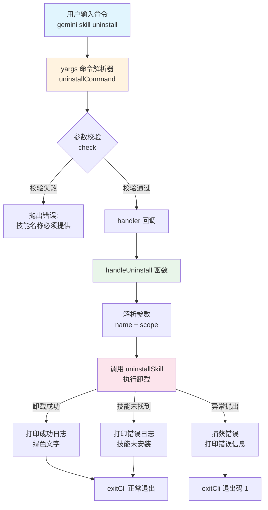

# uninstall.ts

## 概述

`uninstall.ts` 是 Gemini CLI 技能（Skill）卸载命令的实现文件。该文件提供了通过命令行卸载已安装的 Agent 技能的能力。用户可以指定技能名称和作用域（用户级别或工作区级别）来移除不再需要的技能。

该模块导出两个主要成员：
- `handleUninstall` 函数：执行卸载逻辑的核心异步函数
- `uninstallCommand` 对象：符合 yargs `CommandModule` 接口的命令定义对象

## 架构图（Mermaid）



## 核心组件

### 1. `UninstallArgs` 接口

```typescript
interface UninstallArgs {
  name: string;
  scope?: 'user' | 'workspace';
}
```

卸载命令的参数类型定义：
- **`name`** (必需)：要卸载的技能名称，作为位置参数传入
- **`scope`** (可选)：卸载的作用域，支持两个值：
  - `'user'`：用户级别（全局），这是默认值
  - `'workspace'`：工作区级别（仅当前项目）

### 2. `handleUninstall` 异步函数

```typescript
export async function handleUninstall(args: UninstallArgs): Promise<void>
```

这是卸载逻辑的核心实现，处理流程如下：

1. **参数解构**：从 `args` 中提取 `name`，并使用空值合并运算符 `??` 为 `scope` 提供默认值 `'user'`
2. **调用卸载工具函数**：将 `name` 和 `scope` 传递给 `uninstallSkill()` 异步函数
3. **结果处理**：
   - 如果 `result` 为真值（卸载成功），使用 `chalk.green` 打印绿色成功消息，包含技能名称（加粗）、作用域和位置信息
   - 如果 `result` 为假值（技能未找到），使用 `debugLogger.error` 打印技能未安装的错误消息
4. **异常处理**：在 `try-catch` 块中捕获任何异常，通过 `getErrorMessage` 提取错误信息并记录日志，然后以退出码 `1` 调用 `exitCli` 退出

### 3. `uninstallCommand` 命令模块

```typescript
export const uninstallCommand: CommandModule = { ... }
```

符合 yargs `CommandModule` 接口的命令定义对象，包含以下配置：

| 属性 | 值 | 说明 |
|------|-----|------|
| `command` | `'uninstall <name> [--scope]'` | 命令格式，`<name>` 为必需的位置参数 |
| `describe` | `'Uninstalls an agent skill by name.'` | 命令描述文本 |
| `builder` | 函数 | 配置 yargs 参数解析器 |
| `handler` | 异步函数 | 命令执行回调 |

**builder 配置详情**：
- `.positional('name', ...)` — 定义位置参数 `name`，类型为 `string`，标记为必需
- `.option('scope', ...)` — 定义选项参数 `scope`，限制选项为 `['user', 'workspace']`，默认值 `'user'`
- `.check(...)` — 自定义校验函数，确保 `name` 参数不为空

**handler 执行逻辑**：
1. 从 `argv` 中提取 `name` 和 `scope` 参数（使用类型断言转换）
2. 调用 `handleUninstall` 处理卸载
3. 调用 `exitCli()` 正常退出 CLI

## 依赖关系

### 内部依赖

| 模块 | 导入项 | 用途 |
|------|--------|------|
| `@google/gemini-cli-core` | `debugLogger` | 调试日志记录器，用于输出成功/错误信息 |
| `@google/gemini-cli-core` | `getErrorMessage` | 错误信息提取工具函数，从 Error 对象中安全获取消息 |
| `../utils.js` | `exitCli` | CLI 退出工具函数，支持指定退出码 |
| `../../utils/skillUtils.js` | `uninstallSkill` | 技能卸载的实际执行函数，处理文件系统操作 |

### 外部依赖

| 包名 | 导入项 | 用途 |
|------|--------|------|
| `yargs` | `CommandModule` (类型) | yargs 命令模块接口类型定义 |
| `chalk` | `chalk` | 终端文字样式库，用于输出彩色文本 |

## 关键实现细节

1. **作用域默认值处理**：使用 `args.scope ?? 'user'` 空值合并运算符而非 `||`，确保只在 `undefined` 或 `null` 时使用默认值，不会错误处理空字符串等假值。同时在 yargs 的 `builder` 中也设置了 `default: 'user'`，形成双重默认值保障。

2. **错误处理策略**：区分两种错误场景——`uninstallSkill` 返回假值（技能不存在，不退出进程）和抛出异常（真正的错误，以退出码 1 退出）。这种区分使得"技能不存在"不会导致非零退出码。

3. **类型安全**：使用 `eslint-disable` 注释显式抑制 `@typescript-eslint/no-unsafe-type-assertion` 规则，因为 yargs 的 `argv` 类型推导不够精确，需要手动断言 `name` 为 `string`、`scope` 为联合类型。

4. **日志输出**：成功消息使用 `debugLogger.log` 配合 `chalk.green` 和 `chalk.bold` 进行视觉化输出；错误消息使用 `debugLogger.error`。注意这里使用的是 `debugLogger` 而非标准 `console`，表明日志输出遵循项目统一的日志管理机制。

5. **退出流程**：`handler` 在调用 `handleUninstall` 后显式调用 `exitCli()` 确保进程正常退出，而在 `handleUninstall` 内部的异常处理中则传入退出码 `1` 表示失败退出。
