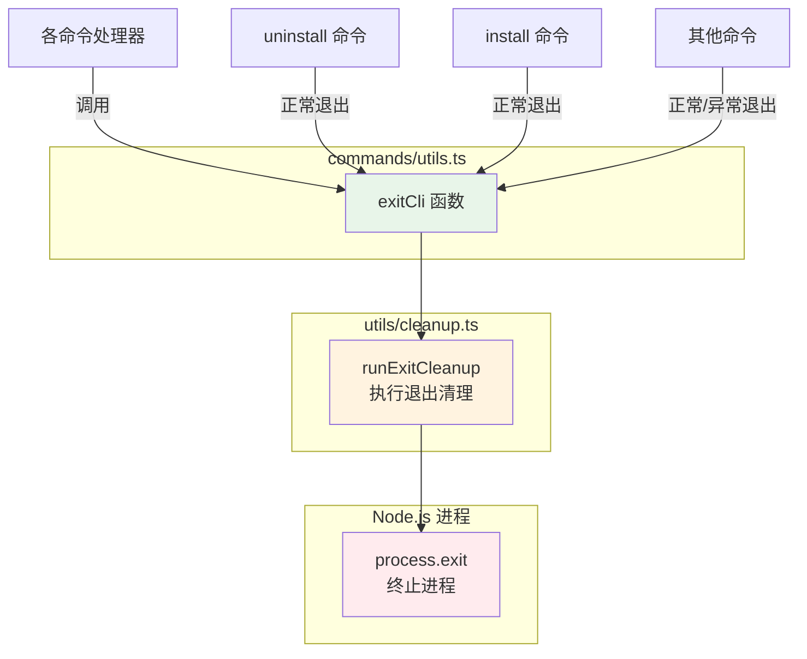

# utils.ts (commands)

## 概述

`utils.ts` 位于 `packages/cli/src/commands/` 目录下，是 CLI 命令层的通用工具模块。当前该文件仅导出一个函数 `exitCli`，用于在 CLI 退出前执行清理操作并终止进程。

该模块作为各命令处理器（如 `uninstall.ts`、`install.ts` 等）的共享工具，为整个 CLI 提供统一的安全退出机制，确保在进程终止前完成必要的资源清理工作。

## 架构图（Mermaid）



## 核心组件

### `exitCli` 异步函数

```typescript
export async function exitCli(exitCode = 0): Promise<void>
```

CLI 统一退出函数，执行以下操作：

1. **调用清理函数**：`await runExitCleanup()` — 等待所有注册的退出清理任务完成
2. **终止进程**：`process.exit(exitCode)` — 以指定的退出码终止 Node.js 进程

**参数说明**：

| 参数 | 类型 | 默认值 | 说明 |
|------|------|--------|------|
| `exitCode` | `number` | `0` | 进程退出码。`0` 表示成功，非零值表示失败 |

**使用示例**：

```typescript
// 正常退出
await exitCli();       // 退出码 0

// 异常退出
await exitCli(1);      // 退出码 1，表示出错
```

**注意事项**：
- 该函数的返回类型声明为 `Promise<void>`，但由于 `process.exit()` 会立即终止进程，实际上永远不会正常 resolve
- `await` 关键字确保 `runExitCleanup` 中所有异步清理任务在进程终止前完成执行
- 函数类型标注中的 `never` 实际返回类型被 TypeScript 推断为 `Promise<void>`，因为 `process.exit` 的调用在 `await` 之后

## 依赖关系

### 内部依赖

| 模块 | 导入项 | 用途 |
|------|--------|------|
| `../utils/cleanup.js` | `runExitCleanup` | 执行退出前的清理操作，如释放文件锁、关闭连接、清理临时文件等 |

### 外部依赖

| 包名 | 导入项 | 用途 |
|------|--------|------|
| (无) | — | 该模块不直接依赖任何外部 npm 包 |

**隐式依赖**：
- **Node.js `process`** 全局对象：用于调用 `process.exit()` 终止进程

## 关键实现细节

1. **退出前清理保障**：`exitCli` 的核心设计目的是避免直接调用 `process.exit()`。在 CLI 应用中，直接退出可能导致资源泄漏（如未关闭的文件句柄、未释放的锁、未完成的网络请求等）。通过先执行 `runExitCleanup()` 再退出，确保了优雅关闭。

2. **默认参数设计**：`exitCode = 0` 默认值使得正常退出场景下调用更简洁（`await exitCli()` 即可），同时保留了传入非零退出码的灵活性。

3. **文件极度精简**：整个文件仅 13 行（含许可证头），体现了单一职责原则——该模块只负责"安全退出"这一个关注点。

4. **被广泛引用**：该函数被多个命令处理器导入使用，是 CLI 退出流程的统一入口。在 `uninstall.ts` 等命令中，无论是正常结束还是异常捕获，都通过 `exitCli` 退出，确保退出行为的一致性。

5. **异步执行顺序**：使用 `await` 等待 `runExitCleanup()` 完成后才调用 `process.exit()`，这意味着如果清理函数中存在异步操作（如写入文件、发送遥测数据等），都能在进程终止前完成。
