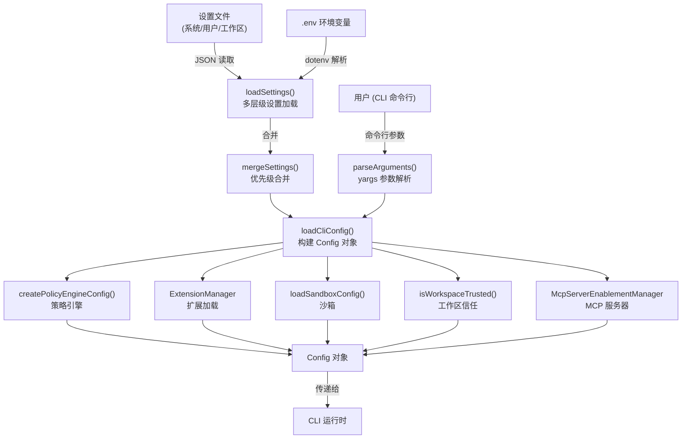
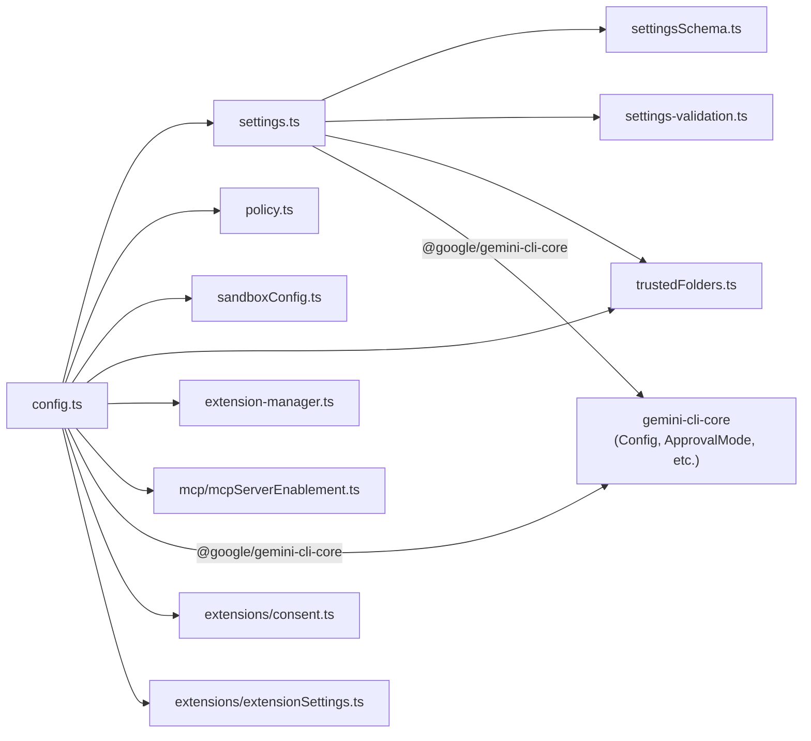
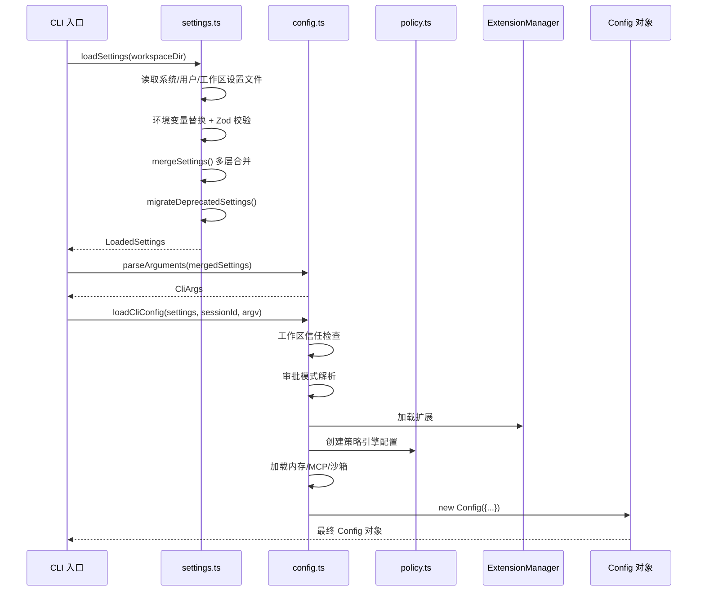

# config 目录

## 概述

`config` 目录是 Gemini CLI 的**配置核心层**，负责 CLI 启动时的全部配置解析、设置加载、策略引擎初始化、扩展管理、沙箱配置、认证管理以及工作区信任判断。它将来自命令行参数、用户设置文件、工作区设置文件、系统设置文件的配置进行多层合并，最终生成唯一的 `Config` 对象供整个 CLI 运行时使用。

## 目录结构

```
config/
├── config.ts                     # CLI 参数解析与核心 Config 对象构建
├── settings.ts                   # 多层级设置加载、合并、迁移、持久化
├── settingsSchema.ts             # 设置 Schema 定义与默认值
├── settings-validation.ts        # Zod 校验逻辑
├── settingPaths.ts               # 设置路径工具
├── auth.ts                       # 认证管理
├── extension-manager.ts          # 扩展管理器（加载/注册扩展）
├── extension.ts                  # 扩展定义
├── extensionRegistryClient.ts    # 扩展注册表客户端
├── policy.ts                     # 策略引擎配置
├── sandboxConfig.ts              # 沙箱配置加载
├── trustedFolders.ts             # 工作区信任判断
├── footerItems.ts                # 底栏项配置
├── extensions/                   # 扩展子系统（同意、设置）
└── mcp/                          # MCP 服务器启用管理
```

## 架构图



## 核心组件

### 1. config.ts - 参数解析与 Config 构建

- **`parseArguments()`**: 使用 `yargs` 解析 CLI 命令行参数，定义了 `--model`、`--prompt`、`--sandbox`、`--yolo`、`--approval-mode`、`--policy`、`--extensions`、`--resume` 等数十个选项。支持子命令（mcp、extensions、skills、hooks）。
- **`loadCliConfig()`**: 核心入口函数，整合设置、参数、策略引擎、扩展管理器、沙箱配置、MCP 服务器等，构建最终的 `Config` 对象。负责：
  - 工作区信任检查
  - 审批模式（default / auto_edit / yolo / plan）解析
  - 内存文件（GEMINI.md）加载
  - 遥测设置解析
  - Admin 白名单与必需 MCP 服务器注入
- **`CliArgs` 接口**: 定义所有 CLI 参数的类型。

### 2. settings.ts - 多层级设置管理

- **设置层级（优先级从低到高）**:
  1. Schema 默认值（内置）
  2. System Defaults（系统默认）
  3. User Settings（用户级 `~/.gemini/settings.json`）
  4. Workspace Settings（工作区级 `.gemini/settings.json`）
  5. System Settings（系统覆盖，最高优先级）
- **`LoadedSettings` 类**: 设置的不可变快照容器，支持：
  - 响应式订阅（`subscribe` / `getSnapshot`，配合 React `useSyncExternalStore`）
  - 按作用域存取（`forScope()` / `setValue()`）
  - 远程 Admin 设置注入（`setRemoteAdminSettings()`）
  - 自动弃用迁移（`migrateDeprecatedSettings()`）
- **`loadEnvironment()`**: 查找并加载 `.env` 文件，支持不受信工作区下的白名单过滤与值消毒。
- **设置缓存**: 10 秒 TTL 缓存，避免重复磁盘 I/O。

### 3. 其他关键模块

| 模块 | 职责 |
|---|---|
| `extension-manager.ts` | 扩展生命周期管理（加载、权限、技能、主题、代理） |
| `policy.ts` | 策略引擎配置创建与工作区策略状态解析 |
| `sandboxConfig.ts` | 沙箱配置加载（路径白名单、网络访问） |
| `trustedFolders.ts` | 判断当前工作区是否受信任 |
| `auth.ts` | 认证管理 |
| `settings-validation.ts` | 使用 Zod 校验设置结构 |
| `settingsSchema.ts` | 定义设置 Schema、类型与默认值 |

## 依赖关系



## 数据流


