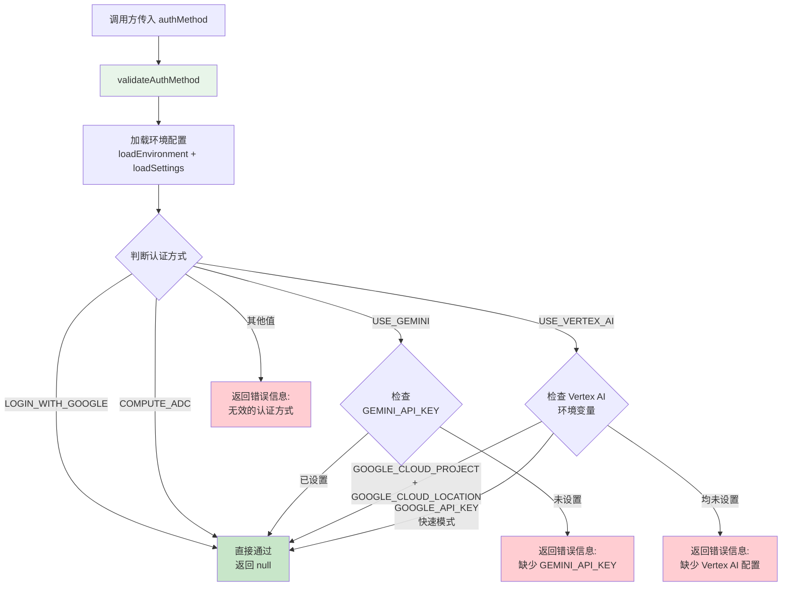

# auth.ts

## 概述

`auth.ts` 是 Gemini CLI 的认证验证模块，位于 `packages/cli/src/config/` 目录下。该文件负责验证用户选择的认证方式是否有效，并检查所需的环境变量是否已正确配置。

该模块导出唯一一个函数 `validateAuthMethod`，它支持四种认证方式的校验：
- **Google 登录认证** (`login_with_google`)
- **应用默认凭据** (`compute_adc`)
- **Gemini API 密钥** (`use_gemini`)
- **Vertex AI** (`use_vertex_ai`)

## 架构图（Mermaid）



## 核心组件

### `validateAuthMethod` 函数

```typescript
export function validateAuthMethod(authMethod: string): string | null
```

认证方式校验的核心函数。根据传入的认证方式字符串，验证所需的环境变量是否已正确配置。

**参数**：

| 参数 | 类型 | 说明 |
|------|------|------|
| `authMethod` | `string` | 用户选择的认证方式标识符 |

**返回值**：

| 返回值 | 含义 |
|--------|------|
| `null` | 认证验证通过，配置有效 |
| `string` | 错误消息，描述缺少哪些环境变量或配置无效 |

**支持的认证方式详解**：

#### 1. `AuthType.LOGIN_WITH_GOOGLE` — Google 登录认证
- 无需额外环境变量
- 直接返回 `null` 表示通过

#### 2. `AuthType.COMPUTE_ADC` — 应用默认凭据 (Application Default Credentials)
- 无需额外环境变量
- 直接返回 `null` 表示通过
- 依赖 Google Cloud SDK 的本地凭据链

#### 3. `AuthType.USE_GEMINI` — Gemini API 密钥认证
- **必需环境变量**：`GEMINI_API_KEY`
- 检查 `process.env['GEMINI_API_KEY']` 是否存在
- 缺失时返回提示信息，告知用户设置 API 密钥

#### 4. `AuthType.USE_VERTEX_AI` — Vertex AI 认证
- 支持两种配置方式（满足其一即可）：
  - **标准模式**：同时设置 `GOOGLE_CLOUD_PROJECT` 和 `GOOGLE_CLOUD_LOCATION`
  - **快速模式**（Express Mode）：设置 `GOOGLE_API_KEY`
- 两种方式都未配置时返回详细的错误提示

## 依赖关系

### 内部依赖

| 模块 | 导入项 | 用途 |
|------|--------|------|
| `@google/gemini-cli-core` | `AuthType` | 认证类型枚举/常量，定义了所有支持的认证方式标识符 |
| `./settings.js` | `loadEnvironment` | 从配置和 `.env` 文件中加载环境变量到 `process.env` |
| `./settings.js` | `loadSettings` | 加载合并后的用户配置（包括用户级和工作区级设置） |

### 外部依赖

| 包名 | 导入项 | 用途 |
|------|--------|------|
| (无) | — | 该模块不直接依赖任何外部 npm 包 |

**隐式依赖**：
- **Node.js `process.env`**：读取环境变量以验证认证配置
- **Node.js `process.cwd()`**：获取当前工作目录，传给 `loadEnvironment` 用于定位 `.env` 文件

## 关键实现细节

1. **环境变量前置加载**：函数开头调用 `loadEnvironment(loadSettings().merged, process.cwd())` 确保在校验前，所有配置源（`.env` 文件、设置文件等）中定义的环境变量已被加载到 `process.env` 中。这意味着用户可以在 `.env` 文件中设置 API 密钥，无需在 shell 中手动 export。

2. **返回值约定**：采用"null 表示成功，字符串表示错误"的模式。这是一种常见的验证函数设计模式，调用方只需检查返回值是否为 `null` 即可判断验证结果。

3. **Vertex AI 双通道验证**：Vertex AI 支持两种互斥的认证配置方式。标准模式需要项目 ID 和位置信息，快速模式（Express Mode）只需一个 API 密钥。代码使用 `!!` 双重否定将环境变量转换为布尔值进行判断。

4. **用户友好的错误消息**：所有错误消息都包含具体的修复建议（"Update your environment and try again"），并提示使用 `.env` 文件时无需重启，降低用户解决问题的认知成本。

5. **防御性兜底**：最后一行 `return 'Invalid auth method selected.'` 处理了未知的 `authMethod` 值，确保函数对任意输入都有明确的返回值，不会出现 `undefined` 返回的情况。

6. **同步函数设计**：尽管内部调用了 `loadEnvironment` 和 `loadSettings`，该函数是同步的（非 `async`），说明配置加载过程是同步 I/O 操作（如 `fs.readFileSync`），适合在 CLI 启动阶段使用。
