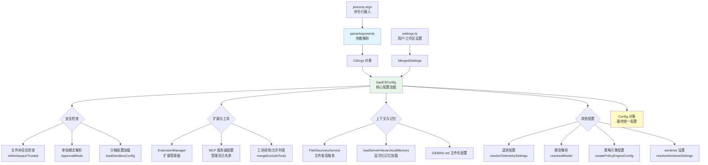
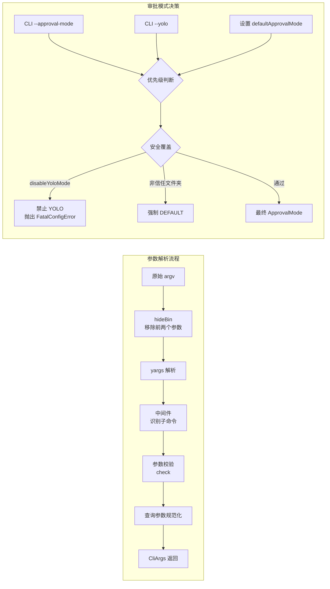

# config.ts

## 概述

`config.ts` 是 Gemini CLI 的核心配置模块，位于 `packages/cli/src/config/` 目录下。它是整个 CLI 应用的"神经中枢"，负责：

1. **命令行参数解析**：使用 yargs 定义和解析所有 CLI 选项、子命令、位置参数
2. **配置加载与合并**：将命令行参数、环境变量、用户设置、工作区设置合并为统一的 `Config` 对象
3. **安全与审批模式管理**：处理 YOLO 模式、文件夹信任、沙箱配置等安全相关逻辑
4. **扩展与 MCP 服务器管理**：加载扩展、配置 MCP 服务器、应用管理员白名单

该文件约 1089 行，是项目中最复杂的配置文件之一，导出了多个关键函数和接口。

## 架构图（Mermaid）





## 核心组件

### 1. `CliArgs` 接口

```typescript
export interface CliArgs {
  query: string | undefined;
  model: string | undefined;
  sandbox: boolean | string | undefined;
  debug: boolean | undefined;
  prompt: string | undefined;
  promptInteractive: string | undefined;
  worktree?: string;
  yolo: boolean | undefined;
  approvalMode: string | undefined;
  policy: string[] | undefined;
  adminPolicy: string[] | undefined;
  allowedMcpServerNames: string[] | undefined;
  allowedTools: string[] | undefined;
  acp?: boolean;
  experimentalAcp?: boolean;
  extensions: string[] | undefined;
  listExtensions: boolean | undefined;
  resume: string | typeof RESUME_LATEST | undefined;
  listSessions: boolean | undefined;
  deleteSession: string | undefined;
  includeDirectories: string[] | undefined;
  screenReader: boolean | undefined;
  useWriteTodos: boolean | undefined;
  outputFormat: string | undefined;
  fakeResponses: string | undefined;
  recordResponses: string | undefined;
  startupMessages?: string[];
  rawOutput: boolean | undefined;
  acceptRawOutputRisk: boolean | undefined;
  isCommand: boolean | undefined;
}
```

定义了 CLI 所有支持的参数类型。关键参数分类如下：

| 类别 | 参数 | 说明 |
|------|------|------|
| 基础 | `query`, `prompt`, `promptInteractive` | 用户查询/提示文本 |
| 模型 | `model` | 指定使用的 AI 模型 |
| 安全 | `yolo`, `approvalMode`, `sandbox` | 安全与审批控制 |
| 策略 | `policy`, `adminPolicy` | 策略引擎配置路径 |
| MCP | `allowedMcpServerNames` | MCP 服务器白名单 |
| 工具 | `allowedTools` | 允许的工具列表 |
| 扩展 | `extensions`, `listExtensions` | 扩展管理 |
| 会话 | `resume`, `listSessions`, `deleteSession` | 会话管理 |
| 工作区 | `worktree`, `includeDirectories` | 工作区配置 |
| 输出 | `outputFormat`, `rawOutput`, `screenReader` | 输出格式与无障碍 |
| 调试 | `debug`, `fakeResponses`, `recordResponses` | 调试与测试 |
| ACP | `acp`, `experimentalAcp` | ACP 模式 |

### 2. `coerceCommaSeparated` 辅助函数

```typescript
const coerceCommaSeparated = (values: string[]): string[] => { ... }
```

将逗号分隔的或多次传递的标志值展平为数组。例如：
- `--policy a,b,c` 转为 `['a', 'b', 'c']`
- `--policy a --policy b` 转为 `['a', 'b']`
- `--policy ""` 保持为 `['']`（特殊情况处理）

### 3. `getWorktreeArg` 函数

```typescript
export function getWorktreeArg(argv: string[]): string | undefined
```

预解析命令行参数，提前提取 `--worktree` / `-w` 标志值。用于在完整参数解析前进行早期设置。配置特点：
- 禁用 `help` 和 `version` 输出
- 使用 `strict(false)` 忽略未知参数
- 使用 `exitProcess(false)` 防止 yargs 自行退出

### 4. `getRequestedWorktreeName` 函数

```typescript
export function getRequestedWorktreeName(settings: LoadedSettings): string | undefined
```

检查 CLI 是否请求了 worktree 并且设置中是否启用了 worktree 功能。双重条件检查：先验证设置中已启用 `experimental.worktrees`，再读取 CLI 参数。

### 5. `parseArguments` 异步函数（核心）

```typescript
export async function parseArguments(settings: MergedSettings): Promise<CliArgs>
```

这是最核心的参数解析函数，约 350 行，负责：

**a) yargs 实例配置**
- 脚本名称：`gemini`
- 区域设置：`en`（英文）
- 终端宽度自适应包装

**b) 子命令注册**
- `mcpCommand` — MCP 服务器管理
- `extensionsCommand` — 扩展管理
- `skillsCommand` — 技能管理
- `hooksCommand` — 钩子管理

**c) 中间件（middleware）**
通过检测第一个位置参数是否匹配已注册子命令名称，自动设置 `isCommand = true` 标志。

**d) 参数校验规则（check）**
- 位置参数查询与 `--prompt` 不能同时使用
- `--prompt` 与 `--prompt-interactive` 不能同时使用
- `--yolo` 与 `--approval-mode` 不能同时使用
- `--output-format` 必须是 `text`、`json`、`stream-json` 之一
- `--worktree` 需要 `experimental.worktrees` 启用

**e) 选项定义（约 30+ 个选项）**
包括 `--model`、`--prompt`、`--sandbox`、`--yolo`、`--approval-mode`、`--policy`、`--extensions`、`--resume`、`--output-format`、`--raw-output` 等。

**f) 查询参数规范化**
- 数组形式的查询参数用空格连接
- 位置参数在交互模式下转为 `promptInteractive`，在无头模式下转为 `prompt`

**g) 错误处理**
解析失败时显示帮助信息并以退出码 1 退出。

### 6. `isDebugMode` 函数

```typescript
export function isDebugMode(argv: CliArgs): boolean
```

判断是否启用调试模式，支持三种方式：
- CLI 参数 `--debug`
- 环境变量 `DEBUG=true` 或 `DEBUG=1`
- 环境变量 `DEBUG_MODE=true` 或 `DEBUG_MODE=1`

### 7. `LoadCliConfigOptions` 接口

```typescript
export interface LoadCliConfigOptions {
  cwd?: string;
  projectHooks?: { [K in HookEventName]?: HookDefinition[] } & { disabled?: string[] };
  worktreeSettings?: WorktreeSettings;
}
```

`loadCliConfig` 函数的可选配置项。

### 8. `loadCliConfig` 异步函数（最核心）

```typescript
export async function loadCliConfig(
  settings: MergedSettings,
  sessionId: string,
  argv: CliArgs,
  options?: LoadCliConfigOptions,
): Promise<Config>
```

这是整个文件最核心、最复杂的函数（约 500 行），它将所有配置源合并为一个统一的 `Config` 对象。处理流程包括：

**a) Worktree 设置解析**
- 如果 CLI 指定了 worktree 或检测到当前在 Gemini worktree 中，获取 worktree 路径和基础 SHA

**b) 记忆上下文配置**
- 设置 GEMINI.md 文件名
- 创建 `FileDiscoveryService` 实例
- 配置文件过滤选项（内存文件过滤 + 通用文件过滤）
- 解析 `includeDirectories`（绝对路径转换 + CLI 额外目录）
- IDE 多工作区目录自动包含（通过 `GEMINI_CLI_IDE_WORKSPACE_PATH`）
- 加载层次化记忆内容（`loadServerHierarchicalMemory`）

**c) 扩展管理器初始化**
- 创建 `ExtensionManager` 并加载扩展
- 获取扩展的计划设置（plan settings）

**d) 审批模式（ApprovalMode）解析**
优先级链：CLI `--approval-mode` > CLI `--yolo` > 设置中的 `defaultApprovalMode`
安全覆盖：
- `disableYoloMode` 或 `secureModeEnabled` 禁止 YOLO → 抛出 `FatalConfigError`
- 非信任文件夹 → 强制回退到 `DEFAULT`

**e) 遥测配置**

**f) 工具排除/允许列表**
- 非交互模式和 ACP 模式下自动排除 `ask_user` 工具
- 合并设置和额外排除项

**g) 策略引擎配置**
- 解析工作区策略目录和确认请求
- 创建策略引擎配置

**h) 模型解析**
优先级链：CLI `--model` > 环境变量 `GEMINI_MODEL` > 设置 `model.name` > 默认 `PREVIEW_GEMINI_MODEL_AUTO`

**i) 沙箱配置**
- 加载沙箱配置
- 合并允许路径和网络访问设置

**j) MCP 服务器配置**
- 管理员白名单过滤（`applyAdminAllowlist`）
- 管理员必需服务器注入（`applyRequiredServers`）
- MCP 启用管理器回调

**k) 构造并返回 `Config` 对象**
最终构造一个包含约 100+ 属性的 `Config` 对象。

### 9. `mergeExcludeTools` 私有函数

```typescript
function mergeExcludeTools(settings: MergedSettings, extraExcludes: string[]): string[]
```

使用 `Set` 去重合并设置中的排除工具列表和额外排除项。

### 10. `resolveWorktreeSettings` 私有异步函数

```typescript
async function resolveWorktreeSettings(cwd: string): Promise<WorktreeSettings | undefined>
```

检测当前工作目录是否在 Gemini worktree 中，如果是则返回 worktree 设置：
1. 使用 `git rev-parse --show-toplevel` 获取 Git 仓库根目录
2. 使用 `getProjectRootForWorktree` 获取项目根目录
3. 使用 `isGeminiWorktree` 判断是否为 Gemini worktree
4. 获取 HEAD SHA 作为 `baseSha`
5. 返回 `{ name, path, baseSha }` 或 `undefined`

## 依赖关系

### 内部依赖

| 模块 | 导入项 | 用途 |
|------|--------|------|
| `@google/gemini-cli-core` | `setGeminiMdFilename`, `getCurrentGeminiMdFilename` | GEMINI.md 文件名管理 |
| `@google/gemini-cli-core` | `ApprovalMode` | 审批模式枚举 |
| `@google/gemini-cli-core` | `DEFAULT_GEMINI_EMBEDDING_MODEL` | 默认嵌入模型常量 |
| `@google/gemini-cli-core` | `DEFAULT_FILE_FILTERING_OPTIONS`, `DEFAULT_MEMORY_FILE_FILTERING_OPTIONS` | 默认文件过滤选项 |
| `@google/gemini-cli-core` | `FileDiscoveryService` | 文件发现服务 |
| `@google/gemini-cli-core` | `resolveTelemetrySettings` | 遥测配置解析 |
| `@google/gemini-cli-core` | `FatalConfigError` | 致命配置错误类 |
| `@google/gemini-cli-core` | `getPty` | PTY 信息获取 |
| `@google/gemini-cli-core` | `debugLogger` | 调试日志记录器 |
| `@google/gemini-cli-core` | `loadServerHierarchicalMemory` | 加载层次化记忆 |
| `@google/gemini-cli-core` | `ASK_USER_TOOL_NAME` | ask_user 工具名称常量 |
| `@google/gemini-cli-core` | `getVersion` | 获取 CLI 版本号 |
| `@google/gemini-cli-core` | `PREVIEW_GEMINI_MODEL_AUTO`, `GEMINI_MODEL_ALIAS_AUTO` | 模型别名常量 |
| `@google/gemini-cli-core` | `coreEvents` | 核心事件发射器 |
| `@google/gemini-cli-core` | `Config` | 最终配置类 |
| `@google/gemini-cli-core` | `resolveToRealPath` | 路径解析为真实路径 |
| `@google/gemini-cli-core` | `applyAdminAllowlist`, `applyRequiredServers` | MCP 管理员白名单/必需服务器 |
| `@google/gemini-cli-core` | `getAdminBlockedMcpServersMessage`, `getAdminErrorMessage` | 管理员错误消息 |
| `@google/gemini-cli-core` | `getProjectRootForWorktree`, `isGeminiWorktree` | Worktree 相关工具 |
| `@google/gemini-cli-core` | `isHeadlessMode` | 无头模式检测 |
| `@google/gemini-cli-core` | `detectIdeFromEnv` | IDE 环境检测 |
| `@google/gemini-cli-core` | 多个类型导入 | `HierarchicalMemory`, `WorktreeSettings`, `HookDefinition`, `HookEventName`, `OutputFormat` |
| `./settings.js` | `Settings`, `MergedSettings`, `saveModelChange`, `loadSettings`, `isWorktreeEnabled`, `LoadedSettings` | 设置管理 |
| `./sandboxConfig.js` | `loadSandboxConfig` | 沙箱配置加载 |
| `../utils/resolvePath.js` | `resolvePath` | 路径解析工具 |
| `../utils/sessionUtils.js` | `RESUME_LATEST` | 恢复最新会话常量 |
| `./trustedFolders.js` | `isWorkspaceTrusted` | 工作区信任检查 |
| `./policy.js` | `createPolicyEngineConfig`, `resolveWorkspacePolicyState` | 策略引擎配置 |
| `./extension-manager.js` | `ExtensionManager` | 扩展管理器 |
| `./mcp/mcpServerEnablement.js` | `McpServerEnablementManager` | MCP 服务器启用管理 |
| `@google/gemini-cli-core/src/utils/extensionLoader.js` | `ExtensionEvents` (类型) | 扩展事件类型 |
| `./extensions/consent.js` | `requestConsentNonInteractive` | 非交互式同意请求 |
| `./extensions/extensionSettings.js` | `promptForSetting` | 扩展设置提示 |
| `../commands/mcp.js` | `mcpCommand` | MCP 子命令 |
| `../commands/extensions.js` | `extensionsCommand` | 扩展子命令 |
| `../commands/skills.js` | `skillsCommand` | 技能子命令 |
| `../commands/hooks.js` | `hooksCommand` | 钩子子命令 |
| `../utils/cleanup.js` | `runExitCleanup` | 退出清理 |

### 外部依赖

| 包名 | 导入项 | 用途 |
|------|--------|------|
| `yargs` | `yargs` (默认导出) | 命令行参数解析框架 |
| `yargs/helpers` | `hideBin` | 从 `process.argv` 中移除前两个元素（node 和脚本路径） |
| `node:process` | `process` | Node.js 进程对象，访问 `argv`、`env`、`cwd()`、`exit()` |
| `node:path` | `path` | 路径操作工具 |
| `execa` | `execa` | 子进程执行工具，用于运行 git 命令 |
| `node:stream` | `EventEmitter` (类型) | 事件发射器类型 |

## 关键实现细节

1. **参数优先级链**：整个配置系统遵循清晰的优先级链：CLI 参数 > 环境变量 > 用户设置 > 默认值。这在模型选择（`argv.model || process.env['GEMINI_MODEL'] || settings.model?.name || defaultModel`）中尤为明显。

2. **安全多层防护**：审批模式经过三层安全检查——首先解析用户请求的模式，然后检查管理员是否禁用了 YOLO 模式（`disableYoloMode` / `secureModeEnabled`），最后检查文件夹信任状态。非信任文件夹强制回退到 `DEFAULT` 模式，确保不会在不安全的环境中自动执行危险操作。

3. **子命令识别中间件**：通过 yargs 中间件在解析早期阶段识别子命令，设置 `isCommand` 标志。这影响后续的交互模式判断——子命令执行完毕后不进入交互循环。

4. **查询参数的双重语义**：位置参数 `query` 在交互模式下作为 `promptInteractive`（执行后继续交互），在无头模式下作为 `prompt`（执行后退出）。这是一个重要的 UX 设计决策。

5. **IDE 多工作区集成**：通过 `GEMINI_CLI_IDE_WORKSPACE_PATH` 环境变量自动检测 VSCode 等 IDE 的多工作区文件夹，将非当前目录的工作区文件夹自动添加到 `includeDirectories`，使 AI 拥有完整的项目上下文。

6. **MCP 管理员控制**：管理员可以通过 `admin.mcp.config` 配置白名单，仅允许特定 MCP 服务器运行。还可以通过 `admin.mcp.requiredConfig` 注入强制性 MCP 服务器。被阻止的服务器会通过事件系统发出警告。

7. **Worktree 自动检测**：`resolveWorktreeSettings` 使用 `git rev-parse` 检测当前是否在 Gemini worktree 中工作，并获取 HEAD SHA 用于后续差异比较。

8. **exitProcess(false) 模式**：yargs 被配置为不自动退出进程（`exitProcess(false)`），这使得 CLI 可以在解析失败时执行清理操作（`runExitCleanup`），避免资源泄漏。`--help` 和 `--version` 也需要手动处理退出。

9. **Config 对象的巨大规模**：最终的 `Config` 构造函数接收约 100+ 个属性，涵盖了 CLI 运行所需的所有配置。这些属性涵盖安全、工具、MCP、扩展、UI、遥测、模型、记忆等多个维度。

10. **非交互模式工具排除**：在非交互模式和 ACP 模式下，`ask_user` 工具被显式排除。注释中解释这是为了"双重保险"——策略引擎本身也会处理，但显式排除确保即使策略规则优先级更高也无法绕过。

11. **onModelChange 和 onReload 回调**：`Config` 对象包含两个回调函数，用于运行时动态更新。`onModelChange` 保存用户的模型切换；`onReload` 重新加载设置以获取最新的技能和代理配置。
