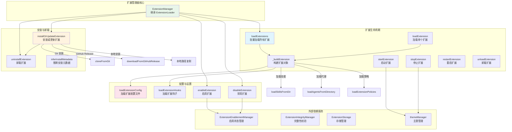
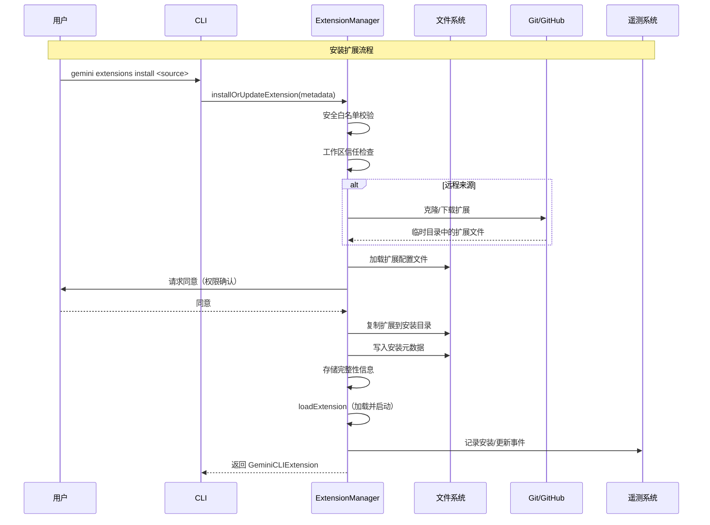
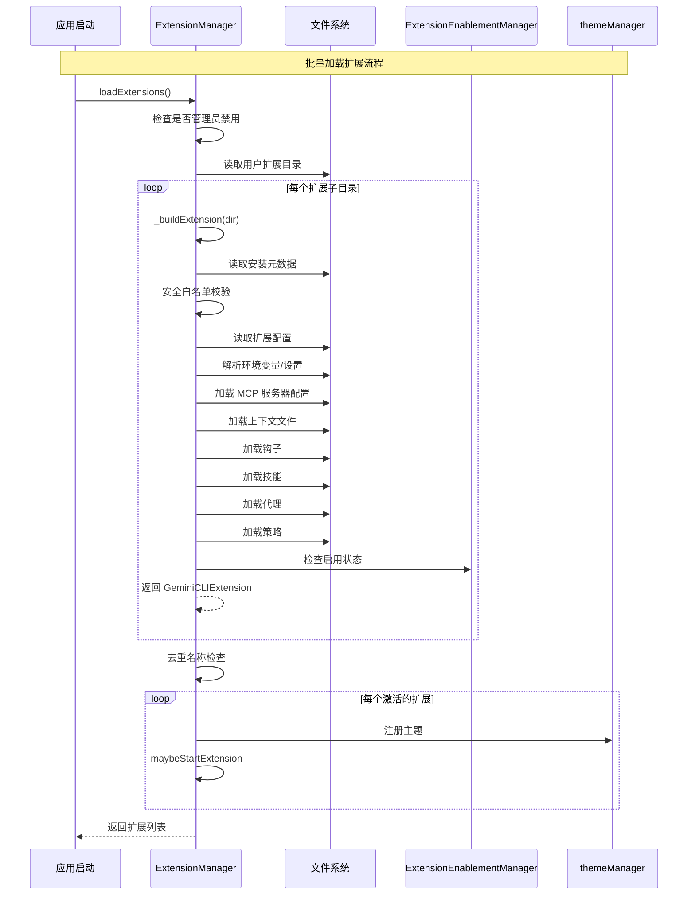

# extension-manager.ts

## 概述

`extension-manager.ts` 是 Gemini CLI 扩展管理系统的核心实现，位于 `packages/cli/src/config/` 目录下。该文件约 1357 行，是整个扩展生命周期管理的中枢，负责：

1. **扩展加载**：从用户扩展目录扫描、构建并激活所有已安装的扩展
2. **扩展安装/更新**：支持从本地路径、Git 仓库、GitHub Release 三种来源安装扩展
3. **扩展卸载**：移除已安装扩展的文件和配置
4. **扩展启用/禁用**：在用户级别和工作区级别管理扩展的激活状态
5. **安全控制**：扩展白名单验证、完整性校验、工作区信任检查
6. **配置解析**：加载扩展配置文件、解析环境变量、处理 MCP 服务器配置、加载钩子和技能

`ExtensionManager` 类继承自 `ExtensionLoader` 基类（来自 `@google/gemini-cli-core`），是其在 CLI 层的具体实现。

## 架构图（Mermaid）







## 核心组件

### 1. `ExtensionManagerParams` 接口

```typescript
interface ExtensionManagerParams {
  enabledExtensionOverrides?: string[];
  settings: MergedSettings;
  requestConsent: (consent: string) => Promise<boolean>;
  requestSetting: ((setting: ExtensionSetting) => Promise<string>) | null;
  workspaceDir: string;
  eventEmitter?: EventEmitter<ExtensionEvents>;
  clientVersion?: string;
  integrityManager?: IExtensionIntegrity;
}
```

构造函数参数接口，关键参数说明：

| 参数 | 类型 | 说明 |
|------|------|------|
| `enabledExtensionOverrides` | `string[]` | 通过 CLI `--extensions` 覆盖启用的扩展列表 |
| `settings` | `MergedSettings` | 合并后的用户/工作区设置 |
| `requestConsent` | `函数` | 请求用户同意的回调（安装时的权限确认） |
| `requestSetting` | `函数 \| null` | 请求用户输入设置值的回调（扩展配置提示） |
| `workspaceDir` | `string` | 当前工作区目录 |
| `eventEmitter` | `EventEmitter` | 核心事件发射器，用于扩展生命周期事件 |
| `clientVersion` | `string` | CLI 客户端版本号 |
| `integrityManager` | `IExtensionIntegrity` | 扩展完整性管理器（可注入测试替身） |

### 2. `ExtensionManager` 类（核心类）

继承自 `ExtensionLoader` 基类，包含以下私有属性：

| 属性 | 类型 | 说明 |
|------|------|------|
| `extensionEnablementManager` | `ExtensionEnablementManager` | 管理扩展的启用/禁用状态 |
| `integrityManager` | `IExtensionIntegrity` | 管理扩展完整性校验 |
| `settings` | `MergedSettings` | 用户设置 |
| `requestConsent` | `函数` | 用户同意请求回调 |
| `requestSetting` | `函数 \| undefined` | 设置值请求回调 |
| `telemetryConfig` | `Config` | 遥测专用配置（精简版 Config） |
| `workspaceDir` | `string` | 工作区目录 |
| `loadedExtensions` | `GeminiCLIExtension[] \| undefined` | 已加载的扩展列表 |
| `loadingPromise` | `Promise \| null` | 加载中的 Promise（防止重复加载） |

#### 构造函数

```typescript
constructor(options: ExtensionManagerParams)
```

初始化所有管理器和配置。特别的是，它创建了一个精简的 `telemetryConfig`（仅包含遥测所需的最少属性），避免循环依赖完整的 `Config` 对象。

#### 关键方法

##### `loadExtensions(): Promise<GeminiCLIExtension[]>`

批量加载所有已安装的扩展。**只应调用一次**（通过 `loadedExtensions` 防止重复调用）。

流程：
1. 检查管理员是否禁用了扩展功能（`admin.extensions.enabled`）
2. 读取用户扩展目录（`ExtensionStorage.getUserExtensionsDir()`）
3. 并行构建所有扩展（`Promise.all`）
4. 检查名称唯一性（抛出异常如有重复）
5. 注册活跃扩展的主题
6. 并行启动所有扩展（`maybeStartExtension`）

使用 `loadingPromise` 实现"加载锁"，防止并发调用导致重复加载。

##### `installOrUpdateExtension(...): Promise<GeminiCLIExtension>`

安装或更新扩展的核心方法（约 300 行），是该类最复杂的方法。

**安全检查阶段**：
1. 白名单验证（`security.allowedExtensions`）— 正则匹配安装源
2. Git 远程源阻止检查（`security.blockGitExtensions`）
3. 工作区信任检查 — 不信任时请求用户信任

**安装来源处理**：
- `local` / `link`：直接使用本地路径
- `git`：使用 `cloneFromGit` 克隆仓库
- `github-release`：优先尝试 `downloadFromGitHubRelease`，失败时回退到 `cloneFromGit`

**冲突检测**：
- 更新时：目标扩展必须已安装
- 安装时：同名扩展不能已存在
- 更新改名时：新名称不能与现有扩展冲突

**同意请求**：通过 `maybeRequestConsentOrFail` 请求用户确认权限（MCP 服务器、钩子、技能等）

**文件操作**：
1. 复制扩展文件到安装目录
2. 写入 `INSTALL_METADATA_FILENAME` 元数据文件
3. 存储完整性校验信息

**更新特殊处理**：
- 保留旧扩展的设置（`getEnvContents`）
- 保留启用状态（全局和工作区级别）
- 先卸载旧版本再安装新版本

**遥测记录**：成功和失败都会记录事件（`logExtensionInstallEvent` / `logExtensionUpdateEvent`）

**错误处理**：外层 catch 块在安装失败时仍然尝试加载配置以记录遥测，然后重新抛出异常

##### `uninstallExtension(extensionIdentifier, isUpdate): Promise<void>`

卸载扩展。通过名称或安装源（不区分大小写）查找扩展，然后：
1. 卸载运行时扩展（`unloadExtension`）
2. 删除扩展目录（递归强制删除）
3. 如果非更新操作：移除启用状态并记录遥测

##### `_buildExtension(extensionDir): Promise<GeminiCLIExtension | null>`

私有方法，构建单个扩展对象。这是扩展加载的核心逻辑（约 230 行）：

1. **目录验证**：确认是有效目录
2. **安装元数据加载**：读取 `INSTALL_METADATA_FILENAME`
3. **安全白名单检查**：与 `installOrUpdateExtension` 类似的安全验证
4. **链接扩展处理**：`link` 类型使用源路径而非安装目录
5. **配置加载**：调用 `loadExtensionConfig` 读取配置文件
6. **扩展设置解析**：
   - 加载用户级和工作区级的设置值
   - 解析环境变量
   - 构建 `resolvedSettings` 数组（包含值、作用域、来源信息）
7. **MCP 服务器配置**：
   - 管理员白名单过滤
   - `filterMcpConfig` 移除 `trust` 字段并冻结
8. **上下文文件**：解析 `contextFileName`（默认 `GEMINI.md`），验证路径安全
9. **变量模板系统**：使用 `hydrationContext` 注入路径分隔符、扩展路径、工作区路径和自定义环境变量
10. **钩子加载**：加载 `hooks/hooks.json` 并注入环境变量
11. **技能加载**：从 `skills/` 目录加载并应用变量替换
12. **策略加载**：从 `policies/` 目录加载策略规则和安全检查器
13. **代理加载**：从 `agents/` 目录加载并应用变量替换
14. **最终组装**：返回完整的 `GeminiCLIExtension` 对象

##### `loadExtensionConfig(extensionDir): Promise<ExtensionConfig>`

加载并验证扩展配置文件（`EXTENSIONS_CONFIG_FILENAME`）：
1. 读取 JSON 配置文件
2. 验证必填字段（`name`、`version`）
3. 应用变量模板替换（`recursivelyHydrateStrings`）
4. 验证名称格式（仅允许字母、数字、连字符）

##### `loadExtensionHooks(extensionDir, context): Promise<...>`

加载扩展钩子配置：
1. 读取 `hooks/hooks.json`
2. 验证 `hooks` 属性是对象
3. 应用变量模板替换
4. 优雅处理文件不存在的情况（返回 `undefined`）

##### `enableExtension(name, scope)` / `disableExtension(name, scope)`

启用/禁用扩展，支持三种作用域：
- `SettingScope.User`：全局启用/禁用
- `SettingScope.Workspace`：工作区级别
- `SettingScope.Session`：仅当前会话（不持久化）

操作包括：更新启用状态 → 记录遥测 → 切换 `isActive` 标志 → 启动/停止扩展

##### `startExtension` / `stopExtension`（重写）

重写父类方法，在启动/停止时额外处理扩展主题的注册/注销。

##### `toOutputString(extension): string`

生成扩展的可读文本描述，包含：状态标记（绿色勾/红色叉）、名称、版本、ID、路径、安装源、启用状态、上下文文件、MCP 服务器、排除工具、技能、设置等。

##### `restartExtension(extension): Promise<void>`

重启扩展：先卸载再重新加载。

### 3. 模块级辅助函数

#### `filterMcpConfig(original): MCPServerConfig`

从 MCP 服务器配置中移除 `trust` 字段并冻结对象，防止扩展提供的配置中包含信任相关的危险设置。

#### `makeWritableRecursive(targetPath): Promise<void>`

递归确保目标路径的所有文件和目录对所有者可写：
- 目录：添加 `rwx`（`0o700`）权限
- 文件：添加 `rw`（`0o600`）权限

#### `copyExtension(source, destination): Promise<void>`

复制扩展文件到目标目录，然后使目标可写。导出供外部使用。

#### `getContextFileNames(config): string[]`

获取扩展的上下文文件名列表。默认为 `['GEMINI.md']`，支持配置为单个字符串或数组。

#### `validateName(name): void`

验证扩展名称格式，仅允许 `a-zA-Z0-9-`。

#### `inferInstallMetadata(source, args): Promise<ExtensionInstallMetadata>`

根据安装源字符串推断安装元数据类型：
- 以 `http://`、`https://`、`git@`、`sso://`、`github:`、`gitlab:` 开头 → `git` 类型
- 其他 → `local` 类型（需要验证路径存在）

本地类型不支持 `--ref` 和 `--auto-update` 选项。

#### `getExtensionId(config, installMetadata?): string`

生成扩展的唯一 ID（SHA-256 哈希值）：
- GitHub 仓库：使用 `https://github.com/{owner}/{repo}` 作为输入
- 其他：使用安装源路径或扩展名称

通过哈希避免泄露私有 Git URL、系统路径等敏感信息。

#### `hashValue(value): string`

SHA-256 哈希函数，返回十六进制字符串。

## 依赖关系

### 内部依赖

| 模块 | 导入项 | 用途 |
|------|--------|------|
| `@google/gemini-cli-core` | `Config` | 配置类，用于创建遥测专用配置 |
| `@google/gemini-cli-core` | `debugLogger` | 调试日志记录器 |
| `@google/gemini-cli-core` | `ExtensionLoader` | 扩展加载器基类 |
| `@google/gemini-cli-core` | `ExtensionIntegrityManager`, `IExtensionIntegrity` | 扩展完整性管理 |
| `@google/gemini-cli-core` | 多个事件类 | `ExtensionInstallEvent`, `ExtensionUninstallEvent`, `ExtensionUpdateEvent`, `ExtensionEnableEvent`, `ExtensionDisableEvent` |
| `@google/gemini-cli-core` | 多个日志函数 | `logExtensionInstallEvent`, `logExtensionUninstall`, `logExtensionUpdateEvent`, `logExtensionEnable`, `logExtensionDisable` |
| `@google/gemini-cli-core` | `loadSkillsFromDir`, `loadAgentsFromDirectory` | 从目录加载技能和代理 |
| `@google/gemini-cli-core` | `loadExtensionPolicies` | 加载扩展策略 |
| `@google/gemini-cli-core` | `homedir`, `getRealPath`, `getErrorMessage` | 工具函数 |
| `@google/gemini-cli-core` | `coreEvents` | 核心事件发射器 |
| `@google/gemini-cli-core` | `applyAdminAllowlist`, `getAdminBlockedMcpServersMessage` | MCP 管理员白名单 |
| `@google/gemini-cli-core` | `CoreToolCallStatus` | 工具调用状态枚举 |
| `@google/gemini-cli-core` | `isSubpath` | 路径安全检查 |
| `@google/gemini-cli-core` | `HookType` | 钩子类型枚举 |
| `@google/gemini-cli-core` | 多个类型 | `MCPServerConfig`, `ExtensionInstallMetadata`, `GeminiCLIExtension`, `HookDefinition`, `HookEventName`, `ResolvedExtensionSetting`, `PolicyRule`, `SafetyCheckerRule`, `ExtensionEvents`, `IntegrityDataStatus` |
| `./extensions/extensionEnablement.js` | `ExtensionEnablementManager` | 扩展启用/禁用状态管理 |
| `./settings.js` | `MergedSettings`, `SettingScope` | 设置类型和作用域枚举 |
| `./extension.js` | `loadInstallMetadata`, `ExtensionConfig` | 安装元数据加载和扩展配置类型 |
| `./trustedFolders.js` | `isWorkspaceTrusted`, `loadTrustedFolders`, `TrustLevel` | 工作区信任管理 |
| `./extensions/github.js` | `cloneFromGit`, `downloadFromGitHubRelease`, `tryParseGithubUrl` | GitHub/Git 安装支持 |
| `./extensions/consent.js` | `maybeRequestConsentOrFail` | 同意请求 |
| `../utils/envVarResolver.js` | `resolveEnvVarsInObject` | 环境变量解析 |
| `./extensions/storage.js` | `ExtensionStorage` | 扩展存储管理（目录路径） |
| `./extensions/variables.js` | `EXTENSIONS_CONFIG_FILENAME`, `INSTALL_METADATA_FILENAME`, `recursivelyHydrateStrings`, `JsonObject`, `VariableContext` | 变量模板系统 |
| `./extensions/extensionSettings.js` | `getEnvContents`, `getEnvFilePath`, `maybePromptForSettings`, `getMissingSettings`, `ExtensionSetting`, `getScopedEnvContents`, `ExtensionSettingScope` | 扩展设置管理 |
| `../ui/themes/theme-manager.js` | `themeManager` | 主题管理器（注册/注销扩展主题） |
| `../commands/extensions/utils.js` | `getFormattedSettingValue` | 设置值格式化显示 |

### 外部依赖

| 包名 | 导入项 | 用途 |
|------|--------|------|
| `node:fs` | `fs` | 文件系统操作（同步和异步） |
| `node:path` | `path` | 路径操作 |
| `node:fs/promises` | `stat` | 文件状态查询（用于 `inferInstallMetadata`） |
| `chalk` | `chalk` | 终端彩色文本（状态标记） |
| `node:crypto` | `createHash`, `randomUUID` | SHA-256 哈希和 UUID 生成 |
| `node:stream` | `EventEmitter` (类型) | 事件发射器类型 |

## 关键实现细节

1. **加载锁机制**：`loadExtensions` 使用 `loadingPromise` 作为加载锁。如果已经在加载中（`loadingPromise` 非 null），直接返回现有 Promise，避免并发调用导致重复加载。`finally` 块确保加载完成后重置锁。

2. **安全白名单正则匹配**：`security.allowedExtensions` 支持正则表达式模式匹配。例如 `^https://github\\.com/myorg/.*$` 仅允许特定组织的扩展。安装和加载阶段都执行此检查，确保即使手动复制文件也无法绕过。

3. **链接类型扩展**：`link` 类型不复制文件，直接使用源路径（`effectiveExtensionPath = installMetadata.source`）。这对开发者调试扩展非常有用，修改源代码后立即生效。

4. **MCP 配置安全过滤**：`filterMcpConfig` 函数从扩展提供的 MCP 服务器配置中移除 `trust` 字段，防止恶意扩展绕过信任机制。使用 `Object.freeze` 冻结返回对象，防止后续修改。

5. **变量模板系统**：扩展配置支持变量替换（`recursivelyHydrateStrings`），可用变量包括：
   - `${extensionPath}` — 扩展安装路径
   - `${workspacePath}` — 工作区路径
   - `${/}` / `${pathSeparator}` — 路径分隔符
   - 自定义环境变量（用户/工作区设置）

6. **GitHub 安装回退策略**：安装 GitHub 扩展时优先尝试下载 Release 资产（更快、更小），失败时回退到 `git clone`。如果仓库没有 Release 且安装类型明确为 `git`，直接克隆无需确认；否则请求用户确认。

7. **更新时的状态迁移**：更新扩展时，如果名称发生变化（`newExtensionName !== previousName`），会保留旧扩展的启用状态（全局和工作区级别），先移除旧名称的启用记录，安装完成后再用新名称恢复启用状态。

8. **遥测隐私保护**：扩展名称在遥测日志中使用 SHA-256 哈希值（`hashValue`），避免泄露用户安装了哪些具体的扩展。扩展 ID 同样使用哈希值，对 GitHub 仓库使用规范化的 HTTPS URL 作为哈希输入以实现去重。

9. **上下文文件路径安全**：使用 `isSubpath` 验证上下文文件路径必须在扩展目录内部，防止通过 `../` 等路径遍历攻击读取扩展目录外的文件。

10. **钩子环境变量注入**：扩展的设置值会作为环境变量注入到钩子命令的执行环境中。仅对 `HookType.Command` 类型的钩子注入，且设置值优先于现有环境变量（`hook.env = { ...hook.env, ...hookEnv }`）。

11. **临时目录清理**：Git/GitHub 安装时在 `try-finally` 块中创建临时目录，确保无论安装成功或失败都会清理临时文件（`fs.promises.rm(tempDir, { recursive: true, force: true })`）。

12. **权限修复**：`makeWritableRecursive` 递归修复从 Git 克隆的文件权限，因为 Git 仓库中的文件可能有只读权限，导致后续更新或删除失败。

13. **扩展设置的作用域优先级**：工作区设置覆盖用户设置（`const customEnv = { ...userSettings, ...workspaceSettings }`）。工作区设置仅在工作区受信任时加载（`isWorkspaceTrusted`）。

14. **延迟加载保护**：`getExtensions()` 在 `loadedExtensions` 未初始化时抛出异常，强制调用方先调用 `loadExtensions()`，避免在扩展未加载时使用空列表导致静默失败。
