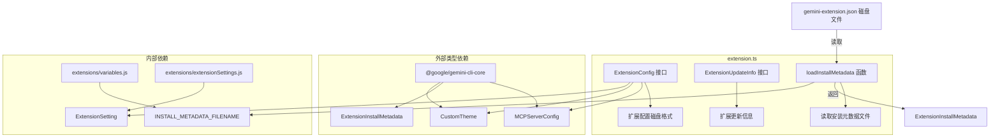

# extension.ts

## 概述

`extension.ts` 是 Gemini CLI 扩展系统的核心类型定义与元数据加载模块。该文件定义了扩展配置的磁盘格式（`ExtensionConfig`）、扩展更新信息结构（`ExtensionUpdateInfo`），并提供了从扩展目录中加载安装元数据的工具函数 `loadInstallMetadata`。

该文件是扩展系统"读取层"的入口，负责将磁盘上的 `gemini-extension.json` 配置文件反序列化为 TypeScript 类型，供其他模块（加载、卸载、更新等）使用。

## 架构图（Mermaid）



## 核心组件

### 1. `ExtensionConfig` 接口

扩展配置的磁盘序列化格式，对应 `gemini-extension.json` 文件的 JSON 结构。该接口**仅限**在文件读取逻辑中引用，不应在加载流程之外使用。

| 字段 | 类型 | 必填 | 说明 |
|------|------|------|------|
| `name` | `string` | 是 | 扩展名称 |
| `version` | `string` | 是 | 扩展版本号 |
| `mcpServers` | `Record<string, MCPServerConfig>` | 否 | MCP 服务器配置映射，键为服务器名称 |
| `contextFileName` | `string \| string[]` | 否 | 上下文文件名，支持单个或多个 |
| `excludeTools` | `string[]` | 否 | 需要排除的工具列表 |
| `settings` | `ExtensionSetting[]` | 否 | 扩展设置项定义 |
| `themes` | `CustomTheme[]` | 否 | 扩展提供的自定义主题，激活时注册 |
| `plan` | `{ directory?: string }` | 否 | 规划功能配置，包含规划产物存储目录 |
| `migratedTo` | `string` | 否 | 扩展迁移目标，用于将扩展迁移到新的仓库源 |

### 2. `ExtensionUpdateInfo` 接口

记录扩展更新前后的版本信息，用于更新流程的追踪。

| 字段 | 类型 | 说明 |
|------|------|------|
| `name` | `string` | 扩展名称 |
| `originalVersion` | `string` | 更新前的版本 |
| `updatedVersion` | `string` | 更新后的版本 |

### 3. `loadInstallMetadata` 函数

```typescript
function loadInstallMetadata(extensionDir: string): ExtensionInstallMetadata | undefined
```

从指定的扩展目录中读取安装元数据文件。

**参数：**
- `extensionDir`：扩展所在目录的绝对路径

**返回值：**
- 成功时返回 `ExtensionInstallMetadata` 对象
- 失败时（文件不存在、JSON 解析失败等）返回 `undefined`

**实现逻辑：**
1. 拼接 `extensionDir` 与 `INSTALL_METADATA_FILENAME` 常量得到元数据文件路径
2. 同步读取文件内容（`fs.readFileSync`）
3. 使用 `JSON.parse` 反序列化为 `ExtensionInstallMetadata`
4. 通过 try-catch 捕获所有异常，失败时静默返回 `undefined`

## 依赖关系

### 内部依赖

| 模块 | 导入项 | 用途 |
|------|--------|------|
| `./extensions/variables.js` | `INSTALL_METADATA_FILENAME` | 安装元数据文件名常量 |
| `./extensions/extensionSettings.js` | `ExtensionSetting`（类型） | 扩展设置项类型定义 |

### 外部依赖

| 模块 | 导入项 | 用途 |
|------|--------|------|
| `@google/gemini-cli-core` | `MCPServerConfig`（类型） | MCP 服务器配置类型 |
| `@google/gemini-cli-core` | `ExtensionInstallMetadata`（类型） | 扩展安装元数据类型 |
| `@google/gemini-cli-core` | `CustomTheme`（类型） | 自定义主题类型 |
| `node:fs` | `*`（全部） | 文件系统操作（`readFileSync`） |
| `node:path` | `*`（全部） | 路径拼接（`path.join`） |

## 关键实现细节

1. **类型仅限读取层使用**：`ExtensionConfig` 接口的注释明确指出，该类型仅供文件读取逻辑引用。如果加载流程之外需要扩展信息，应使用 Core 包中定义的 `GeminiCLIExtension` 类。这种设计将磁盘格式与运行时模型解耦，便于版本演进。

2. **同步文件读取**：`loadInstallMetadata` 使用 `fs.readFileSync` 进行同步读取，这在 CLI 启动阶段是可接受的，但在运行时热路径中可能成为性能瓶颈。

3. **静默失败策略**：`loadInstallMetadata` 对所有异常采用静默捕获（返回 `undefined`），不抛出错误也不打印日志。这意味着调用方需要自行处理 `undefined` 的情况。

4. **扩展迁移机制**：`migratedTo` 字段支持扩展仓库源的迁移，允许扩展从一个源平滑迁移到另一个源，确保用户无感知更新。

5. **MCP 服务器集成**：`mcpServers` 字段表明扩展可以声明式地定义多个 MCP（Model Context Protocol）服务器，这是扩展与 AI 模型交互的核心机制。

6. **规划功能支持**：`plan` 字段为扩展提供了规划产物的存储目录配置能力，这是 Gemini CLI 规划功能的扩展点。
