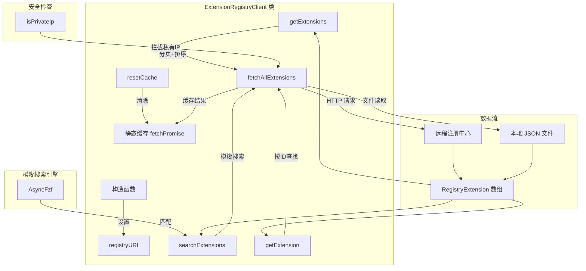

# extensionRegistryClient.ts

## 概述

`extensionRegistryClient.ts` 是 Gemini CLI 扩展注册中心的客户端模块。它负责从远程注册中心（默认为 `https://geminicli.com/extensions.json`）或本地文件获取扩展列表，并提供分页查询、模糊搜索和按 ID 查找等功能。

该客户端采用单例缓存模式，首次获取后将扩展列表缓存在静态 Promise 中，避免重复网络请求。搜索功能基于 `fzf` 库实现模糊匹配，支持对扩展名称、描述和全名的联合搜索。

## 架构图（Mermaid）



## 核心组件

### 1. `RegistryExtension` 接口

注册中心扩展的完整数据结构，描述一个扩展在注册中心的全部元信息。

| 字段 | 类型 | 说明 |
|------|------|------|
| `id` | `string` | 扩展唯一标识符 |
| `rank` | `number` | 排名权重（数字越小排名越高） |
| `url` | `string` | 扩展仓库 URL |
| `fullName` | `string` | 完整名称（如 `owner/repo`） |
| `repoDescription` | `string` | 仓库描述 |
| `stars` | `number` | GitHub 星标数 |
| `lastUpdated` | `string` | 最后更新时间 |
| `extensionName` | `string` | 扩展名称 |
| `extensionVersion` | `string` | 扩展版本 |
| `extensionDescription` | `string` | 扩展描述 |
| `avatarUrl` | `string` | 头像 URL |
| `hasMCP` | `boolean` | 是否包含 MCP 服务器 |
| `hasContext` | `boolean` | 是否包含上下文文件 |
| `hasHooks` | `boolean` | 是否包含钩子 |
| `hasSkills` | `boolean` | 是否包含技能 |
| `hasCustomCommands` | `boolean` | 是否包含自定义命令 |
| `isGoogleOwned` | `boolean` | 是否由 Google 维护 |
| `licenseKey` | `string` | 许可证标识 |

### 2. `ExtensionRegistryClient` 类

扩展注册中心客户端，提供扩展列表的获取、搜索和查询功能。

#### 静态属性

| 属性 | 类型 | 说明 |
|------|------|------|
| `DEFAULT_REGISTRY_URL` | `string` | 默认注册中心地址：`https://geminicli.com/extensions.json` |
| `FETCH_TIMEOUT_MS` | `number` | 网络请求超时时间：10000ms（10 秒） |
| `fetchPromise` | `Promise<RegistryExtension[]> \| null` | 静态缓存，所有实例共享同一份数据 |

#### 构造函数

```typescript
constructor(registryURI?: string)
```

接受可选的注册中心 URI 参数。如果未提供，则使用默认的 `DEFAULT_REGISTRY_URL`。支持 HTTP(S) URL 和本地文件路径。

#### `getExtensions` 方法

```typescript
async getExtensions(
  page: number = 1,
  limit: number = 10,
  orderBy: 'ranking' | 'alphabetical' = 'ranking'
): Promise<{ extensions: RegistryExtension[]; total: number }>
```

分页获取扩展列表，支持按排名或字母顺序排序。

**参数：**
- `page`：页码，默认 1
- `limit`：每页数量，默认 10
- `orderBy`：排序方式，`'ranking'`（按排名）或 `'alphabetical'`（按字母）

**返回值：** 包含当前页扩展数组和总数的对象。

**实现细节：**
- 使用 `switch` + `never` 类型实现穷举检查，确保排序方式的完备性
- 使用展开运算符 `[...]` 创建副本数组后再排序，避免修改缓存数据

#### `searchExtensions` 方法

```typescript
async searchExtensions(query: string): Promise<RegistryExtension[]>
```

使用模糊搜索查找扩展。搜索范围覆盖扩展名称、描述和全名三个字段。

**参数：**
- `query`：搜索关键词

**返回值：** 匹配的扩展数组，按相关性排序。

**实现细节：**
- 空查询时直接返回全部扩展
- 基于 `AsyncFzf` 进行异步模糊匹配
- 使用自定义 `selector` 函数将三个字段拼接为搜索文本

#### `getExtension` 方法

```typescript
async getExtension(id: string): Promise<RegistryExtension | undefined>
```

按 ID 精确查找单个扩展。

#### `fetchAllExtensions` 私有方法

```typescript
private async fetchAllExtensions(): Promise<RegistryExtension[]>
```

核心数据获取方法，支持两种数据源：

1. **HTTP(S) 远程源**：使用 `fetchWithTimeout` 带超时地请求远程 JSON
2. **本地文件源**：使用 `resolveToRealPath` 解析路径后读取本地文件

**缓存策略：**
- 使用静态 `fetchPromise` 实现 Promise 级缓存
- 首次调用时发起请求并存储 Promise
- 后续调用直接返回已缓存的 Promise
- 请求失败时自动清除缓存（设置 `fetchPromise = null`），允许重试

#### `resetCache` 静态方法

```typescript
static resetCache(): void
```

清除缓存的 Promise，标记为 `@internal`，主要用于测试场景。

## 依赖关系

### 内部依赖

无直接内部模块依赖（不导入项目内其他文件）。

### 外部依赖

| 模块 | 导入项 | 用途 |
|------|--------|------|
| `node:fs/promises` | `*` | 异步文件读取（本地注册中心） |
| `@google/gemini-cli-core` | `fetchWithTimeout` | 带超时的 HTTP 请求 |
| `@google/gemini-cli-core` | `resolveToRealPath` | 路径解析（处理符号链接等） |
| `@google/gemini-cli-core` | `isPrivateIp` | 私有 IP 地址检测（安全防护） |
| `fzf` | `AsyncFzf` | 异步模糊搜索引擎 |

## 关键实现细节

1. **Promise 级缓存**：缓存的是 Promise 本身而非结果值。这意味着即使多个调用几乎同时发生，也只会触发一次网络请求，所有调用者共享同一个 Promise。这是一种优雅的去重策略。

2. **安全防护 - 私有 IP 检测**：在发起 HTTP 请求前，使用 `isPrivateIp` 检查 URI 是否指向私有 IP 地址。这是一种 SSRF（服务器端请求伪造）防护机制，防止恶意注册中心 URL 被用于探测内网服务。

3. **双数据源支持**：通过检查 URI 前缀（`http`）区分远程和本地数据源。本地文件路径会经过 `resolveToRealPath` 解析，确保符号链接等场景的正确处理。

4. **失败自动重试**：当 `fetchAllExtensions` 失败时，catch 块会将 `fetchPromise` 重置为 `null`，使得下次调用可以重新发起请求，而不是永远返回一个 rejected Promise。

5. **穷举性排序检查**：`getExtensions` 方法的 `switch` 语句使用 `never` 类型的 `_exhaustiveCheck` 变量，确保如果将来添加新的排序方式但忘记处理，TypeScript 编译器会报错。

6. **模糊搜索的多字段联合**：搜索时将 `extensionName`、`extensionDescription` 和 `fullName` 拼接为单一字符串进行匹配，提升了搜索的覆盖面和用户体验。

7. **超时控制**：网络请求设置了 10 秒超时（`FETCH_TIMEOUT_MS = 10000`），防止网络异常时无限等待。
