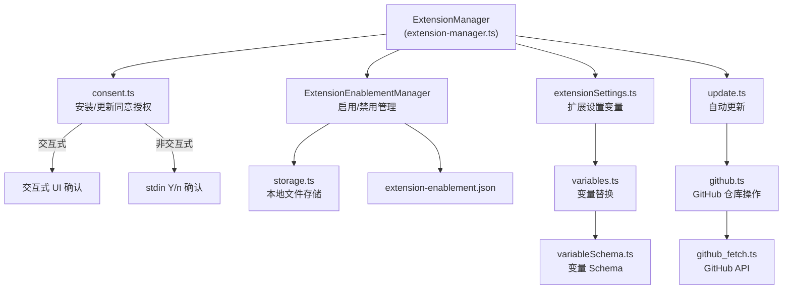
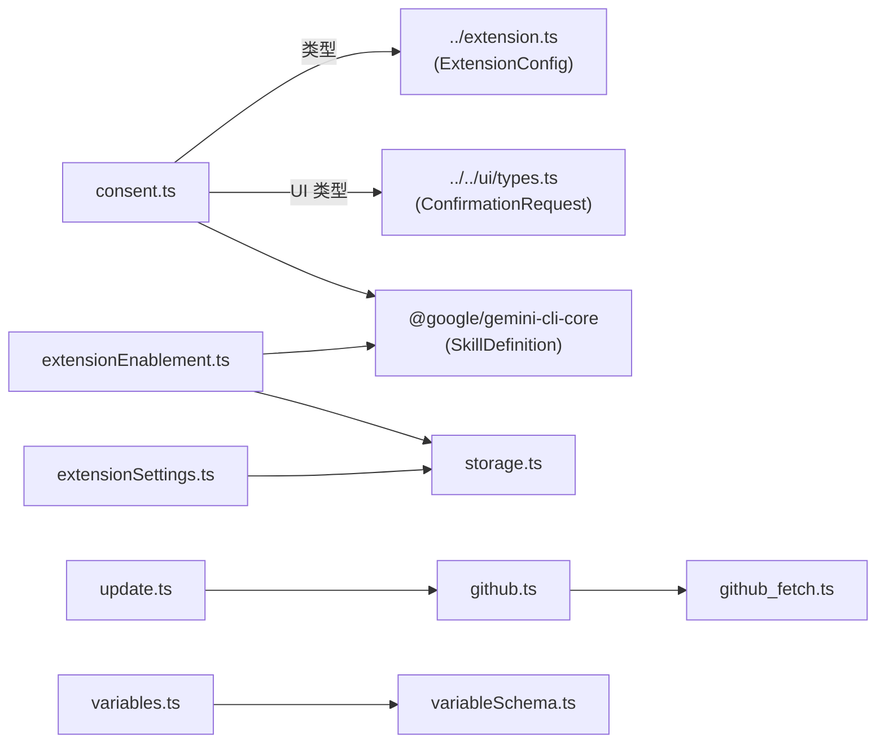
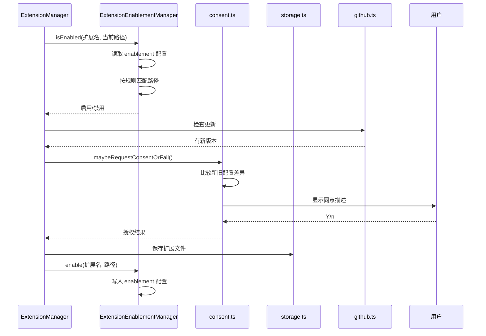

# extensions 目录

## 概述

`extensions` 目录是 Gemini CLI **扩展子系统**的实现层，负责扩展的同意授权、启用/禁用管理、设置变量解析、GitHub 仓库拉取、本地存储以及自动更新。它为上层 `extension-manager.ts` 提供底层能力，确保扩展在安装、更新、启用时均经过用户明确授权，并支持按路径粒度控制扩展的启用范围。

## 目录结构

```
extensions/
├── consent.ts                # 扩展安装/更新同意授权
├── extensionEnablement.ts    # 扩展启用/禁用管理器
├── extensionSettings.ts      # 扩展设置变量提示与解析
├── variables.ts              # 扩展配置中的变量替换
├── variableSchema.ts         # 变量 Schema 定义
├── storage.ts                # 扩展本地存储管理
├── github.ts                 # GitHub 仓库克隆/更新
├── github_fetch.ts           # GitHub API 数据拉取
├── update.ts                 # 扩展自动更新逻辑
├── *.test.ts                 # 对应测试文件
```

## 架构图



## 核心组件

### 1. consent.ts - 同意授权

- **`requestConsentNonInteractive()`**: 非交互模式下通过 stdin 读取 Y/n 获取用户同意。
- **`requestConsentInteractive()`**: 交互模式下通过 UI 确认对话框获取用户同意。
- **`maybeRequestConsentOrFail()`**: 比较新旧扩展配置的同意描述，仅在有差异时请求同意；用户拒绝则抛出异常。
- **`skillsConsentString()`**: 为安装 Agent Skills 构建同意描述文本。
- 安装警告明确提示：扩展可能来自第三方开发者，Google 不为其安全性背书。

### 2. extensionEnablement.ts - 启用/禁用管理

- **`ExtensionEnablementManager` 类**: 管理每个扩展的启用状态，支持：
  - **路径级粒度控制**: 通过 Override 规则按工作目录路径启用/禁用扩展。
  - **CLI 覆盖**: `--extensions` 参数可覆盖所有配置，仅启用指定扩展；`-e none` 禁用全部。
  - **规则优先级**: 最后匹配的规则获胜（last-match-wins）。
- **`Override` 类**: 封装单条启用/禁用规则：
  - 支持 `!` 前缀表示禁用。
  - 支持 `*` 后缀表示包含子目录。
  - 提供 glob 到正则的转换、冲突检测、父子关系判断。
- 配置持久化到 `~/.gemini/extensions/extension-enablement.json`。

### 3. 其他模块

| 模块 | 职责 |
|---|---|
| `extensionSettings.ts` | 提示用户输入扩展所需的设置变量值 |
| `variables.ts` | 在扩展配置中替换 `${variable}` 形式的变量引用 |
| `variableSchema.ts` | 定义扩展变量的 Schema 类型 |
| `storage.ts` | 管理扩展在本地磁盘的存储路径与文件操作 |
| `github.ts` | 从 GitHub 仓库克隆/拉取扩展代码 |
| `github_fetch.ts` | 通过 GitHub API 获取仓库元数据 |
| `update.ts` | 扩展自动更新检查与执行 |

## 依赖关系



## 数据流


