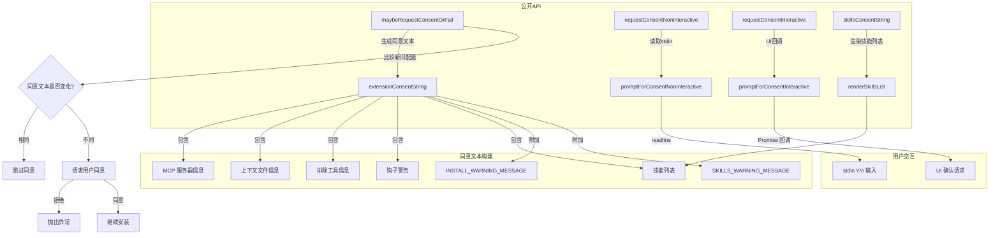

# consent.ts

## 概述

`consent.ts` 是 Gemini CLI 扩展安装的用户同意管理模块。它负责在扩展安装、更新、迁移或技能安装过程中，向用户展示安全警告信息并获取用户的明确同意。

该模块是安全机制的关键一环，确保用户在安装第三方扩展前充分了解扩展的功能范围（MCP 服务器、上下文文件、钩子、技能等），并明确同意安装。模块同时支持交互模式（Interactive）和非交互模式（Non-Interactive）两种同意流程。

## 架构图（Mermaid）



## 核心组件

### 1. 警告消息常量

#### `INSTALL_WARNING_MESSAGE`
黄色警告文本，提醒用户扩展可能由第三方开发者创建，来源于公开仓库，Google 不对其功能或安全性做任何保证。建议用户在安装前仔细检查扩展及其源代码。

#### `SKILLS_WARNING_MESSAGE`
黄色警告文本，说明代理技能会向系统提示词注入专门指令和领域知识，可能改变代理对请求的理解方式及与环境的交互方式。建议用户审查技能定义。

### 2. `skillsConsentString` 函数

```typescript
async function skillsConsentString(
  skills: SkillDefinition[],
  source: string,
  targetDir?: string,
  isLink?: boolean
): Promise<string>
```

为安装代理技能构建同意描述文本。

**参数：**
- `skills`：技能定义数组
- `source`：技能来源标识
- `targetDir`：可选的安装目标目录
- `isLink`：是否为链接操作（而非安装），默认 `false`

**实现逻辑：**
1. 根据 `isLink` 确定操作描述（"Installing" 或 "Linking"）
2. 列出所有技能名称和描述
3. 显示安装/链接目标目录
4. 附加 `SKILLS_WARNING_MESSAGE` 警告

### 3. `requestConsentNonInteractive` 函数

```typescript
async function requestConsentNonInteractive(consentDescription: string): Promise<boolean>
```

在非交互模式下请求用户同意。通过日志输出同意描述，然后从 stdin 读取 Y/n 响应。

**重要限制：** 不可在交互模式下调用，否则会破坏 CLI 功能。

### 4. `requestConsentInteractive` 函数

```typescript
async function requestConsentInteractive(
  consentDescription: string,
  addExtensionUpdateConfirmationRequest: (value: ConfirmationRequest) => void
): Promise<boolean>
```

在交互模式下请求用户同意。通过 UI 回调函数添加确认请求，并等待用户响应。

**重要限制：** 不可在非交互模式下调用。

### 5. `promptForConsentNonInteractive` 函数

```typescript
async function promptForConsentNonInteractive(
  prompt: string,
  defaultValue?: boolean
): Promise<boolean>
```

底层的非交互式同意提示实现。

**参数：**
- `prompt`：提示文本
- `defaultValue`：用户直接按回车时的默认值，默认 `true`

**实现细节：**
- 动态导入 `node:readline` 模块
- 创建 readline 接口并提问
- 接受 `y`、`yes`（大小写不敏感）为同意
- 空输入使用默认值

### 6. `promptForConsentInteractive` 私有函数

```typescript
async function promptForConsentInteractive(
  prompt: string,
  addExtensionUpdateConfirmationRequest: (value: ConfirmationRequest) => void
): Promise<boolean>
```

底层的交互式同意提示实现。通过向 UI 层注册一个 `ConfirmationRequest` 来获取用户反馈，使用 Promise 模式等待 `onConfirm` 回调被调用。

### 7. `extensionConsentString` 私有函数

```typescript
async function extensionConsentString(
  extensionConfig: ExtensionConfig,
  hasHooks: boolean,
  skills?: SkillDefinition[],
  previousName?: string,
  wasMigrated?: boolean
): Promise<string>
```

根据扩展配置构建完整的同意描述文本。这是同意系统的核心文本生成器。

**文本内容覆盖：**
1. 操作类型描述（安装/迁移/重命名）
2. MCP 服务器列表（区分本地/远程）
3. 上下文文件名
4. 排除的工具列表
5. 钩子警告
6. 代理技能列表
7. 安装警告和技能警告

**安全处理：** 使用 `escapeAnsiCtrlCodes` 对扩展配置进行 ANSI 控制码转义，防止恶意扩展通过终端控制码注入攻击。

### 8. `renderSkillsList` 私有函数

```typescript
async function renderSkillsList(skills: SkillDefinition[]): Promise<string[]>
```

渲染技能列表的共享格式化逻辑。对每个技能显示名称（加粗）、描述、源文件位置和目录中的文件数量。

### 9. `maybeRequestConsentOrFail` 函数

```typescript
async function maybeRequestConsentOrFail(
  extensionConfig: ExtensionConfig,
  requestConsent: (consent: string) => Promise<boolean>,
  hasHooks: boolean,
  previousExtensionConfig?: ExtensionConfig,
  previousHasHooks?: boolean,
  skills?: SkillDefinition[],
  previousSkills?: SkillDefinition[],
  isMigrating?: boolean
): Promise<void>
```

同意流程的主入口函数。智能决策是否需要请求同意。

**核心逻辑：**
1. 生成当前扩展配置的同意文本
2. 如果存在先前配置，也生成其同意文本
3. 比较新旧同意文本：
   - 若相同 → 静默跳过（无需再次同意）
   - 若不同 → 请求用户同意
4. 用户拒绝时抛出 `Error`（消息为 `Installation cancelled for "扩展名"`)

**设计亮点：** 通过比较同意文本字符串而非配置对象来判断是否需要重新同意，这意味着只有影响安全性的实质变更才会触发同意流程。

## 依赖关系

### 内部依赖

| 模块 | 导入项 | 用途 |
|------|--------|------|
| `../../ui/types.js` | `ConfirmationRequest`（类型） | 交互式确认请求的类型定义 |
| `../../ui/utils/textUtils.js` | `escapeAnsiCtrlCodes` | ANSI 控制码转义，安全防护 |
| `../extension.js` | `ExtensionConfig`（类型） | 扩展配置类型定义 |

### 外部依赖

| 模块 | 导入项 | 用途 |
|------|--------|------|
| `node:fs/promises` | `*` | 异步文件系统操作（读取技能目录） |
| `node:path` | `*` | 路径操作（获取技能目录） |
| `@google/gemini-cli-core` | `debugLogger` | 调试日志输出 |
| `@google/gemini-cli-core` | `SkillDefinition`（类型） | 技能定义类型 |
| `chalk` | `default` | 终端文本着色（黄色警告、加粗、灰色等） |
| `node:readline`（动态导入） | `createInterface` | 非交互模式下的 stdin 读取 |

## 关键实现细节

1. **双模式同意流程**：模块严格区分交互模式和非交互模式，各自有独立的实现路径。交互模式通过 UI 回调系统工作，非交互模式通过 stdin readline 工作。注释中明确警告不可混用，否则会导致 CLI 崩溃。

2. **ANSI 控制码防护**：`extensionConsentString` 在处理扩展配置前，先使用 `escapeAnsiCtrlCodes` 进行转义。这防止了恶意扩展在配置的 name、contextFileName 等字段中注入终端控制码，从而误导用户（例如隐藏关键警告信息）。

3. **增量同意策略**：`maybeRequestConsentOrFail` 通过对比新旧同意文本来决定是否需要用户重新确认。对于没有安全相关变更的更新（如仅修改内部实现而不改变 MCP 服务器、钩子等配置），用户不会被反复打扰。

4. **MCP 服务器来源区分**：同意文本中会区分显示本地（`command` 字段）和远程（`httpUrl` 字段）MCP 服务器，帮助用户评估风险。本地服务器显示完整的命令及参数，远程服务器显示 URL。

5. **技能目录文件计数**：`renderSkillsList` 会尝试读取技能所在目录的文件列表来显示文件数量，帮助用户了解技能的复杂度。如果目录读取失败，会显示警告而非崩溃。

6. **readline 动态导入**：`promptForConsentNonInteractive` 使用 `await import('node:readline')` 动态导入，而非静态导入，可能是为了避免在不需要 readline 的场景下（如交互模式）产生不必要的模块加载。

7. **抛出异常的拒绝策略**：用户拒绝安装时，`maybeRequestConsentOrFail` 通过抛出异常（而非返回布尔值）来中断流程，确保调用方不可能忽略用户的拒绝决定。
