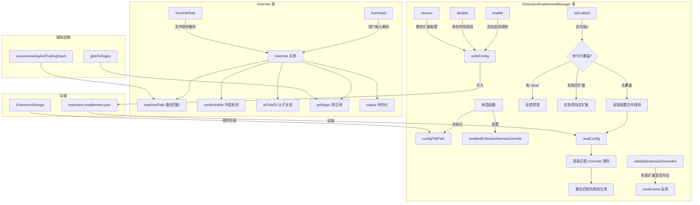

# extensionEnablement.ts

## 概述

`extensionEnablement.ts` 是 Gemini CLI 扩展启用/禁用管理模块。它实现了基于路径的扩展启用控制机制，允许用户针对不同的工作目录启用或禁用特定扩展。

该模块的核心思想是"覆盖规则"（Override）：用户可以为每个扩展定义一组基于路径 glob 的规则，最后匹配的规则决定扩展在当前目录下是否启用。此外，模块还支持通过命令行参数（如 `-e none` 或 `-e ext1,ext2`）在运行时全局覆盖扩展启用配置。

## 架构图（Mermaid）



## 核心组件

### 1. `ExtensionEnablementConfig` 接口

单个扩展的启用配置。

| 字段 | 类型 | 说明 |
|------|------|------|
| `overrides` | `string[]` | 覆盖规则数组，按顺序应用 |

### 2. `AllExtensionsEnablementConfig` 接口

所有扩展的启用配置映射，键为扩展名称。

```typescript
interface AllExtensionsEnablementConfig {
  [extensionName: string]: ExtensionEnablementConfig;
}
```

### 3. `Override` 类

覆盖规则的核心模型类，封装了规则的解析、匹配、比较和序列化逻辑。

#### 属性

| 属性 | 类型 | 说明 |
|------|------|------|
| `baseRule` | `string` | 基础路径规则（已标准化，带前导和尾部斜杠） |
| `isDisable` | `boolean` | 是否为禁用规则（`!` 前缀） |
| `includeSubdirs` | `boolean` | 是否包含子目录（`*` 后缀） |

#### 规则格式说明

磁盘存储的规则格式：
- `/path/to/dir/` — 精确匹配该目录，启用扩展
- `/path/to/dir/*` — 匹配该目录及其所有子目录，启用扩展
- `!/path/to/dir/` — 精确匹配该目录，禁用扩展
- `!/path/to/dir/*` — 匹配该目录及其所有子目录，禁用扩展

#### 静态工厂方法

**`fromInput(inputRule, includeSubdirs)`**：从用户输入创建 Override。自动标准化路径（确保前导和尾部斜杠），解析 `!` 前缀。

**`fromFileRule(fileRule)`**：从配置文件中的规则字符串创建 Override。自动解析 `!` 前缀和 `*` 后缀。

#### 实例方法

| 方法 | 返回类型 | 说明 |
|------|----------|------|
| `conflictsWith(other)` | `boolean` | 检测两个规则是否冲突（同路径但不同行为） |
| `isEqualTo(other)` | `boolean` | 检测两个规则是否完全相等 |
| `asRegex()` | `RegExp` | 将规则转为正则表达式 |
| `isChildOf(parent)` | `boolean` | 检测当前规则是否为另一个规则的子路径 |
| `output()` | `string` | 序列化为配置文件中的规则字符串 |
| `matchesPath(path)` | `boolean` | 检测给定路径是否匹配此规则 |

### 4. `ExtensionEnablementManager` 类

扩展启用管理的主类，提供完整的 CRUD 操作和启用状态查询。

#### 构造函数

```typescript
constructor(enabledExtensionNames?: string[])
```

**参数：**
- `enabledExtensionNames`：可选的扩展名称列表，用于命令行级全局覆盖。名称会被转为小写存储。

**初始化逻辑：**
1. 从 `ExtensionStorage` 获取用户扩展目录
2. 设置配置文件路径为 `<扩展目录>/extension-enablement.json`
3. 存储命令行覆盖列表（小写化）

#### `isEnabled` 方法

```typescript
isEnabled(extensionName: string, currentPath: string): boolean
```

判断指定扩展在给定路径下是否启用。采用三级优先级策略：

**优先级 1 — `none` 全局禁用**：如果命令行覆盖列表仅包含 `'none'`，则禁用所有扩展。

**优先级 2 — 命令行指定扩展列表**：如果命令行覆盖列表非空，则仅启用列表中的扩展（大小写不敏感比较）。

**优先级 3 — 配置文件规则**：读取配置文件中该扩展的覆盖规则，按顺序逐条匹配当前路径，**最后匹配的规则生效**（Last Match Wins）。默认为启用。

#### `readConfig` / `writeConfig` 方法

配置文件的读写操作。读取时对 `ENOENT`（文件不存在）做静默处理，返回空对象。写入时自动创建目录。

#### `enable` 方法

```typescript
enable(extensionName: string, includeSubdirs: boolean, scopePath: string): void
```

为指定扩展添加启用规则。在添加新规则前，会清理已有规则：
1. 移除与新规则冲突的规则
2. 移除与新规则完全相同的规则
3. 移除新规则子路径下的规则（因为父规则已覆盖）

#### `disable` 方法

```typescript
disable(extensionName: string, includeSubdirs: boolean, scopePath: string): void
```

为指定扩展添加禁用规则。实现上是调用 `enable` 并在路径前加 `!` 前缀。

#### `remove` 方法

```typescript
remove(extensionName: string): void
```

完全移除指定扩展的所有启用配置。

#### `validateExtensionOverrides` 方法

```typescript
validateExtensionOverrides(extensions: GeminiCLIExtension[]): void
```

验证命令行覆盖列表中的扩展名是否都存在。对于不存在的扩展名，通过 `coreEvents` 发出错误反馈。`'none'` 是保留关键字，会被跳过。

### 5. 辅助函数

#### `ensureLeadingAndTrailingSlash`

标准化目录路径：将反斜杠替换为正斜杠，确保路径以 `/` 开头和结尾。

#### `globToRegex`

将简化的 glob 模式转为正则表达式：
1. 转义正则特殊字符
2. 将 `*` 转换为可选的匹配组 `(/<anything>)?`
3. 生成锚定的完整匹配正则（`^...$`）

## 依赖关系

### 内部依赖

| 模块 | 导入项 | 用途 |
|------|--------|------|
| `./storage.js` | `ExtensionStorage` | 获取用户扩展目录路径 |

### 外部依赖

| 模块 | 导入项 | 用途 |
|------|--------|------|
| `node:fs` | `default` | 同步文件读写（配置文件） |
| `node:path` | `default` | 路径拼接 |
| `@google/gemini-cli-core` | `coreEvents` | 事件系统（发出错误反馈） |
| `@google/gemini-cli-core` | `GeminiCLIExtension`（类型） | 扩展类型定义 |

## 关键实现细节

1. **Last Match Wins 语义**：`isEnabled` 方法中的规则匹配采用"最后匹配胜出"策略。这意味着用户可以通过在规则列表末尾添加更具体的规则来覆盖之前的宽泛规则。例如，先启用 `/workspace/*`，再禁用 `!/workspace/sensitive/`。

2. **三级优先级体系**：
   - 最高优先级：`-e none` 命令行参数（禁用一切）
   - 中等优先级：`-e ext1,ext2` 命令行参数（仅启用指定扩展）
   - 最低优先级：配置文件中的路径规则

3. **规则冲突清理**：`enable` 方法在添加新规则前会智能清理现有规则，移除冲突项、重复项和已被父规则覆盖的子规则。这确保配置文件不会积累冗余规则。

4. **disable 复用 enable**：`disable` 方法通过在路径前加 `!` 前缀后委托给 `enable` 方法实现，避免了代码重复。`enable` 方法内部通过解析 `!` 前缀来区分启用和禁用。

5. **跨平台路径标准化**：`ensureLeadingAndTrailingSlash` 将 Windows 反斜杠统一转为正斜杠，确保跨平台一致的路径匹配行为。

6. **大小写不敏感的命令行匹配**：命令行覆盖列表在构造时就被小写化，后续比较也使用 `toLocaleLowerCase()`，确保命令行参数不区分大小写。

7. **默认启用策略**：扩展默认是启用的（`let enabled = true`），只有存在匹配的禁用规则时才会被禁用。这是一种"宽松默认"策略，对用户更友好。

8. **错误容错**：配置文件读取失败时（文件不存在或 JSON 解析错误），返回空对象而非抛出异常，确保不会因为配置文件损坏而阻止 CLI 运行。
