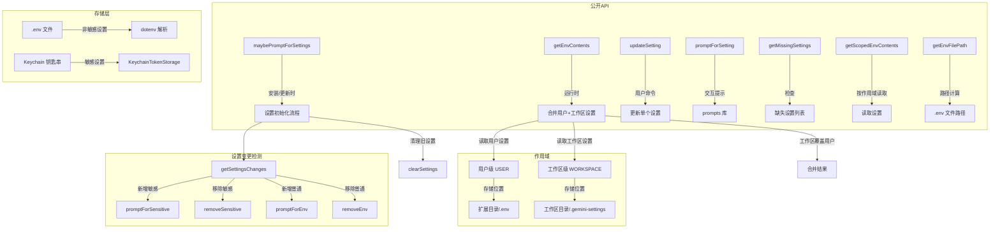

# extensionSettings.ts

## 概述

`extensionSettings.ts` 是 Gemini CLI 扩展设置管理模块。它负责管理扩展定义的自定义设置项（如 API 密钥、配置参数等），提供设置的存储、读取、更新和清理功能。

该模块的核心设计特性是**双层作用域**（用户级和工作区级）与**敏感信息安全存储**。非敏感设置以 `.env` 文件格式存储在磁盘上，而敏感设置（如密码、API 密钥）则通过操作系统的 Keychain（钥匙串）安全存储。读取时，工作区设置会覆盖用户设置，实现就近优先原则。

## 架构图（Mermaid）



## 核心组件

### 1. `ExtensionSettingScope` 枚举

设置的作用域，决定存储位置和优先级。

| 值 | 说明 |
|------|------|
| `USER` (`'user'`) | 用户级作用域，存储在用户扩展目录下，对所有工作区生效 |
| `WORKSPACE` (`'workspace'`) | 工作区级作用域，存储在当前工作区目录下，仅对当前工作区生效，优先级高于用户级 |

### 2. `ExtensionSetting` 接口

扩展设置项的定义结构。

| 字段 | 类型 | 必填 | 说明 |
|------|------|------|------|
| `name` | `string` | 是 | 设置项显示名称 |
| `description` | `string` | 是 | 设置项描述 |
| `envVar` | `string` | 是 | 对应的环境变量名 |
| `sensitive` | `boolean` | 否 | 是否为敏感信息（默认 `false`），敏感信息存储在 Keychain 中 |

### 3. `getKeychainStorageName` 函数

```typescript
function getKeychainStorageName(
  extensionName: string,
  extensionId: string,
  scope: ExtensionSettingScope,
  workspaceDir?: string
): string
```

生成 Keychain 存储键名。格式为 `Gemini CLI Extensions {扩展名} {扩展ID}`，工作区级会追加工作区目录路径。

### 4. `getEnvFilePath` 函数

```typescript
function getEnvFilePath(
  extensionName: string,
  scope: ExtensionSettingScope,
  workspaceDir?: string
): string
```

计算 `.env` 文件路径：
- **用户级**：由 `ExtensionStorage` 提供的扩展专属目录下的 `.env` 文件
- **工作区级**：`{工作区目录}/{EXTENSION_SETTINGS_FILENAME}`

工作区级作用域要求必须提供 `workspaceDir` 参数，否则抛出异常。

### 5. `maybePromptForSettings` 函数

```typescript
async function maybePromptForSettings(
  extensionConfig: ExtensionConfig,
  extensionId: string,
  requestSetting: (setting: ExtensionSetting) => Promise<string>,
  previousExtensionConfig?: ExtensionConfig,
  previousSettings?: Record<string, string>
): Promise<void>
```

扩展安装/更新时的设置初始化入口。智能检测设置变更并只提示用户输入新增的设置项。

**核心流程：**
1. 如果新旧配置都没有设置项，直接返回
2. 默认使用 `USER` 作用域（安装阶段无法询问用户选择作用域）
3. 如果新配置无设置但旧配置有，清除所有旧设置
4. 使用 `getSettingsChanges` 检测设置变更
5. 删除已移除的普通设置和敏感设置
6. 逐个提示用户输入新增设置的值
7. 敏感设置存入 Keychain，非敏感设置写入 `.env` 文件
8. 写入前验证目标路径不是目录

### 6. `formatEnvContent` 私有函数

```typescript
function formatEnvContent(settings: Record<string, string>): string
```

将设置键值对格式化为 `.env` 文件内容。

**安全校验：**
- 环境变量名：必须匹配 `^[a-zA-Z_][a-zA-Z0-9_]*$`（仅字母、数字、下划线）
- 环境变量值：不允许包含换行符（`\n` 或 `\r`）
- 包含空格的值会被双引号包裹，内部反斜杠和双引号会被转义

### 7. `promptForSetting` 函数

```typescript
async function promptForSetting(setting: ExtensionSetting): Promise<string>
```

使用 `prompts` 库向用户交互式请求设置值。敏感设置使用 `password` 类型（隐藏输入），普通设置使用 `text` 类型。

### 8. `getScopedEnvContents` 函数

```typescript
async function getScopedEnvContents(
  extensionConfig: ExtensionConfig,
  extensionId: string,
  scope: ExtensionSettingScope,
  workspaceDir?: string
): Promise<Record<string, string>>
```

读取指定作用域下的所有设置。先从 `.env` 文件读取非敏感设置，再从 Keychain 读取敏感设置。两者合并为一个键值对映射。

### 9. `getEnvContents` 函数

```typescript
async function getEnvContents(
  extensionConfig: ExtensionConfig,
  extensionId: string,
  workspaceDir: string
): Promise<Record<string, string>>
```

获取扩展的完整设置，合并用户级和工作区级。

**合并策略：** 使用对象展开运算符 `{ ...userSettings, ...workspaceSettings }`，工作区设置覆盖同名的用户设置。

### 10. `updateSetting` 函数

```typescript
async function updateSetting(
  extensionConfig: ExtensionConfig,
  extensionId: string,
  settingKey: string,
  requestSetting: (setting: ExtensionSetting) => Promise<string>,
  scope: ExtensionSettingScope,
  workspaceDir: string
): Promise<void>
```

更新单个设置项。

**流程：**
1. 通过 `name` 或 `envVar` 查找设置定义
2. 请求用户输入新值
3. 敏感设置：有值则存入 Keychain，空值则删除 Keychain 中的密钥
4. 非敏感设置：读取现有 `.env` 文件，更新/删除指定键，写回文件
5. 写回时过滤掉所有敏感设置的环境变量，确保不会意外将密钥泄漏到 `.env` 文件

### 11. `getSettingsChanges` 私有函数

```typescript
function getSettingsChanges(
  settings: ExtensionSetting[],
  oldSettings: ExtensionSetting[]
): settingsChanges
```

对比新旧设置列表，计算四类变更：

| 变更类型 | 字段 | 说明 |
|----------|------|------|
| 新增敏感设置 | `promptForSensitive` | 需要提示用户输入的新敏感设置 |
| 移除敏感设置 | `removeSensitive` | 需要从 Keychain 删除的旧敏感设置 |
| 新增普通设置 | `promptForEnv` | 需要提示用户输入的新普通设置 |
| 移除普通设置 | `removeEnv` | 需要从 `.env` 文件删除的旧普通设置 |

**比较基准：** 两个设置被视为"相同"当且仅当 `envVar` 相同且 `sensitive` 标志相同。

### 12. `clearSettings` 私有函数

```typescript
async function clearSettings(
  envFilePath: string,
  keychain: KeychainTokenStorage
): Promise<void>
```

清除所有设置。将 `.env` 文件内容清空，并删除 Keychain 中的所有密钥。如果 Keychain 不可用则跳过密钥清理。

### 13. `getMissingSettings` 函数

```typescript
async function getMissingSettings(
  extensionConfig: ExtensionConfig,
  extensionId: string,
  workspaceDir: string
): Promise<ExtensionSetting[]>
```

检查扩展配置中定义的哪些设置尚未被用户配置（值为 `undefined`），返回缺失的设置项列表。

## 依赖关系

### 内部依赖

| 模块 | 导入项 | 用途 |
|------|--------|------|
| `./storage.js` | `ExtensionStorage` | 获取扩展存储目录和 `.env` 文件路径 |
| `../extension.js` | `ExtensionConfig`（类型） | 扩展配置类型定义 |
| `./variables.js` | `EXTENSION_SETTINGS_FILENAME` | 工作区级设置文件名常量 |

### 外部依赖

| 模块 | 导入项 | 用途 |
|------|--------|------|
| `node:fs/promises` | `*` | 异步文件操作（写入 `.env` 文件） |
| `node:fs` | `*`（别名 `fsSync`） | 同步文件操作（存在性检查、读取） |
| `node:path` | `*` | 路径拼接 |
| `dotenv` | `*` | `.env` 文件解析 |
| `prompts` | `default` | 交互式命令行提示 |
| `@google/gemini-cli-core` | `debugLogger` | 调试日志 |
| `@google/gemini-cli-core` | `KeychainTokenStorage` | 操作系统 Keychain 安全存储 |

## 关键实现细节

1. **双存储机制**：非敏感设置存储在 `.env` 文件中（人类可读、可版本控制），敏感设置存储在操作系统 Keychain 中（加密存储、不可直接读取）。这种分离确保了 API 密钥等敏感信息不会被意外提交到版本控制系统。

2. **双层作用域覆盖**：用户级设置是全局默认值，工作区级设置可以覆盖特定项目的配置。合并时使用简单的对象展开（`{ ...user, ...workspace }`），工作区设置优先。

3. **增量设置更新**：`maybePromptForSettings` 通过 `getSettingsChanges` 精确计算设置变更，只提示用户输入新增的设置，不重复询问已有设置。这在扩展更新时提供了良好的用户体验。

4. **环境变量名安全校验**：`formatEnvContent` 使用正则 `^[a-zA-Z_][a-zA-Z0-9_]*$` 验证环境变量名，防止注入攻击。同时拒绝包含换行符的值，防止 `.env` 文件格式被破坏。

5. **值的安全转义**：包含空格的值会被双引号包裹，内部的反斜杠和双引号会被正确转义（`\\` 和 `\"`），确保 `.env` 文件的格式正确性。

6. **防目录写入**：写入 `.env` 文件前，会检查目标路径是否为目录。如果是目录则抛出异常，防止覆盖目录结构。

7. **Keychain 可用性检查**：`clearSettings` 在清理 Keychain 密钥前会检查 `keychain.isAvailable()`，确保在 Keychain 不可用的环境（如 CI/CD 或无 GUI 的服务器）中不会崩溃。

8. **设置变更的敏感/非敏感分离**：`getSettingsChanges` 将设置分为敏感和非敏感两类分别处理变更，确保敏感设置的迁移（新增/删除）走 Keychain 路径，非敏感设置走 `.env` 文件路径。

9. **设置查找的双键匹配**：`updateSetting` 支持通过 `name` 或 `envVar` 两种方式查找设置项，提供了更灵活的用户体验。

10. **安装阶段的作用域限制**：`maybePromptForSettings` 在安装/更新时硬编码使用 `USER` 作用域，因为安装阶段无法提供合适的 UI 来询问用户选择作用域。用户可以通过 `settings set` 命令后续调整。

11. **写回时过滤敏感设置**：`updateSetting` 在将非敏感设置写回 `.env` 文件时，会过滤掉所有标记为 `sensitive` 的环境变量。这是一个关键的安全措施，防止在修改非敏感设置时意外将已存在于内存中的敏感值写入 `.env` 文件。
