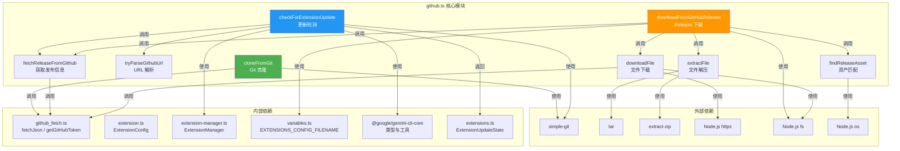

# github.ts

## 概述

`github.ts` 是 Gemini CLI 扩展系统中负责 GitHub 仓库交互的核心模块，提供了一套完整的 GitHub 扩展安装、更新检测和下载能力。该模块支持两种主要的扩展安装方式：**Git 克隆**和 **GitHub Release 下载**，并且能够智能识别当前操作系统平台来选择合适的发布资产。

主要职责包括：
- 从 Git 仓库克隆扩展代码
- 解析和验证 GitHub 仓库 URL（支持 HTTPS 和 SSH 格式）
- 从 GitHub Release 获取发布信息
- 检测已安装扩展是否有可用更新
- 下载和解压 GitHub Release 资产文件（支持 `.tar.gz` 和 `.zip` 格式）
- 根据操作系统平台和架构智能选择匹配的发布资产

## 架构图（Mermaid）



## 核心组件

### 1. `cloneFromGit(installMetadata, destination): Promise<void>`

**功能**：将 Git 仓库克隆到指定的本地路径。

**执行流程**：
1. 初始化 `simpleGit` 实例
2. 若存在 `GITHUB_TOKEN` 且源 URL 是 GitHub HTTPS 地址，则将 token 注入 URL 的 username 字段用于认证
3. 执行浅克隆 (`--depth 1`) 以减少下载量
4. 获取远程仓库列表，验证远程仓库存在
5. 使用指定的 `ref`（分支/标签/commit）或默认 `HEAD` 执行 `fetch`
6. 切换到 `FETCH_HEAD`（分离 HEAD 状态）

```typescript
export async function cloneFromGit(
  installMetadata: ExtensionInstallMetadata,
  destination: string,
): Promise<void>
```

**关键特性**：
- 使用 `--depth 1` 浅克隆，减少网络传输量
- 自动注入 GitHub Token 到 HTTPS URL 中进行认证
- 支持指定任意 Git ref（分支、标签、commit hash）
- 最终处于 detached HEAD 状态，这是预期行为

### 2. `tryParseGithubUrl(source): GithubRepoInfo | null`

**功能**：解析各种格式的 GitHub 仓库 URL，提取 owner 和 repo 信息。

**支持的 URL 格式**：
- SSH 格式：`git@github.com:owner/repo.git`
- HTTPS 格式：`https://github.com/owner/repo`
- 简写格式：`owner/repo`（自动补全为 `https://github.com/owner/repo`）

**返回值**：
- 成功解析返回 `{ owner, repo }` 对象
- 非 GitHub 地址返回 `null`
- 无效 URL 抛出 `TypeError`
- 路径格式不正确抛出 `Error`

```typescript
export interface GithubRepoInfo {
  owner: string;
  repo: string;
}
```

### 3. `fetchReleaseFromGithub(owner, repo, ref?, allowPreRelease?): Promise<GithubReleaseData | null>`

**功能**：从 GitHub API 获取仓库的发布版本信息。

**策略逻辑**：
1. 若指定了 `ref`，直接获取对应 tag 的发布
2. 若不允许预发布版本，尝试获取标记为 `latest` 的发布
3. 若允许预发布版本，或 `latest` 获取失败，获取最近的一个发布（`per_page=1`）
4. 无发布时返回 `null`

```typescript
export async function fetchReleaseFromGithub(
  owner: string,
  repo: string,
  ref?: string,
  allowPreRelease?: boolean,
): Promise<GithubReleaseData | null>
```

### 4. `checkForExtensionUpdate(extension, extensionManager): Promise<ExtensionUpdateState>`

**功能**：检测已安装的扩展是否有可用更新。

**支持三种安装类型的更新检测**：

| 安装类型 | 检测方法 |
|----------|----------|
| `local` | 从本地路径重新加载扩展配置，比较版本号 |
| `git` | 使用 `git ls-remote` 获取远程 HEAD hash，与本地 HEAD hash 比较 |
| `github-release` | 通过 GitHub API 获取最新 Release 的 tag，与已安装的 releaseTag 比较 |

**迁移支持**：如果扩展有 `migratedTo` 字段，会递归检查迁移目标的更新状态。

**返回值枚举**：
- `ExtensionUpdateState.UPDATE_AVAILABLE` — 有可用更新
- `ExtensionUpdateState.UP_TO_DATE` — 已是最新
- `ExtensionUpdateState.NOT_UPDATABLE` — 不支持更新检测
- `ExtensionUpdateState.ERROR` — 检测过程出错

### 5. `downloadFromGitHubRelease(installMetadata, destination, githubRepoInfo): Promise<GitHubDownloadResult>`

**功能**：从 GitHub Release 下载并解压扩展资产。

**完整执行流程**：
1. 调用 `fetchReleaseFromGithub` 获取发布信息
2. 调用 `findReleaseAsset` 查找匹配当前平台的资产
3. 若无匹配资产，回退使用 `tarball_url` 或 `zipball_url`
4. 确定下载文件名及类型（tar.gz / zip）
5. 设置正确的 Accept 头（二进制资产用 `application/octet-stream`，源码包用 `application/vnd.github+json`）
6. 调用 `downloadFile` 下载文件
7. 调用 `extractFile` 解压文件
8. 处理解压后的目录结构：如果解压后只有一个包含 `gemini_extension.json` 的目录，将其内容提升到目标目录
9. 删除下载的压缩包

**返回值类型**：

```typescript
export type GitHubDownloadResult =
  | { tagName?: string; type: 'git' | 'github-release'; success: false;
      failureReason: 'failed to fetch release data' | 'no release data'
        | 'no release asset found' | 'failed to download asset'
        | 'failed to extract asset' | 'unknown';
      errorMessage: string; }
  | { tagName?: string; type: 'git' | 'github-release'; success: true; };
```

### 6. `findReleaseAsset(assets): Asset | undefined`

**功能**：根据当前操作系统平台和 CPU 架构，从发布资产列表中选择最匹配的资产。

**匹配优先级**（从高到低）：
1. **平台 + 架构匹配**：资产名以 `{platform}.{arch}.` 开头（如 `darwin.arm64.xxx`）
2. **平台匹配**：资产名以 `{platform}.` 开头（如 `darwin.xxx`）
3. **通用资产**：当仅有一个资产且名称不包含任何平台标识（`darwin`、`linux`、`win32`）时选用

### 7. `downloadFile(url, dest, options?, redirectCount?): Promise<void>`

**功能**：使用 HTTPS 下载文件到本地路径。

**特性**：
- 自动注入 `User-Agent` 和 `Authorization` 头
- 支持自定义请求头
- 支持 301/302 重定向（最多 10 次）
- 使用 `fs.createWriteStream` 流式写入磁盘，内存高效
- 使用 `res.pipe(file)` 管道方式传输数据

### 8. `extractFile(file, dest): Promise<void>`

**功能**：解压文件到指定目录。

**支持格式**：
| 文件格式 | 使用的库 |
|----------|----------|
| `.tar.gz` | `tar` 包的 `tar.x()` |
| `.zip` | `extract-zip` 包的 `extract()` |

不支持的格式会抛出错误。

## 依赖关系

### 内部依赖

| 模块 | 导入内容 | 用途 |
|------|----------|------|
| `./github_fetch.js` | `fetchJson`, `getGitHubToken` | HTTP JSON 请求和 GitHub Token 获取 |
| `../extension.js` | `ExtensionConfig` (类型) | 扩展配置类型定义 |
| `../extension-manager.js` | `ExtensionManager` (类型) | 扩展管理器类型（用于加载扩展配置） |
| `./variables.js` | `EXTENSIONS_CONFIG_FILENAME` | 扩展配置文件名常量 |
| `@google/gemini-cli-core` | `debugLogger`, `getErrorMessage`, `ExtensionInstallMetadata`, `GeminiCLIExtension` | 日志工具、错误处理、核心类型定义 |
| `../../ui/state/extensions.js` | `ExtensionUpdateState` | 扩展更新状态枚举 |

### 外部依赖

| 依赖项 | 类型 | 用途 |
|--------|------|------|
| `simple-git` | npm 包 | 执行 Git 操作（clone、fetch、checkout、ls-remote 等） |
| `tar` | npm 包 | 解压 `.tar.gz` 归档文件 |
| `extract-zip` | npm 包 | 解压 `.zip` 归档文件 |
| `node:https` | Node.js 内置 | 执行 HTTPS 文件下载请求 |
| `node:fs` | Node.js 内置 | 文件系统操作（读写、删除、目录遍历） |
| `node:path` | Node.js 内置 | 路径拼接和解析 |
| `node:os` | Node.js 内置 | 获取操作系统平台和架构信息 |

## 关键实现细节

### 1. GitHub Token 注入策略

`cloneFromGit` 中对 GitHub HTTPS URL 采用了 URL 用户名注入的方式来传递 token：

```typescript
const parsedUrl = new URL(sourceUrl);
if (parsedUrl.protocol === 'https:' && parsedUrl.hostname === 'github.com') {
  if (!parsedUrl.username) {
    parsedUrl.username = token;
  }
}
```

这种方式将 token 嵌入到 URL 的 `username` 部分（如 `https://TOKEN@github.com/owner/repo`），是 Git 支持的标准认证方式。仅在 URL 未设置 username 时注入，避免覆盖用户已有配置。

### 2. GitHub Release 下载的 Accept 头差异

模块根据下载内容类型设置不同的 `Accept` 头：
- **二进制资产（release artifacts）**：`Accept: application/octet-stream` — 直接获取原始内容
- **源码包（tarball/zipball）**：`Accept: application/vnd.github+json` — 获取 302 重定向到实际下载地址

错误使用 Accept 头会导致 GitHub API 返回 `415 Unsupported Media Type`。

### 3. 解压后目录结构规范化

GitHub 的 tarball/zipball 下载后通常会包含一个顶层目录（如 `owner-repo-sha/`）。模块通过以下逻辑处理：

1. 检查解压后目标目录是否恰好包含 2 个条目（压缩包 + 一个目录）
2. 验证该目录内是否包含 `gemini_extension.json` 配置文件
3. 如果满足条件，将目录内容全部移到上级目录
4. 删除空的中间目录

### 4. 平台感知的资产选择

`findReleaseAsset` 使用三级降级策略匹配资产：
1. 精确匹配（平台 + 架构）：如 `darwin.arm64.tar.gz`
2. 平台匹配：如 `darwin.tar.gz`
3. 通用匹配：仅当只有一个资产且不包含平台标识符时

### 5. 更新检测的迁移支持

`checkForExtensionUpdate` 支持扩展迁移场景：当扩展设置了 `migratedTo` 字段时，会递归检查迁移目标地址的更新状态。如果迁移目标有更新或已是最新，都视为当前扩展有可用更新（需要迁移到新地址）。

### 6. 错误处理设计模式

`downloadFromGitHubRelease` 采用了 **结果类型模式**（Result Type Pattern），通过返回值的 `success` 字段区分成功和失败，而非抛出异常。失败时提供详细的 `failureReason` 枚举和 `errorMessage` 描述，便于上层调用方进行精确的错误分类和用户提示。

### 7. Git 浅克隆优化

`cloneFromGit` 使用 `--depth 1` 参数执行浅克隆，仅下载最近一次提交的数据。这对于扩展安装场景非常合适，因为不需要完整的 Git 历史记录，能大幅减少下载时间和磁盘占用。

### 8. 流式文件下载

`downloadFile` 使用 `res.pipe(file)` 将 HTTP 响应流直接管道到文件写入流，避免将整个文件内容加载到内存中，对大文件下载友好。
