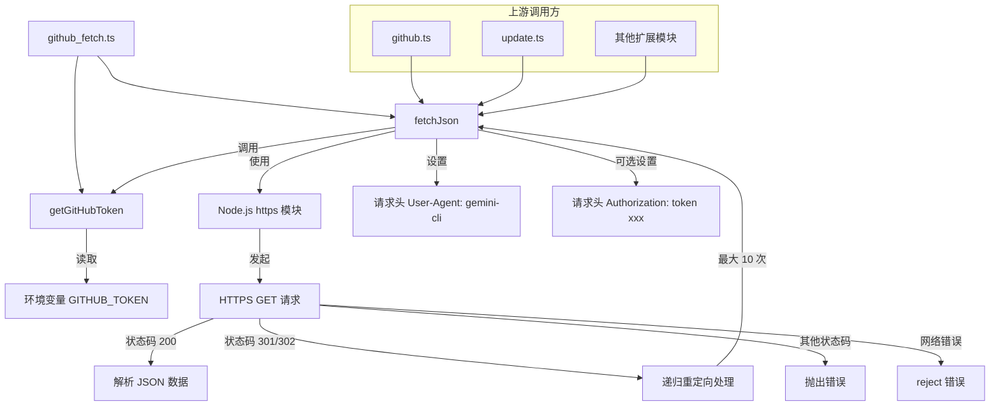

# github_fetch.ts

## 概述

`github_fetch.ts` 是一个轻量级的 GitHub API HTTP 请求工具模块，提供了两个核心功能：获取 GitHub 认证令牌和执行带认证的 HTTPS JSON 请求。该模块是 Gemini CLI 与 GitHub API 交互的底层网络通信基础设施，被其他 GitHub 相关扩展模块（如 `github.ts`、`update.ts`）所依赖。

模块使用 Node.js 原生 `https` 模块实现网络请求，避免了引入额外的 HTTP 客户端库依赖，保持了轻量化设计。

## 架构图（Mermaid）



## 核心组件

### 1. `getGitHubToken(): string | undefined`

**功能**：从环境变量中获取 GitHub 认证令牌。

- **输入**：无参数
- **输出**：返回 `GITHUB_TOKEN` 环境变量的值，若未设置则返回 `undefined`
- **用途**：为 GitHub API 请求提供认证信息，用于提高 API 速率限制配额（未认证请求每小时仅 60 次，认证后可达 5000 次）

```typescript
export function getGitHubToken(): string | undefined {
  return process.env['GITHUB_TOKEN'];
}
```

### 2. `fetchJson<T>(url: string, redirectCount?: number): Promise<T>`

**功能**：执行带认证的 HTTPS GET 请求，返回解析后的 JSON 数据。

- **泛型参数 `T`**：指定返回的 JSON 数据类型，提供类型安全保障
- **参数**：
  - `url: string` — 请求的完整 HTTPS URL
  - `redirectCount: number = 0` — 当前重定向计数（内部递归使用，默认值为 0）
- **返回值**：`Promise<T>` — 解析后的 JSON 对象

**核心逻辑**：

1. **构建请求头**：设置 `User-Agent` 为 `gemini-cli`，若存在 GitHub Token 则添加 `Authorization` 头
2. **发起请求**：使用 `https.get()` 发起 GET 请求
3. **重定向处理**：支持 301/302 重定向，最多递归 10 次，超过则抛出 `Too many redirects` 错误
4. **数据收集**：通过流式方式收集响应数据块（chunks），最终拼接并解析为 JSON
5. **错误处理**：非 200 状态码抛出明确的错误信息，网络错误直接 reject

```typescript
export async function fetchJson<T>(
  url: string,
  redirectCount: number = 0,
): Promise<T> {
  const headers: { 'User-Agent': string; Authorization?: string } = {
    'User-Agent': 'gemini-cli',
  };
  const token = getGitHubToken();
  if (token) {
    headers.Authorization = `token ${token}`;
  }
  return new Promise((resolve, reject) => {
    https
      .get(url, { headers }, (res) => {
        // 重定向处理、数据收集、错误处理...
      })
      .on('error', reject);
  });
}
```

## 依赖关系

### 内部依赖

无。`github_fetch.ts` 是一个底层工具模块，不依赖项目中的其他模块。

### 外部依赖

| 依赖项 | 类型 | 说明 |
|--------|------|------|
| `node:https` | Node.js 内置模块 | 用于发起 HTTPS 网络请求 |

## 关键实现细节

### 1. 认证机制

- 通过环境变量 `GITHUB_TOKEN` 获取认证令牌
- 令牌以 `token <TOKEN>` 格式放入 `Authorization` 请求头
- 令牌是可选的：未设置时仍可发起请求，但受限于 GitHub 的匿名 API 速率限制（60 次/小时）

### 2. 重定向处理

- 支持 HTTP 301（永久重定向）和 302（临时重定向）
- 采用递归方式处理重定向，每次递归时 `redirectCount` 递增
- 设置最大重定向次数为 **10 次**，防止无限重定向循环
- 重定向时检查 `Location` 头是否存在，缺失则抛出明确错误

**注意**：代码中存在一个潜在的微小问题 —— 使用了后置递增 `redirectCount++` 而非前置递增 `++redirectCount`。由于后置递增的特性，传给递归调用的值是递增前的值（即当前值），但由于 `redirectCount` 是局部变量且每次递归都会重新比较 `>= 10`，实际行为上最多可能允许 11 次重定向而非 10 次。

### 3. 流式数据收集

- 使用 `Buffer[]` 数组收集所有数据块
- 在 `end` 事件中使用 `Buffer.concat()` 拼接所有数据块
- 将拼接后的 Buffer 转为字符串后通过 `JSON.parse()` 解析
- 使用 TypeScript 类型断言 `as T` 将解析结果转换为泛型类型

### 4. 错误处理策略

| 场景 | 处理方式 |
|------|----------|
| 重定向次数超过 10 | `reject(new Error('Too many redirects'))` |
| 重定向缺少 Location 头 | `reject(new Error('No location header in redirect response'))` |
| 非 200 状态码 | `reject(new Error('Request failed with status code ${statusCode}'))` |
| 网络层错误 | 通过 `.on('error', reject)` 直接传递原始错误 |

### 5. 设计特点

- **零外部依赖**：仅使用 Node.js 内置 `https` 模块，不依赖 `axios`、`node-fetch` 等第三方库
- **泛型支持**：通过 TypeScript 泛型 `<T>` 提供类型安全的返回值
- **Promise 封装**：将基于回调的 `https.get` API 封装为 Promise，支持 async/await 调用模式
- **User-Agent 标识**：所有请求都携带 `gemini-cli` 的 User-Agent 标识，符合 GitHub API 的使用要求
