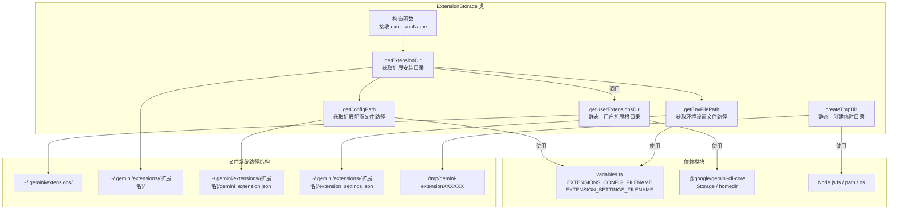

# storage.ts

## 概述

`storage.ts` 定义了 `ExtensionStorage` 类，负责管理 Gemini CLI 扩展的文件系统存储路径。该类封装了扩展的目录结构约定，为每个扩展提供统一的路径计算接口，包括扩展安装目录、配置文件路径、环境设置文件路径等。

此外，该类还提供了两个静态工具方法：获取用户级扩展根目录和创建临时目录（用于下载/安装过程中的中间存储）。

`ExtensionStorage` 是扩展安装、加载、配置读取等操作的基础设施模块，被扩展管理器和其他扩展相关模块广泛使用。

## 架构图（Mermaid）



## 核心组件

### `ExtensionStorage` 类

一个以扩展名称为核心的存储路径管理类，所有路径计算都基于扩展名称和用户根目录。

#### 属性

| 属性 | 类型 | 访问修饰符 | 说明 |
|------|------|-----------|------|
| `extensionName` | `string` | `private readonly` | 扩展的唯一名称标识，用于构建路径 |

#### 构造函数

```typescript
constructor(extensionName: string)
```

接收扩展名称作为参数，存储为只读私有属性。

#### 实例方法

##### `getExtensionDir(): string`

**功能**：获取当前扩展的安装目录路径。

**路径规则**：`{用户扩展根目录}/{扩展名}`

```typescript
getExtensionDir(): string {
  return path.join(
    ExtensionStorage.getUserExtensionsDir(),
    this.extensionName,
  );
}
```

**示例返回值**：`/Users/username/.gemini/extensions/my-extension`

##### `getConfigPath(): string`

**功能**：获取扩展配置文件的完整路径。

**路径规则**：`{扩展安装目录}/{EXTENSIONS_CONFIG_FILENAME}`

配置文件名由 `variables.ts` 中的常量 `EXTENSIONS_CONFIG_FILENAME` 定义（通常为 `gemini_extension.json`）。

**示例返回值**：`/Users/username/.gemini/extensions/my-extension/gemini_extension.json`

##### `getEnvFilePath(): string`

**功能**：获取扩展环境设置文件的完整路径。

**路径规则**：`{扩展安装目录}/{EXTENSION_SETTINGS_FILENAME}`

环境设置文件名由 `variables.ts` 中的常量 `EXTENSION_SETTINGS_FILENAME` 定义（通常为 `extension_settings.json`）。

**示例返回值**：`/Users/username/.gemini/extensions/my-extension/extension_settings.json`

#### 静态方法

##### `static getUserExtensionsDir(): string`

**功能**：获取用户级扩展根目录路径。

**实现**：通过 `@google/gemini-cli-core` 包的 `Storage` 类和 `homedir` 函数来计算路径。

```typescript
static getUserExtensionsDir(): string {
  return new Storage(homedir()).getExtensionsDir();
}
```

这确保了与 Gemini CLI Core 的存储路径约定保持一致。

##### `static async createTmpDir(): Promise<string>`

**功能**：在系统临时目录下创建一个以 `gemini-extension` 为前缀的唯一临时目录。

```typescript
static async createTmpDir(): Promise<string> {
  return fs.promises.mkdtemp(path.join(os.tmpdir(), 'gemini-extension'));
}
```

**用途**：在扩展安装或更新过程中，作为中间下载/解压的临时存储位置。安装完成后，临时目录中的内容会被移动到正式的扩展目录。

**示例返回值**：`/tmp/gemini-extensionABC123`（后缀由 `fs.mkdtemp` 自动生成随机字符）

## 依赖关系

### 内部依赖

| 模块 | 导入内容 | 用途 |
|------|----------|------|
| `./variables.js` | `EXTENSION_SETTINGS_FILENAME`, `EXTENSIONS_CONFIG_FILENAME` | 扩展配置文件名和环境设置文件名常量 |
| `@google/gemini-cli-core` | `Storage`, `homedir` | 获取用户主目录及扩展存储路径的核心逻辑 |

### 外部依赖

| 依赖项 | 类型 | 用途 |
|--------|------|------|
| `node:path` | Node.js 内置模块 | 跨平台路径拼接 |
| `node:fs` | Node.js 内置模块 | 文件系统操作（创建临时目录） |
| `node:os` | Node.js 内置模块 | 获取系统临时目录路径 |

## 关键实现细节

### 1. 路径层级结构

`ExtensionStorage` 管理的路径遵循以下层级结构：

```
~/.gemini/                                    <-- 用户级 Gemini 配置根目录
  └── extensions/                             <-- 用户扩展根目录 (getUserExtensionsDir)
        └── {extensionName}/                  <-- 单个扩展目录 (getExtensionDir)
              ├── gemini_extension.json        <-- 扩展配置文件 (getConfigPath)
              └── extension_settings.json      <-- 环境设置文件 (getEnvFilePath)
```

### 2. 路径计算的委托模式

`getUserExtensionsDir` 不自行拼接路径，而是委托给 `@google/gemini-cli-core` 的 `Storage` 类：

```typescript
new Storage(homedir()).getExtensionsDir()
```

这种设计确保了扩展存储路径与 CLI Core 的路径约定保持一致，避免硬编码路径导致的维护问题。如果 Core 层修改了存储路径逻辑，CLI 层会自动适配。

### 3. 临时目录的唯一性保证

`createTmpDir` 使用 `fs.promises.mkdtemp`，该 API 会在指定前缀后自动附加 6 个随机字符，确保每次调用都创建唯一的临时目录。这避免了并发安装多个扩展时的目录冲突问题。

### 4. 单一职责设计

`ExtensionStorage` 类严格遵循单一职责原则：仅负责路径计算和目录创建，不涉及文件内容的读写和解析。文件内容的处理由上层的 `ExtensionManager` 等模块负责。

### 5. 不可变性设计

`extensionName` 使用 `private readonly` 修饰，确保创建后不可修改。这使得 `ExtensionStorage` 实例的所有路径计算都是确定性的、无副作用的。
