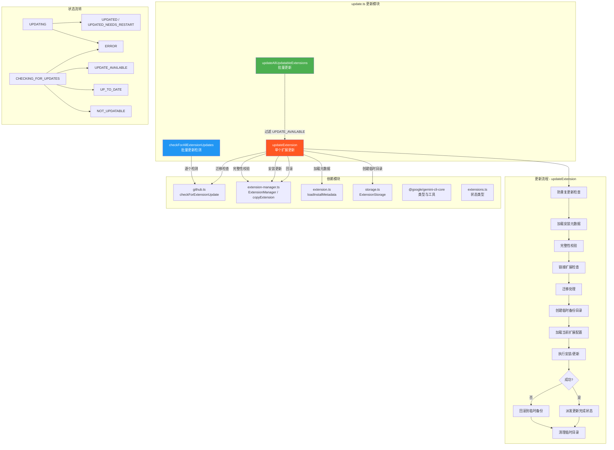

# update.ts

## 概述

`update.ts` 是 Gemini CLI 扩展更新系统的核心模块，提供了扩展的更新检测和执行更新的完整生命周期管理。该模块包含三个主要功能：

1. **单个扩展更新**（`updateExtension`）：执行单个扩展的完整更新流程，包括完整性校验、迁移处理、安装更新和回滚机制
2. **批量更新**（`updateAllUpdatableExtensions`）：并行更新所有有可用更新的扩展
3. **批量更新检测**（`checkForAllExtensionUpdates`）：并行检测所有扩展是否有可用更新

该模块采用了状态驱动的设计模式，通过 `dispatch` 函数向 UI 层发送状态更新，实现了更新流程与用户界面的解耦。

## 架构图（Mermaid）



## 核心组件

### 1. 接口定义

#### `ExtensionUpdateInfo`

表示一次成功更新的结果信息。

```typescript
export interface ExtensionUpdateInfo {
  name: string;            // 扩展名称
  originalVersion: string; // 更新前版本
  updatedVersion: string;  // 更新后版本
}
```

#### `ExtensionUpdateCheckResult`

表示一次更新检测的结果。

```typescript
export interface ExtensionUpdateCheckResult {
  state: ExtensionUpdateState; // 检测到的更新状态
  error?: string;              // 可选的错误信息
}
```

### 2. `updateExtension(extension, extensionManager, currentState, dispatchExtensionStateUpdate, enableExtensionReloading?): Promise<ExtensionUpdateInfo | undefined>`

**功能**：执行单个扩展的完整更新流程。

**参数**：

| 参数 | 类型 | 说明 |
|------|------|------|
| `extension` | `GeminiCLIExtension` | 要更新的扩展实例 |
| `extensionManager` | `ExtensionManager` | 扩展管理器实例 |
| `currentState` | `ExtensionUpdateState` | 当前的更新状态 |
| `dispatchExtensionStateUpdate` | `(action: ExtensionUpdateAction) => void` | 状态更新派发函数 |
| `enableExtensionReloading` | `boolean?` | 是否启用扩展热重载 |

**完整执行流程**：

1. **防重复更新**：如果当前状态已是 `UPDATING`，直接返回 `undefined`
2. **派发 UPDATING 状态**：通知 UI 层更新已开始
3. **加载安装元数据**：从扩展路径加载 `installMetadata`，验证 `type` 字段存在
4. **完整性校验**：调用 `extensionManager.verifyExtensionIntegrity()` 验证扩展文件完整性
   - 如果状态为 `INVALID`，抛出错误并建议用户重新安装
5. **链接扩展检查**：`link` 类型的扩展不需要更新，派发 `UP_TO_DATE` 状态并抛出错误
6. **迁移处理**：如果扩展有 `migratedTo` 字段，检查迁移目标的更新状态，如果目标可用则更新安装源
7. **创建临时备份目录**：用于更新失败时的回滚
8. **执行更新**：调用 `extensionManager.installOrUpdateExtension()` 执行实际更新
9. **派发完成状态**：根据 `enableExtensionReloading` 派发 `UPDATED` 或 `UPDATED_NEEDS_RESTART`
10. **错误回滚**：更新失败时使用 `copyExtension` 将备份恢复到扩展目录
11. **清理**：无论成功与否，最后清理临时目录

**返回值**：成功时返回 `ExtensionUpdateInfo` 对象，防重复时返回 `undefined`，失败时抛出错误。

### 3. `updateAllUpdatableExtensions(extensions, extensionsState, extensionManager, dispatch, enableExtensionReloading?): Promise<ExtensionUpdateInfo[]>`

**功能**：并行更新所有状态为 `UPDATE_AVAILABLE` 的扩展。

**执行逻辑**：
1. 从扩展列表中过滤出状态为 `UPDATE_AVAILABLE` 的扩展
2. 对每个符合条件的扩展调用 `updateExtension`
3. 使用 `Promise.all` 并行执行所有更新
4. 过滤掉 `undefined` 结果（防重复更新返回的）
5. 返回所有成功更新的 `ExtensionUpdateInfo` 数组

```typescript
export async function updateAllUpdatableExtensions(
  extensions: GeminiCLIExtension[],
  extensionsState: Map<string, ExtensionUpdateStatus>,
  extensionManager: ExtensionManager,
  dispatch: (action: ExtensionUpdateAction) => void,
  enableExtensionReloading?: boolean,
): Promise<ExtensionUpdateInfo[]>
```

### 4. `checkForAllExtensionUpdates(extensions, extensionManager, dispatch): Promise<void>`

**功能**：并行检测所有扩展是否有可用更新。

**执行流程**：
1. 派发 `BATCH_CHECK_START` 事件
2. 遍历所有扩展：
   - 没有 `installMetadata` 的扩展直接标记为 `NOT_UPDATABLE`
   - 有 `installMetadata` 的扩展标记为 `CHECKING_FOR_UPDATES`，并异步调用 `checkForExtensionUpdate`
3. 使用 `Promise.all` 等待所有检测完成
4. 在 `finally` 块中派发 `BATCH_CHECK_END` 事件（确保无论是否有错误都会触发）

```typescript
export async function checkForAllExtensionUpdates(
  extensions: GeminiCLIExtension[],
  extensionManager: ExtensionManager,
  dispatch: (action: ExtensionUpdateAction) => void,
): Promise<void>
```

## 依赖关系

### 内部依赖

| 模块 | 导入内容 | 用途 |
|------|----------|------|
| `../../ui/state/extensions.js` | `ExtensionUpdateAction`, `ExtensionUpdateState`, `ExtensionUpdateStatus` | 更新状态类型和 action 类型定义 |
| `../extension.js` | `loadInstallMetadata` | 从文件系统加载扩展安装元数据 |
| `./github.js` | `checkForExtensionUpdate` | 检测单个扩展的更新可用性 |
| `../extension-manager.js` | `copyExtension`, `ExtensionManager` | 扩展的复制（回滚用）和管理器 |
| `./storage.js` | `ExtensionStorage` | 创建临时目录 |
| `@google/gemini-cli-core` | `debugLogger`, `getErrorMessage`, `GeminiCLIExtension`, `IntegrityDataStatus` | 日志、错误处理、核心类型、完整性状态 |

### 外部依赖

| 依赖项 | 类型 | 用途 |
|--------|------|------|
| `node:fs` | Node.js 内置模块 | 文件系统操作（清理临时目录） |

## 关键实现细节

### 1. 状态驱动的更新流程

更新流程通过 `dispatchExtensionStateUpdate` 函数向 UI 层派发状态变更，实现了业务逻辑与 UI 的完全解耦。状态流转如下：

```
初始 → UPDATING → UPDATED / UPDATED_NEEDS_RESTART (成功)
初始 → UPDATING → ERROR (失败)
```

UI 层可以根据这些状态变化实时更新用户界面（如显示进度条、成功/失败提示等）。

### 2. 完整性校验机制

在执行更新前，模块会调用 `extensionManager.verifyExtensionIntegrity()` 验证扩展文件的完整性。如果校验结果为 `IntegrityDataStatus.INVALID`，则拒绝更新并建议用户重新安装。这防止了在已被篡改的扩展上执行更新操作。

### 3. 回滚机制

`updateExtension` 实现了完善的回滚机制：

```typescript
const tempDir = await ExtensionStorage.createTmpDir();
try {
  // ... 执行更新 ...
} catch (e) {
  // 更新失败，使用备份恢复
  await copyExtension(tempDir, extension.path);
  throw e;
} finally {
  // 清理临时目录
  await fs.promises.rm(tempDir, { recursive: true, force: true });
}
```

流程：
1. 更新前创建临时备份目录
2. 如果更新过程中出现任何错误，使用 `copyExtension` 将备份内容恢复到扩展原路径
3. 无论成功或失败，都会在 `finally` 块中清理临时目录

### 4. 扩展热重载支持

通过 `enableExtensionReloading` 参数控制更新完成后的状态：
- **启用热重载**：派发 `UPDATED` 状态，扩展可以在当前会话中立即生效
- **未启用热重载**：派发 `UPDATED_NEEDS_RESTART` 状态，需要重启 CLI 才能使用新版本

### 5. 扩展迁移处理

当扩展配置了 `migratedTo` 字段时（表示扩展已迁移到新的仓库地址），更新逻辑会：
1. 检查迁移目标地址是否有可用的版本（UPDATE_AVAILABLE 或 UP_TO_DATE）
2. 如果迁移目标可用，将 `installMetadata.source` 更新为迁移目标地址
3. 后续的安装/更新操作将从新地址获取扩展

### 6. 并发更新策略

- `updateAllUpdatableExtensions` 使用 `Promise.all` 并行更新所有可更新的扩展，最大化网络利用率
- `checkForAllExtensionUpdates` 同样使用 `Promise.all` 并行检测更新
- 通过状态检查（`UPDATING` 状态防重复）避免同一扩展被并发更新

### 7. 链接扩展的特殊处理

`link` 类型的扩展（通过符号链接关联到本地开发目录的扩展）不需要更新操作，因为它们始终指向最新的本地代码。模块在检测到 `link` 类型时直接派发 `UP_TO_DATE` 状态并抛出错误中止更新。

### 8. 批量检测的事件边界

`checkForAllExtensionUpdates` 使用 `BATCH_CHECK_START` 和 `BATCH_CHECK_END` 事件包裹整个检测过程，`BATCH_CHECK_END` 放在 `finally` 块中确保始终触发。这允许 UI 层准确识别批量检测的开始和结束时机（例如显示/隐藏加载指示器）。
