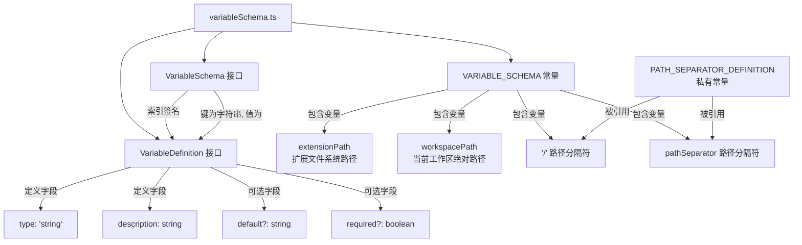

# variableSchema.ts

## 概述

`variableSchema.ts` 是 Gemini CLI 扩展系统中的变量模式定义文件。该文件定义了扩展（Extension）可使用的变量类型接口和内置变量模式（Schema）。这些变量用于在扩展配置中进行路径和环境变量的模板替换，使扩展能够动态引用工作区路径、扩展路径以及系统路径分隔符等信息。

## 架构图（Mermaid）



## 核心组件

### 1. `VariableDefinition` 接口

定义单个变量的结构规范：

```typescript
export interface VariableDefinition {
  type: 'string';         // 变量类型，目前仅支持 'string'
  description: string;    // 变量用途描述
  default?: string;       // 可选的默认值
  required?: boolean;     // 是否为必需变量
}
```

- **type**: 当前仅支持字符串类型 `'string'`，表明变量系统目前设计为纯字符串模板替换。
- **description**: 对变量用途的文字描述，便于文档生成和开发者理解。
- **default**: 当变量未被显式设置时使用的默认值。
- **required**: 标记变量是否为必须提供的，若为 `true` 且未提供，可能触发校验错误。

### 2. `VariableSchema` 接口

以索引签名形式定义变量模式的字典结构：

```typescript
export interface VariableSchema {
  [key: string]: VariableDefinition;
}
```

这是一个字符串索引的字典类型，键为变量名，值为 `VariableDefinition`。允许任意数量的变量定义。

### 3. `PATH_SEPARATOR_DEFINITION` 私有常量

```typescript
const PATH_SEPARATOR_DEFINITION = {
  type: 'string',
  description: 'The path separator.',
} as const;
```

这是一个模块内部私有常量，使用 `as const` 断言确保类型推断为字面量类型。该常量被 `VARIABLE_SCHEMA` 中的两个路径分隔符变量共同引用，避免重复定义。

### 4. `VARIABLE_SCHEMA` 导出常量

```typescript
export const VARIABLE_SCHEMA = {
  extensionPath: { ... },
  workspacePath: { ... },
  '/': PATH_SEPARATOR_DEFINITION,
  pathSeparator: PATH_SEPARATOR_DEFINITION,
} as const;
```

这是核心的内置变量注册表，包含四个预定义变量：

| 变量名 | 说明 | 用途 |
|--------|------|------|
| `extensionPath` | 扩展在文件系统中的路径 | 引用扩展自身目录中的资源文件 |
| `workspacePath` | 当前工作区的绝对路径 | 引用用户项目中的文件和目录 |
| `/` | 路径分隔符 | 跨平台路径拼接（简写形式） |
| `pathSeparator` | 路径分隔符 | 跨平台路径拼接（完整名称形式） |

其中 `/` 和 `pathSeparator` 指向同一个定义对象，是同一功能的两种命名方式。

## 依赖关系

### 内部依赖

无。该文件是一个纯定义文件，不导入项目中的任何其他模块。它作为扩展变量系统的基础定义层，被其他模块引用。

### 外部依赖

无。该文件不依赖任何第三方库，仅使用 TypeScript 原生语法。

## 关键实现细节

1. **`as const` 断言的使用**: `PATH_SEPARATOR_DEFINITION` 和 `VARIABLE_SCHEMA` 均使用了 `as const` 断言。这使得 TypeScript 将它们的类型推断为只读的字面量类型，而非宽泛的 `string` 类型。这种设计确保了类型安全——消费者代码可以精确知道 `type` 字段的值是 `'string'` 而非 `string`。

2. **双命名路径分隔符**: `/` 和 `pathSeparator` 共享同一个定义对象引用 `PATH_SEPARATOR_DEFINITION`。这意味着在模板中，用户可以使用 `${/}` 或 `${pathSeparator}` 两种写法来引用路径分隔符，提高了模板编写的灵活性和可读性。

3. **可扩展的设计**: `VariableSchema` 接口使用了 `[key: string]` 索引签名，允许扩展自定义额外的变量。而 `VARIABLE_SCHEMA` 则作为系统内置变量的基线集合，扩展开发者可以在此基础上添加自定义变量。

4. **仅支持字符串类型**: 当前 `type` 字段仅支持 `'string'` 值，表明变量系统目前是一个简单的字符串模板替换机制。如果将来需要支持数字、布尔值等类型，需要扩展 `VariableDefinition` 中的 `type` 联合类型。

5. **许可证**: 文件头部标注了 Apache-2.0 许可证，版权归 Google LLC 所有（2025年）。
