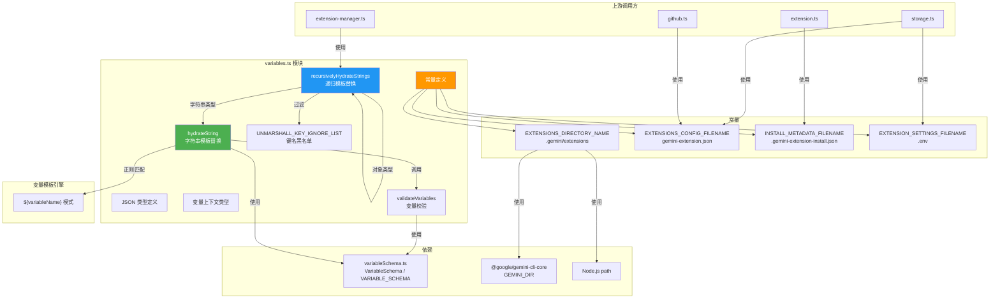

# variables.ts

## 概述

`variables.ts` 是 Gemini CLI 扩展系统的变量和常量定义模块，承担两大职责：

1. **常量定义**：定义扩展系统使用的文件名和目录名常量，这些常量是整个扩展系统文件结构约定的基础
2. **变量模板引擎**：提供一套字符串模板变量替换机制，支持在扩展配置中使用 `${variableName}` 语法引用动态值（如扩展路径、工作区路径、路径分隔符等），并能递归处理嵌套的对象和数组结构

该模块同时定义了 JSON 相关的类型别名（`JsonObject`、`JsonArray`、`JsonValue`），供整个扩展系统使用。

## 架构图（Mermaid）



## 核心组件

### 1. 常量定义

#### `EXTENSIONS_DIRECTORY_NAME`

扩展安装的相对目录路径。

```typescript
export const EXTENSIONS_DIRECTORY_NAME = path.join(GEMINI_DIR, 'extensions');
```

值为 `.gemini/extensions`，由 `@google/gemini-cli-core` 的 `GEMINI_DIR`（`.gemini`）与 `extensions` 拼接而成。

#### `EXTENSIONS_CONFIG_FILENAME`

扩展配置文件名，每个扩展根目录下都应包含此文件。

```typescript
export const EXTENSIONS_CONFIG_FILENAME = 'gemini-extension.json';
```

#### `INSTALL_METADATA_FILENAME`

扩展安装元数据文件名，记录扩展的安装来源、类型、ref 等信息。以 `.` 开头表示隐藏文件。

```typescript
export const INSTALL_METADATA_FILENAME = '.gemini-extension-install.json';
```

#### `EXTENSION_SETTINGS_FILENAME`

扩展环境设置文件名，存储扩展运行时需要的环境变量。

```typescript
export const EXTENSION_SETTINGS_FILENAME = '.env';
```

### 2. JSON 类型定义

为扩展配置系统提供类型安全的 JSON 值表示：

```typescript
export type JsonObject = { [key: string]: JsonValue };
export type JsonArray = JsonValue[];
export type JsonValue =
  | string
  | number
  | boolean
  | null
  | JsonObject
  | JsonArray;
```

这是一个递归类型定义，完整覆盖了 JSON 规范中所有合法的值类型。

### 3. `VariableContext` 类型

变量上下文类型，用于传递模板替换所需的变量值。

```typescript
export type VariableContext = {
  [key: string]: string | undefined;
};
```

值类型为 `string | undefined`，`undefined` 表示变量未提供值。

### 4. `validateVariables(variables, schema): void`

**功能**：根据 Schema 校验变量上下文中是否提供了所有必需的变量。

```typescript
export function validateVariables(
  variables: VariableContext,
  schema: VariableSchema,
) {
  for (const key in schema) {
    const definition = schema[key];
    if (definition.required && !variables[key]) {
      throw new Error(`Missing required variable: ${key}`);
    }
  }
}
```

**校验逻辑**：
- 遍历 Schema 中定义的所有变量
- 如果变量标记为 `required` 且在上下文中未提供（falsy 值），抛出 `Missing required variable` 错误

**内置变量 Schema（来自 `variableSchema.ts`）**：

| 变量名 | 类型 | 是否必需 | 说明 |
|--------|------|----------|------|
| `extensionPath` | string | 否 | 扩展在文件系统中的路径 |
| `workspacePath` | string | 否 | 当前工作区的绝对路径 |
| `/` | string | 否 | 路径分隔符 |
| `pathSeparator` | string | 否 | 路径分隔符（`/` 的别名） |

### 5. `hydrateString(str, context): string`

**功能**：将字符串中的 `${variableName}` 占位符替换为上下文中对应的变量值。

```typescript
export function hydrateString(str: string, context: VariableContext): string {
  validateVariables(context, VARIABLE_SCHEMA);
  const regex = /\${(.*?)}/g;
  return str.replace(regex, (match, key) =>
    context[key] == null ? match : context[key],
  );
}
```

**执行流程**：
1. 首先调用 `validateVariables` 校验上下文中的变量是否满足 Schema 要求
2. 使用正则表达式 `/\${(.*?)}/g` 全局匹配所有 `${...}` 模式
3. 对每个匹配项：
   - 如果上下文中存在对应值（非 `null`/`undefined`），替换为该值
   - 如果上下文中不存在对应值，保留原始占位符不替换

**示例**：
```typescript
hydrateString(
  '${extensionPath}/tools/bin',
  { extensionPath: '/home/user/.gemini/extensions/my-ext' }
)
// 返回: '/home/user/.gemini/extensions/my-ext/tools/bin'
```

### 6. `recursivelyHydrateStrings<T>(obj, values): T`

**功能**：递归遍历任意嵌套的 JSON 对象/数组结构，对其中所有字符串值执行模板变量替换。

```typescript
export function recursivelyHydrateStrings<T>(
  obj: T,
  values: VariableContext,
): T
```

**递归处理策略**：

| 值类型 | 处理方式 |
|--------|----------|
| `string` | 调用 `hydrateString` 进行模板替换 |
| `Array` | 递归处理每个数组元素 |
| `object` (非 null) | 递归处理每个键值对的值，跳过黑名单中的键 |
| 其他（number, boolean, null） | 原样返回，不做处理 |

**安全性保护**：使用 `UNMARSHALL_KEY_IGNORE_LIST` 黑名单过滤危险键名：

```typescript
const UNMARSHALL_KEY_IGNORE_LIST: Set<string> = new Set<string>([
  '__proto__',
  'constructor',
  'prototype',
]);
```

## 依赖关系

### 内部依赖

| 模块 | 导入内容 | 用途 |
|------|----------|------|
| `./variableSchema.js` | `VariableSchema` (类型), `VARIABLE_SCHEMA` | 变量定义的 Schema 接口和内置变量 Schema |
| `@google/gemini-cli-core` | `GEMINI_DIR` | Gemini 配置根目录名（`.gemini`） |

### 外部依赖

| 依赖项 | 类型 | 用途 |
|--------|------|------|
| `node:path` | Node.js 内置模块 | 路径拼接（构建 `EXTENSIONS_DIRECTORY_NAME`） |

## 关键实现细节

### 1. 原型链污染防护

`recursivelyHydrateStrings` 通过 `UNMARSHALL_KEY_IGNORE_LIST` 黑名单阻止了三个危险键名的处理：

- `__proto__`：JavaScript 对象原型链属性
- `constructor`：构造函数引用
- `prototype`：原型对象

这是对**原型链污染攻击（Prototype Pollution）**的防护措施。如果恶意扩展配置中包含如 `{"__proto__": {"isAdmin": true}}` 这样的结构，未经过滤的递归处理可能导致全局对象被污染。通过跳过这些键名，确保了配置解析过程的安全性。

此外，还使用了 `Object.prototype.hasOwnProperty.call(obj, key)` 来确保只处理对象自身的属性，不处理继承的属性。

### 2. 非贪婪正则匹配

`hydrateString` 使用的正则表达式 `/\${(.*?)}/g` 中的 `*?` 是非贪婪量词（lazy quantifier）。这确保了在遇到连续多个模板变量时能正确解析：

```
输入: "${a}/${b}"
贪婪匹配会捕获: "a}/${b"  (错误)
非贪婪匹配会捕获: "a" 和 "b"  (正确)
```

### 3. 未定义变量的保留策略

当模板中的变量在上下文中不存在（`context[key] == null`）时，`hydrateString` 选择**保留原始占位符**而非删除或抛出错误：

```typescript
context[key] == null ? match : context[key]
```

这种设计允许分阶段替换：第一次替换只处理已知变量，后续步骤可以替换剩余变量。使用 `== null`（松散等于）同时匹配 `null` 和 `undefined`。

### 4. 泛型保持输入输出类型一致

`recursivelyHydrateStrings<T>` 使用泛型 `T` 确保返回值类型与输入值类型一致。虽然内部使用了多处 `as unknown as T` 类型断言（因为递归处理中间状态的类型难以精确推导），但从调用方的角度看，类型是安全的：传入 `ExtensionConfig`，返回的仍然是 `ExtensionConfig`。

### 5. 常量命名与文件约定

| 常量 | 值 | 文件性质 | 用途 |
|------|-----|----------|------|
| `EXTENSIONS_CONFIG_FILENAME` | `gemini-extension.json` | 公开配置文件 | 扩展功能声明（名称、工具、提示词等） |
| `INSTALL_METADATA_FILENAME` | `.gemini-extension-install.json` | 隐藏元数据文件 | 记录安装来源、类型、版本等（以 `.` 开头） |
| `EXTENSION_SETTINGS_FILENAME` | `.env` | 隐藏环境文件 | 存储敏感环境变量（API key 等） |

隐藏文件（`.` 前缀）不应被版本控制系统跟踪，通常包含安装特定的元数据和敏感信息。

### 6. 路径分隔符的双重命名

在 `VARIABLE_SCHEMA`（定义在 `variableSchema.ts` 中）中，路径分隔符同时以 `/` 和 `pathSeparator` 两个名称暴露：

```typescript
'/': PATH_SEPARATOR_DEFINITION,
pathSeparator: PATH_SEPARATOR_DEFINITION,
```

这为扩展配置编写者提供了两种等效的写法：`${/}` 或 `${pathSeparator}`，前者更简洁，后者更具可读性。
